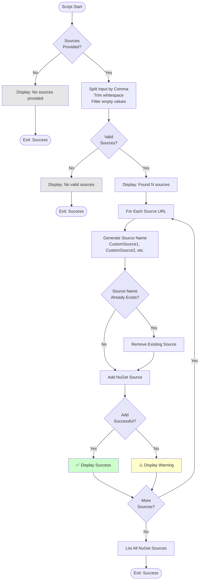

# Configure Custom NuGet Sources from Input Script

## Overview

This script configures custom NuGet package sources from comma-separated input, allowing workflows to use additional NuGet feeds beyond the default nuget.org.

## Script Location

`.github/workflows/powershell/Configure-CustomNuGetSourcesFromInput.ps1`

## Purpose

Adds custom NuGet sources to the local NuGet configuration with auto-generated names, enabling package restoration from private or preview feeds.

## When It's Used

- **Update Packages Workflow**: When manual `nugetSources` input is provided
- **PR Build Workflow**: When PR description contains `nuget-source:` lines

## Parameters

| Parameter | Type | Required | Default | Description |
|-----------|------|----------|---------|-------------|
| `SourcesInput` | string | No | "" | Comma-separated list of NuGet source URLs |

## How It Works



## What It Does

1. **Input Validation**
   - Checks if SourcesInput is provided
   - Splits by comma and trims whitespace
   - Filters out empty entries

2. **Source Processing**
   - Generates auto-incremented names (CustomSource1, CustomSource2, etc.)
   - Checks if source name already exists
   - Removes existing source if found
   - Adds new source to NuGet configuration

3. **Error Handling**
   - Catches errors during source addition
   - Displays warnings but doesn't fail the workflow
   - Continues processing remaining sources

4. **Verification**
   - Lists all configured NuGet sources
   - Confirms additions were successful

## Output

### Console Output

**No Sources Provided**:
```
================================================
Configuring Custom NuGet Sources
================================================
No custom NuGet sources provided.
```

**Successful Configuration**:
```
================================================
Configuring Custom NuGet Sources
================================================
Found 2 custom NuGet source(s):

Adding NuGet source:
  Name: CustomSource1
  URL:  https://www.myget.org/F/umbraco-dev/api/v3/index.json
  ✅ Successfully added CustomSource1

Adding NuGet source:
  Name: CustomSource2
  URL:  https://pkgs.dev.azure.com/myorg/_packaging/myfeed/nuget/v3/index.json
  ✅ Successfully added CustomSource2

================================================
NuGet Source Configuration Complete
================================================

All configured NuGet sources:
  1. nuget.org [Enabled]
     https://api.nuget.org/v3/index.json
  2. CustomSource1 [Enabled]
     https://www.myget.org/F/umbraco-dev/api/v3/index.json
  3. CustomSource2 [Enabled]
     https://pkgs.dev.azure.com/myorg/_packaging/myfeed/nuget/v3/index.json
```

**Error Example**:
```
Adding NuGet source:
  Name: CustomSource1
  URL:  https://invalid-url/index.json
  ⚠️  Failed to add CustomSource1 (exit code: 1)
```

## Usage Examples

### Example 1: Single Custom Source

```powershell
.\Configure-CustomNuGetSourcesFromInput.ps1 `
  -SourcesInput "https://www.myget.org/F/umbraco-dev/api/v3/index.json"
```

### Example 2: Multiple Custom Sources

```powershell
.\Configure-CustomNuGetSourcesFromInput.ps1 `
  -SourcesInput "https://www.myget.org/F/umbraco-dev/api/v3/index.json,https://pkgs.dev.azure.com/myorg/_packaging/myfeed/nuget/v3/index.json"
```

### Example 3: In Workflow

```yaml
- name: Configure custom NuGet sources
  if: ${{ github.event.inputs.nugetSources != '' }}
  shell: pwsh
  run: |
    ./.github/workflows/powershell/Configure-CustomNuGetSourcesFromInput.ps1 `
      -SourcesInput '${{ github.event.inputs.nugetSources }}'
```

## Implementation Details

### Source Naming Convention

- Sources are named sequentially: `CustomSource1`, `CustomSource2`, etc.
- Names are auto-generated to avoid conflicts
- Existing sources with the same name are removed before adding

### Commands Used

**Check Existing Sources**:
```powershell
dotnet nuget list source
```

**Remove Existing Source**:
```powershell
dotnet nuget remove source $sourceName
```

**Add New Source**:
```powershell
dotnet nuget add source $sourceUrl --name $sourceName
```

### Exit Codes

- `0`: Success (even if no sources provided)
- No error exit codes - warnings are displayed but don't fail

## Supported Source Types

### Public NuGet Feeds

✅ **Supported**:
- NuGet.org: `https://api.nuget.org/v3/index.json`
- MyGet: `https://www.myget.org/F/{feed-name}/api/v3/index.json`
- Azure DevOps (public): `https://pkgs.dev.azure.com/{org}/_packaging/{feed}/nuget/v3/index.json`
- GitHub Packages: `https://nuget.pkg.github.com/{owner}/index.json`

❌ **Not Supported**:
- Authenticated feeds (no credentials parameter)
- Non-v3 feeds (v2 feeds may work but are not guaranteed)

## Troubleshooting

### Issue: Source Not Added

**Symptoms**:
```
⚠️  Failed to add CustomSource1 (exit code: 1)
```

**Possible Causes**:
1. Invalid URL format
2. Network connectivity issues
3. Feed requires authentication

**Solution**:
- Verify URL is a valid v3 NuGet feed
- Ensure feed is publicly accessible
- Check network/firewall settings

### Issue: Source Already Exists Warning

**Symptoms**:
```
Removing existing source...
```

**Explanation**:
- Normal behavior when re-running workflow
- Script removes and re-adds to ensure fresh configuration

### Issue: Empty Sources List

**Symptoms**:
```
No valid custom NuGet sources provided.
```

**Possible Causes**:
- Input contains only whitespace
- Input contains only commas

**Solution**:
- Provide at least one valid URL
- Check input parameter value

## Related Documentation

- [workflow-update-nuget-packages.md](workflow-update-nuget-packages.md) - Update packages workflow
- [workflow-pr.md](workflow-pr.md) - PR build workflow with custom sources support
- [general-consuming-packages.md](general-consuming-packages.md) - Package consumption guide

## Notes

- Sources are added to **local machine configuration** only
- Sources are **not persisted** to repository NuGet.config
- Sources are available for **current workflow run** only
- No authentication support - only public feeds
- Invalid sources produce warnings but don't fail the workflow
