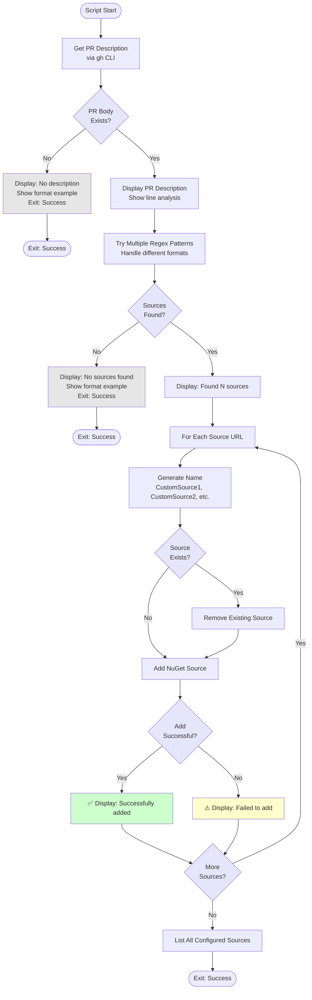

# Configure Custom NuGet Sources Script

## Overview

This script reads a GitHub PR description and extracts custom NuGet source URLs, then adds them to the local NuGet configuration for the build.

## Script Location

`.github/workflows/powershell/Configure-CustomNuGetSources.ps1`

## Purpose

Enables PR builds to use custom NuGet sources (like MyGet, Azure DevOps Artifacts, or preview feeds) by parsing specially formatted lines in the PR description.

## When It's Used

- **PR Workflow**: First configuration step after .NET setup

## Parameters

| Parameter | Type | Required | Description |
|-----------|------|----------|-------------|
| `PrNumber` | string | Yes | The GitHub pull request number |

## How It Works



## What It Does

1. **PR Description Retrieval**
   - Uses `gh pr view` to get PR body
   - Displays full description for debugging

2. **Pattern Matching**
   - Tries multiple regex patterns to extract sources
   - Handles various whitespace formats
   - Pattern: `nuget-source: <URL>`

3. **Source Configuration**
   - Auto-generates source names (CustomSource1, CustomSource2, etc.)
   - Removes existing sources with same name
   - Adds new sources via `dotnet nuget add source`

4. **Verification**
   - Lists all configured sources
   - Confirms additions were successful

## PR Description Format

Add custom NuGet sources to your PR description using this format:

```markdown
nuget-source: https://www.myget.org/F/umbraco-dev/api/v3/index.json
nuget-source: https://pkgs.dev.azure.com/myorg/_packaging/myfeed/nuget/v3/index.json
```

**Important**:
- Each source on its own line
- Format: `nuget-source: <URL>`
- Can have leading whitespace
- Multiple sources supported

## Output

### Console Output

**Sources Found**:
```
================================================
Checking PR Description for Custom NuGet Sources
================================================

PR Description:
---
Testing with preview packages

nuget-source: https://www.myget.org/F/umbraco-dev/api/v3/index.json
---

Found 1 custom NuGet source(s):

Adding NuGet source:
  Name: CustomSource1
  URL:  https://www.myget.org/F/umbraco-dev/api/v3/index.json
  ✅ Successfully added CustomSource1

================================================
NuGet Source Configuration Complete
================================================

All configured NuGet sources:
  1. nuget.org [Enabled]
     https://api.nuget.org/v3/index.json
  2. CustomSource1 [Enabled]
     https://www.myget.org/F/umbraco-dev/api/v3/index.json
```

**No Sources**:
```
No custom NuGet sources found in PR description.
To add custom NuGet sources, include them in the PR description using this format:
  nuget-source: https://www.myget.org/F/umbraco-dev/api/v3/index.json
```

## Usage Examples

### Example 1: In Workflow

```yaml
- name: Configure custom NuGet sources from PR description
  shell: pwsh
  env:
    GH_TOKEN: ${{ secrets.GITHUB_TOKEN }}
  run: |
    ./.github/workflows/powershell/Configure-CustomNuGetSources.ps1 `
      -PrNumber "${{ github.event.pull_request.number }}"
```

### Example 2: Manual Run

```powershell
$env:GH_TOKEN = "ghp_..."
.\Configure-CustomNuGetSources.ps1 -PrNumber 123
```

## Supported Patterns

The script tries multiple regex patterns to handle various formats:

1. **Simple pattern**: `nuget-source:\s*(\S+)`
2. **With leading whitespace**: `(?m)^\s*nuget-source:\s*(.+?)[\r\n]`
3. **End of line**: `(?m)^\s*nuget-source:\s*(.+)$`
4. **No leading spaces**: `(?m)^nuget-source:\s*(.+)$`

## Troubleshooting

### Issue: Sources Not Detected

**Symptoms**:
```
No custom NuGet sources found in PR description.
```

**Possible Causes**:
- Format doesn't match pattern
- Extra whitespace or special characters
- Using wrong prefix

**Solution**:
Ensure exact format:
```
nuget-source: https://example.com/index.json
```

### Issue: GitHub CLI Authentication

**Symptoms**:
```
gh: To use GitHub CLI, please authenticate...
```

**Cause**:
- GH_TOKEN not set

**Solution**:
```yaml
env:
  GH_TOKEN: ${{ secrets.GITHUB_TOKEN }}
```

### Issue: Source Add Fails

**Symptoms**:
```
⚠️  Failed to add CustomSource1 (exit code: 1)
```

**Possible Causes**:
- Invalid URL format
- Network connectivity issue
- Non-v3 feed

**Solution**:
- Verify URL is a valid v3 NuGet feed
- Check network connectivity
- Ensure feed is publicly accessible

## Related Documentation

- [workflow-pr.md](workflow-pr.md) - Parent workflow
- [script-configure-custom-nuget-sources-from-input.md](script-configure-custom-nuget-sources-from-input.md) - Similar script for manual input

## Notes

- **Parses PR description** via GitHub CLI
- **Auto-generates source names** to avoid conflicts
- **Tries multiple patterns** for flexibility
- **Non-failing** - exits successfully even if no sources found
- **Debugging output** - shows PR body and line-by-line analysis
- **Supports multiple sources** - add as many as needed
- **Removes existing sources** with same name before adding
