# Create-ZapAlertIssues.ps1 Documentation

PowerShell script that parses OWASP ZAP JSON security reports and automatically creates GitHub issues for each unique security alert found during scanning.

## Synopsis

```powershell
Create-ZapAlertIssues.ps1
    -ReportPath <String>
    -Repository <String>
    -Token <String>
    [-BranchName <String>]
    [-TemplateSource <String>]
    [-TemplateVersion <String>]
    [-UmbracoCmsVersion <String>]
    [-PullRequestUrl <String>]
```

## Description

This script automates the creation of GitHub issues for security vulnerabilities discovered by OWASP ZAP scans. It parses the ZAP JSON report, extracts security alerts, and creates well-formatted GitHub issues with complete details including risk level, description, solution, references, and example instances.

The script intelligently avoids creating duplicate issues by checking for existing issues with the same title, and includes comprehensive metadata about the scan context (branch, template version, Umbraco version, etc.) to aid in debugging and resolution.

## Location

`.github/workflows/powershell/Create-ZapAlertIssues.ps1`

## Parameters

### -ReportPath

**Type**: String
**Required**: Yes
**Description**: Path to the OWASP ZAP JSON report file (typically `report_json.json`).

**Example**:
```powershell
-ReportPath "report_json.json"
-ReportPath "${{ github.workspace }}/report.json"
```

### -Repository

**Type**: String
**Required**: Yes
**Description**: GitHub repository in the format `owner/repo` where issues will be created.

**Example**:
```powershell
-Repository "prjseal/Clean"
-Repository "${{ github.repository }}"
```

### -Token

**Type**: String
**Required**: Yes
**Description**: GitHub personal access token or `GITHUB_TOKEN` with `issues:write` permission.

**Example**:
```powershell
-Token $env:GITHUB_TOKEN
-Token "ghp_your_token_here"
```

### -BranchName

**Type**: String
**Required**: No
**Description**: Name of the branch where the scan was performed. Added to issue metadata.

**Example**:
```powershell
-BranchName "main"
-BranchName "feature/security-improvements"
```

### -TemplateSource

**Type**: String
**Required**: No
**Description**: Source of the Clean template used for testing (`nuget`, `github-packages`, or `code`).

**Example**:
```powershell
-TemplateSource "nuget"
-TemplateSource "github-packages"
-TemplateSource "code"
```

### -TemplateVersion

**Type**: String
**Required**: No
**Description**: Version of the Clean template that was tested.

**Example**:
```powershell
-TemplateVersion "7.0.0"
-TemplateVersion "7.0.1-ci.42"
```

### -UmbracoCmsVersion

**Type**: String
**Required**: No
**Description**: Version of Umbraco CMS used in the tested site.

**Example**:
```powershell
-UmbracoCmsVersion "15.0.0"
-UmbracoCmsVersion "14.3.1"
```

### -PullRequestUrl

**Type**: String
**Required**: No
**Description**: URL of the pull request that triggered the scan, if applicable.

**Example**:
```powershell
-PullRequestUrl "https://github.com/prjseal/Clean/pull/123"
```

## Environment Variables

The script uses the following environment variables:

### GITHUB_OUTPUT

**Optional**: Auto-provided in GitHub Actions
**Description**: File path for workflow outputs that subsequent steps can use.

**Outputs Written**:
- `issues_created`: Number of new issues created by the script

## Examples

### Example 1: Basic Usage

```powershell
./Create-ZapAlertIssues.ps1 `
  -ReportPath "report_json.json" `
  -Repository "prjseal/Clean" `
  -Token $env:GITHUB_TOKEN
```

**Result**: Creates GitHub issues for all unique alerts in the report

### Example 2: With Full Metadata

```powershell
./Create-ZapAlertIssues.ps1 `
  -ReportPath "report_json.json" `
  -Repository "prjseal/Clean" `
  -Token $env:GITHUB_TOKEN `
  -BranchName "main" `
  -TemplateSource "nuget" `
  -TemplateVersion "7.0.0" `
  -UmbracoCmsVersion "15.0.0"
```

**Result**: Creates issues with complete scan metadata for better tracking

### Example 3: PR-Triggered Scan

```powershell
./Create-ZapAlertIssues.ps1 `
  -ReportPath "report_json.json" `
  -Repository "${{ github.repository }}" `
  -Token $env:GITHUB_TOKEN `
  -BranchName "${{ github.head_ref }}" `
  -TemplateSource "code" `
  -TemplateVersion "7.0.1" `
  -PullRequestUrl "https://github.com/prjseal/Clean/pull/123"
```

**Result**: Creates issues linked to the triggering pull request

### Example 4: GitHub Actions Usage

```yaml
- name: Create GitHub Issues for ZAP Alerts
  id: create-issues
  if: always() && hashFiles('report_json.json') != ''
  shell: pwsh
  env:
    GITHUB_TOKEN: ${{ secrets.GITHUB_TOKEN }}
  run: |
    $params = @{
      ReportPath = "report_json.json"
      Repository = "${{ github.repository }}"
      Token = "$env:GITHUB_TOKEN"
      BranchName = "${{ github.ref_name }}"
      TemplateSource = "nuget"
      TemplateVersion = "7.0.0"
    }
    ./.github/workflows/powershell/Create-ZapAlertIssues.ps1 @params
```

## Process Flow

```mermaid
flowchart TD
    Start([Script Start]) --> ParseParams[Parse Parameters<br/>Validate required inputs]

    ParseParams --> DisplayHeader[Display Header<br/>- Report path<br/>- Repository]

    DisplayHeader --> CheckReport{Report<br/>File Exists?}

    CheckReport -->|No| ErrorNoReport[Display Error<br/>Report file not found]
    ErrorNoReport --> End1([Exit Code 0:<br/>No Alerts])

    CheckReport -->|Yes| ParseReport[Parse ZAP Report<br/>- Read JSON file<br/>- Navigate site structure<br/>- Extract alerts array]

    ParseReport --> ParseOK{Parsing<br/>Success?}

    ParseOK -->|No| ErrorParse[Display Error<br/>Failed to parse JSON]
    ErrorParse --> End2([Exit Code 0:<br/>Parse Error])

    ParseOK -->|Yes| ProcessAlerts[Process Each Alert<br/>- Extract risk level<br/>- Build content sections<br/>- Get first instance<br/>- Create alert object]

    ProcessAlerts --> CountAlerts{Alerts<br/>Found?}

    CountAlerts -->|No| NoAlerts[Display Message<br/>No alerts found]
    NoAlerts --> End3([Exit Code 0:<br/>No Alerts])

    CountAlerts -->|Yes| FetchIssues[Fetch Existing Issues<br/>- Query GitHub API<br/>- Filter: security, zap-scan labels<br/>- Paginate through all results<br/>- Extract issue titles]

    FetchIssues --> ProcessLoop[For Each Alert<br/>Build issue title]

    ProcessLoop --> CheckExists{Issue<br/>Already Exists?}

    CheckExists -->|Yes| SkipIssue[Skip Issue<br/>Increment skipped counter<br/>Display skip message]
    SkipIssue --> NextAlert{More<br/>Alerts?}

    CheckExists -->|No| BuildBody[Build Issue Body<br/>- Add alert content<br/>- Add example instance<br/>- Add footer<br/>- Add scan metadata]

    BuildBody --> CreateLabels[Create Labels Array<br/>- security<br/>- zap-scan<br/>- Risk level lowercase]

    CreateLabels --> CreateIssue[Create GitHub Issue<br/>- POST to GitHub API<br/>- Set title, body, labels<br/>- Handle errors]

    CreateIssue --> IssueCreated{Creation<br/>Success?}

    IssueCreated -->|Yes| IncrementCreated[Increment Created Counter<br/>Display success message]
    IncrementCreated --> RateLimit[Rate Limiting<br/>Sleep 500ms]

    IssueCreated -->|No| DisplayError[Display Error Message<br/>Continue processing]
    DisplayError --> RateLimit

    RateLimit --> NextAlert

    NextAlert -->|Yes| ProcessLoop
    NextAlert -->|No| DisplaySummary[Display Summary<br/>- Total alerts<br/>- Issues created<br/>- Issues skipped]

    DisplaySummary --> SaveOutput{GITHUB_OUTPUT<br/>Exists?}

    SaveOutput -->|Yes| WriteOutput[Write Output<br/>issues_created=$created]
    SaveOutput -->|No| End4([Exit Code 0:<br/>Success])

    WriteOutput --> End4

    style ErrorNoReport fill:#ffcccc
    style ErrorParse fill:#ffcccc
    style NoAlerts fill:#ffffcc
    style SkipIssue fill:#ffffcc
    style DisplayError fill:#ffcccc
    style DisplaySummary fill:#ccffcc
    style End1 fill:#ffffcc
    style End2 fill:#ffcccc
    style End3 fill:#ffffcc
    style End4 fill:#ccffcc
```



## Output

The script produces detailed, color-coded console output:

### Header
```
=== ZAP Alert Issue Creator ===
Report: report_json.json
Repository: prjseal/Clean
```

### Parsing
```
Parsed 5 alerts from report
```

### Fetching Existing Issues
```
Fetching existing issues (page 1)...
Found 3 existing ZAP security issues
```

### Processing Alerts
```
Processing alerts...
✓ Created issue #42: [ZAP Security] Missing Anti-CSRF Tokens
⊘ Skipped (exists): [ZAP Security] X-Frame-Options Header Not Set
✓ Created issue #43: [ZAP Security] Cross-Site Scripting (Reflected)
⊘ Skipped (exists): [ZAP Security] Cookie Without Secure Flag
✓ Created issue #44: [ZAP Security] SQL Injection
```

### Summary
```
=== Summary ===
Total alerts: 5
Issues created: 3
Issues skipped (already exist): 2
```

## Key Features

### 1. ZAP Report Parsing

Handles the complex ZAP JSON report structure:

```powershell
# Navigate through ZAP report structure: site -> alerts[]
foreach ($site in $zapReport.site) {
    if (-not $site.alerts) {
        continue
    }

    foreach ($alert in $site.alerts) {
        # Extract risk level from riskdesc (e.g., "High (Medium)" -> "High")
        $riskLevel = 'Unknown'
        if ($alert.riskdesc -match '^(High|Medium|Low|Informational)') {
            $riskLevel = $matches[1]
        }

        # Build complete alert content
        $contentParts = @()
        $contentParts += "## $($alert.name)"
        $contentParts += ""
        $contentParts += "**Risk Level:** $riskLevel"
        # ... add more sections
    }
}
```

### 2. Duplicate Detection

Prevents creating duplicate issues:

```powershell
# Fetch all existing issues with security and zap-scan labels
$existingIssues = Get-ExistingIssues -Repository $Repository -Token $Token
$existingTitles = $existingIssues | ForEach-Object { $_.title }

# Check before creating
$issueTitle = "[ZAP Security] $($alert.Title)"
if ($existingTitles -contains $issueTitle) {
    Write-ColorOutput "⊘ Skipped (exists): $issueTitle" -Color Yellow
    $skipped++
    continue
}
```

### 3. Comprehensive Issue Content

Creates detailed, well-structured GitHub issues:

```powershell
# Issue body includes:
# - Risk level and confidence
# - Description
# - Solution
# - References
# - CWE ID and WASC ID
# - Example instance with full details:
#   - URL
#   - HTTP method
#   - Parameter
#   - Attack payload
#   - Evidence
#   - Other info
# - Automatic creation footer
# - Scan metadata section
```

### 4. Smart Pagination

Handles large numbers of existing issues:

```powershell
$allIssues = @()
$page = 1
$perPage = 100

do {
    $uri = "https://api.github.com/repos/$Repository/issues?state=all&per_page=$perPage&page=$page&labels=security,zap-scan"
    $response = Invoke-RestMethod -Uri $uri -Headers $headers -Method Get
    $allIssues += $response
    $page++

    Start-Sleep -Milliseconds 100  # Rate limiting courtesy
} while ($response.Count -eq $perPage)
```

### 5. Metadata Enrichment

Adds contextual information to issues:

```powershell
$issueBody += "`n`n### Scan Metadata"
if ($BranchName) {
    $issueBody += "`n- **Branch:** ``$BranchName``"
}
if ($TemplateSource) {
    $templateSourceDisplay = switch ($TemplateSource) {
        'github-packages' { "GitHub Packages" }
        'code' { "Local Repository Code" }
        default { "NuGet.org" }
    }
    $issueBody += "`n- **Template Source:** $templateSourceDisplay"
}
if ($TemplateVersion) {
    $issueBody += "`n- **Clean Template Version:** $TemplateVersion"
}
if ($UmbracoCmsVersion) {
    $issueBody += "`n- **Umbraco CMS Version:** $UmbracoCmsVersion"
}
if ($PullRequestUrl) {
    $issueBody += "`n- **Related PR:** $PullRequestUrl"
}
```

### 6. Automatic Labeling

Applies appropriate labels for filtering and organization:

```powershell
# Standard labels plus risk-specific label
$labels = @('security', 'zap-scan', $alert.RiskLevel.ToLower())

# Results in labels like:
# - security, zap-scan, high
# - security, zap-scan, medium
# - security, zap-scan, low
# - security, zap-scan, informational
```

### 7. Rate Limiting

Respects GitHub API rate limits:

```powershell
# Between fetching pages
Start-Sleep -Milliseconds 100

# Between creating issues
Start-Sleep -Milliseconds 500
```

### 8. Error Handling

Continues processing even if individual operations fail:

```powershell
try {
    $response = Invoke-RestMethod -Uri $uri -Headers $headers -Method Post -Body $issueData
    Write-ColorOutput "✓ Created issue #$($response.number): $Title" -Color Green
    return $response
}
catch {
    Write-ColorOutput "✗ Failed to create issue '$Title': $($_.Exception.Message)" -Color Red
    return $null
}
```

## API Endpoints Used

### GitHub Issues API - List Issues

**Method**: GET
**URL**: `https://api.github.com/repos/{owner}/{repo}/issues`
**Query Parameters**:
- `state=all`: Fetch both open and closed issues
- `per_page=100`: Maximum results per page
- `page={n}`: Page number for pagination
- `labels=security,zap-scan`: Filter by labels

**Headers**:
- `Authorization: token {token}`
- `Accept: application/vnd.github.v3+json`
- `User-Agent: PowerShell-ZAP-Issue-Creator`

**Response**: JSON array of issue objects

### GitHub Issues API - Create Issue

**Method**: POST
**URL**: `https://api.github.com/repos/{owner}/{repo}/issues`
**Body**: JSON object with:
- `title`: Issue title string
- `body`: Issue body markdown string
- `labels`: Array of label strings

**Headers**:
- `Authorization: token {token}`
- `Accept: application/vnd.github.v3+json`
- `Content-Type: application/json`
- `User-Agent: PowerShell-ZAP-Issue-Creator`

**Response**: JSON object of created issue

## Exit Codes

| Code | Meaning |
|------|---------|
| 0 | Success - Script completed (regardless of issues created or errors) |

**Note**: The script always exits with code 0 to prevent workflow failures. It's designed to be informational and non-blocking.

## Output Files

The script does not create any files. All output is to:
- Console (colored terminal output)
- `GITHUB_OUTPUT` environment file (if running in GitHub Actions)

## Workflow Integration

The script is designed to integrate with OWASP ZAP security scanning workflows:

### Step 1: Run ZAP Scan

```yaml
- name: Run OWASP ZAP Full Scan
  uses: zaproxy/action-full-scan@v0.13.0
  continue-on-error: true
  with:
    target: ${{ steps.setup-site.outputs.site_url }}
    rules_file_name: '.zap/rules.tsv'
    cmd_options: '-a -j'
```

### Step 2: Upload Reports (Optional)

```yaml
- name: Upload ZAP Scan Report (JSON)
  if: always()
  uses: actions/upload-artifact@v4
  with:
    name: zap-scan-report-json
    path: report_json.json
```

### Step 3: Create Issues (This Script)

```yaml
- name: Create GitHub Issues for ZAP Alerts
  id: create-issues
  if: always() && hashFiles('report_json.json') != ''
  shell: pwsh
  env:
    GITHUB_TOKEN: ${{ secrets.GITHUB_TOKEN }}
  run: |
    $params = @{
      ReportPath = "report_json.json"
      Repository = "${{ github.repository }}"
      Token = "$env:GITHUB_TOKEN"
      BranchName = "${{ github.ref_name }}"
      TemplateSource = "nuget"
      TemplateVersion = "${{ steps.setup-site.outputs.clean_template_version }}"
    }

    if ("${{ steps.setup-site.outputs.umbraco_cms_version }}" -ne "") {
      $params.UmbracoCmsVersion = "${{ steps.setup-site.outputs.umbraco_cms_version }}"
    }

    ./.github/workflows/powershell/Create-ZapAlertIssues.ps1 @params
```

### Step 4: Check Results

```yaml
- name: Fail Check if Issues Created from Code Template
  if: steps.setup-site.outputs.template_source == 'code' && steps.create-issues.outputs.issues_created != '0'
  run: |
    echo "::error::Security scan found ${{ steps.create-issues.outputs.issues_created }} new issue(s)"
    exit 1
```

## Issue Format

Created GitHub issues follow this format:

### Issue Title
```
[ZAP Security] {Alert Name}
```

**Examples**:
- `[ZAP Security] Missing Anti-CSRF Tokens`
- `[ZAP Security] Cross-Site Scripting (Reflected)`
- `[ZAP Security] SQL Injection`

### Issue Body Structure

```markdown
## {Alert Name}

**Risk Level:** High

**Confidence:** Medium

### Description

{Description from ZAP}

### Solution

{Solution recommendations from ZAP}

### Reference

{Reference links from ZAP}

**CWE ID:** {CWE ID}

**WASC ID:** {WASC ID}

### Example Instance

**URL:** `https://localhost:5000/page`

**Method:** GET

**Parameter:** `search`

**Attack:** `<script>alert(1)</script>`

**Evidence:**
```
<script>alert(1)</script>
```

**Other Info:** {Additional information}

---

*This issue was automatically created from an OWASP ZAP security scan.*
*Alert detected on: 2025-12-03*
*Plugin ID: 10202*

### Scan Metadata
- **Branch:** `main`
- **Template Source:** NuGet.org
- **Clean Template Version:** 7.0.0
- **Umbraco CMS Version:** 15.0.0
- **Related PR:** https://github.com/prjseal/Clean/pull/123
```

### Issue Labels

Each issue is automatically labeled with:
- `security` - Identifies as security-related
- `zap-scan` - Identifies as ZAP scan finding
- `{risk-level}` - One of: `high`, `medium`, `low`, or `informational`

## Troubleshooting

### No Issues Created Despite Alerts

**Observation**: Script reports alerts found but 0 issues created

**Causes**:
- All alerts already have existing issues
- GitHub API token lacks `issues:write` permission
- API rate limiting or connectivity issues

**Solution**:
1. Check "Issues skipped" count in summary
2. Verify token permissions in repository settings
3. Check for API error messages in output
4. Review existing issues with `security` and `zap-scan` labels

### Authentication Failed

**Error**: "Failed to create issue" or "401 Unauthorized"

**Causes**:
- Invalid or expired GitHub token
- Token lacks required permissions
- Token not passed to script correctly

**Solution**:
1. Verify `GITHUB_TOKEN` is set: `$env:GITHUB_TOKEN`
2. Check token has `issues:write` permission
3. For personal access tokens, verify not expired
4. Ensure token is passed to `-Token` parameter

### Report Not Found

**Error**: "Error: Report file not found"

**Causes**:
- ZAP scan failed to generate report
- Report path incorrect
- Report file in different location

**Solution**:
1. Verify ZAP scan completed successfully
2. Check report file exists: `ls report_json.json`
3. Verify path passed to `-ReportPath` parameter
4. Check ZAP action output for report generation

### JSON Parsing Failed

**Error**: "Failed to parse JSON report"

**Causes**:
- Corrupted or incomplete report file
- ZAP scan terminated early
- Report format changed

**Solution**:
1. Open report file and verify valid JSON
2. Check ZAP scan logs for errors
3. Verify ZAP action version compatibility
4. Try re-running the scan

### Rate Limiting

**Observation**: Script slows down or fails partway through

**Causes**:
- GitHub API rate limit reached
- Too many alerts processed too quickly

**Solution**:
1. Script includes built-in rate limiting (500ms between issues)
2. For large numbers of alerts, expect longer runtime
3. Check rate limit status: https://api.github.com/rate_limit
4. Wait for rate limit to reset (usually 1 hour)

### Duplicate Issues Created

**Observation**: Multiple issues with same alert name

**Causes**:
- Script run multiple times on same report
- Issue title format changed
- Issues closed/deleted between runs

**Solution**:
1. Script fetches issues with `state=all` (open and closed)
2. Check for exact title match in existing issues
3. Manually close duplicate issues
4. Consider updating `.zap/rules.tsv` to ignore false positives

## Dependencies

The script requires:

- **PowerShell 7+**: For cross-platform script execution
- **Internet Access**: To communicate with GitHub API
- **GitHub Repository**: With issues enabled
- **GitHub Token**: With `issues:write` permission

No external PowerShell modules are required - script uses built-in cmdlets.

## Related Documentation

- [workflow-zap-security-scan.md](workflow-zap-security-scan.md) - ZAP workflow documentation
- [script-test-latest-with-zap.md](script-test-latest-with-zap.md) - Site setup script
- [GitHub Issues API](https://docs.github.com/en/rest/issues/issues)
- [OWASP ZAP Alert Reference](https://www.zaproxy.org/docs/alerts/)
- [CWE (Common Weakness Enumeration)](https://cwe.mitre.org/)

## Best Practices

### For Issue Management

1. **Review regularly**: Check new `zap-scan` labeled issues daily
2. **Triage by risk**: Address `high` labeled issues first
3. **Close false positives**: Close and document why certain alerts are not applicable
4. **Update ZAP rules**: Add false positives to `.zap/rules.tsv`
5. **Track trends**: Monitor if issue count increases over time

### For Workflow Integration

1. **Always run conditional**: Use `if: always()` to run even if scan fails
2. **Check report exists**: Use `hashFiles('report_json.json') != ''`
3. **Pass metadata**: Provide all optional parameters for better context
4. **Use outputs**: Check `issues_created` in subsequent steps
5. **Fail on code template issues**: Block PRs that introduce new vulnerabilities

### For Token Security

1. **Use GITHUB_TOKEN**: Prefer automatic token over personal access tokens
2. **Minimum permissions**: Only grant `issues:write` permission
3. **Never log token**: Script carefully avoids logging sensitive data
4. **Rotate regularly**: If using PAT, rotate periodically
5. **Scope appropriately**: Limit token to specific repositories if possible

### For Alert Processing

1. **Provide context**: Always include template version and branch name
2. **Link to PRs**: Include PR URL when scan triggered by pull request
3. **Test locally first**: Run ZAP locally before relying on CI
4. **Understand alerts**: Don't blindly fix - understand the vulnerability
5. **Document resolutions**: Comment on issues with how they were fixed

## Advanced Usage

### Selective Issue Creation

Modify script to only create issues for certain risk levels:

```powershell
# Only create issues for High and Medium risks
if ($alert.RiskLevel -in @('High', 'Medium')) {
    # Create issue
}
```

### Custom Issue Templates

Modify the issue body format to match your team's preferences:

```powershell
$issueBody = @"
## Security Alert: $($alert.Title)

### Risk Assessment
- **Severity:** $($alert.RiskLevel)
- **Confidence:** $($alert.Confidence)

### What We Found
$($alert.Description)

### How to Fix
$($alert.Solution)
"@
```

### Integration with Project Boards

Add issues to project boards automatically:

```powershell
# After creating issue
$projectCardUri = "https://api.github.com/projects/columns/{column_id}/cards"
$cardData = @{
    content_id = $response.id
    content_type = "Issue"
} | ConvertTo-Json

Invoke-RestMethod -Uri $projectCardUri -Headers $headers -Method Post -Body $cardData
```

## Summary

The Create-ZapAlertIssues script provides:
- ✅ Automatic GitHub issue creation from ZAP reports
- ✅ Intelligent duplicate detection
- ✅ Comprehensive issue content with examples
- ✅ Risk-based labeling (high, medium, low, informational)
- ✅ Scan metadata for debugging context
- ✅ Pagination for handling many existing issues
- ✅ Rate limiting for API courtesy
- ✅ Error handling with detailed logging
- ✅ Workflow integration via GitHub Actions outputs
- ✅ Non-blocking execution (always exits 0)

This script streamlines the security vulnerability tracking process by automatically creating well-structured, actionable GitHub issues for each unique security alert discovered by OWASP ZAP scans, while avoiding duplicate issues and providing rich context for resolution.
