# create-zap-scan-summary.sh Documentation

Bash script that creates a comprehensive GitHub Actions workflow summary for OWASP ZAP security scan results, including scan details, security findings, and downloadable artifacts.

## Synopsis

```bash
create-zap-scan-summary.sh <branch_name> <template_source> <template_version> <site_url> [umbraco_cms_version] [issues_created]
```

## Description

This script generates a formatted markdown summary for GitHub Actions workflow runs that includes OWASP ZAP security scan metadata, results, and contextual information. The summary is displayed on the workflow run page and provides a quick overview of scan results without needing to download artifacts.

The script intelligently includes different sections based on the template source and whether GitHub issues were created, providing contextual guidance for different scanning scenarios.

## Location

`.github/workflows/scripts/create-zap-scan-summary.sh`

## Parameters

### branch_name (Positional Argument 1)

**Type**: String
**Required**: Yes
**Description**: Branch where the security scan was performed.

**Examples**:
```bash
"main"
"feature/security-improvements"
"claude/refactor-zap-workflow-xyz"
```

### template_source (Positional Argument 2)

**Type**: String
**Required**: Yes
**Description**: Source of the Clean template used for testing.

**Valid Values**:
- `code` - Local repository code
- `nuget` - Published package from NuGet.org
- `github-packages` - CI build from GitHub Packages

### template_version (Positional Argument 3)

**Type**: String
**Required**: Yes
**Description**: Version of the Clean template that was tested.

**Examples**:
```bash
"7.0.1"         # Stable release
"7.0.2-ci.42"   # CI build
```

### site_url (Positional Argument 4)

**Type**: String (URL)
**Required**: Yes
**Description**: Target URL that was scanned by ZAP.

**Examples**:
```bash
"https://localhost:5001"
"http://localhost:5000"
```

### umbraco_cms_version (Positional Argument 5)

**Type**: String
**Required**: No (Optional)
**Description**: Version of Umbraco CMS used in the tested site.

**Examples**:
```bash
"15.0.0"
"14.3.1"
```

### issues_created (Positional Argument 6)

**Type**: String (Number)
**Required**: No (Optional)
**Description**: Number of GitHub issues created from the scan results.

**Examples**:
```bash
"0"   # No new issues
"3"   # Three new issues created
"15"  # Fifteen new issues created
```

## Environment Variables

The script uses the following environment variables:

### GITHUB_STEP_SUMMARY

**Required**: Yes (in GitHub Actions)
**Description**: File path for workflow summary markdown that GitHub Actions displays on the workflow run page.

**Note**: This is automatically provided by GitHub Actions. The script will error if not set.

## Examples

### Example 1: Basic Summary (Minimum Required Arguments)

```bash
./create-zap-scan-summary.sh "main" "nuget" "7.0.1" "https://localhost:5001"
```

**Result**: Creates summary with scan details but no Umbraco CMS version or issue count

### Example 2: Complete Summary (All Arguments)

```bash
./create-zap-scan-summary.sh \
  "main" \
  "nuget" \
  "7.0.1" \
  "https://localhost:5001" \
  "15.0.0" \
  "3"
```

**Result**: Creates summary with all metadata including Umbraco version and issue count

### Example 3: Code Template with Issues Created

```bash
./create-zap-scan-summary.sh \
  "feature/new-security" \
  "code" \
  "7.0.2" \
  "https://localhost:5001" \
  "15.0.0" \
  "2"
```

**Result**: Creates summary with failure notice for local code testing

### Example 4: GitHub Actions Usage

```yaml
- name: ZAP Scan Summary
  if: always()
  run: |
    ./.github/workflows/scripts/create-zap-scan-summary.sh \
      "${{ steps.setup-site.outputs.branch_name || github.ref_name }}" \
      "${{ steps.setup-site.outputs.template_source }}" \
      "${{ steps.setup-site.outputs.clean_template_version }}" \
      "${{ steps.setup-site.outputs.site_url }}" \
      "${{ steps.setup-site.outputs.umbraco_cms_version }}" \
      "${{ steps.create-issues.outputs.issues_created }}"
```

## Process Flow

```mermaid
flowchart TD
    Start([Script Start]) --> CheckArgs{Minimum 4<br/>Arguments<br/>Provided?}

    CheckArgs -->|No| ShowError[Display Error<br/>Usage information]
    ShowError --> End1([Exit Code 1:<br/>Missing Arguments])

    CheckArgs -->|Yes| ReadArgs[Read Required Arguments<br/>1-4: branch, source, version, URL<br/>5-6: Optional CMS version, issues]

    ReadArgs --> CheckEnv{GITHUB_STEP_SUMMARY<br/>Environment<br/>Variable Set?}

    CheckEnv -->|No| ErrorNoEnv[Display Error<br/>Must run in GitHub Actions]
    ErrorNoEnv --> End2([Exit Code 1:<br/>Not in GitHub Actions])

    CheckEnv -->|Yes| DisplayInfo[Display Generation Info<br/>Branch, source, version, URL]

    DisplayInfo --> WriteHeader[Write Summary Header<br/>## OWASP ZAP Security Scan Complete]

    WriteHeader --> WriteScanDetails[Write Scan Details Section<br/>- Branch<br/>- Template source<br/>- Template version<br/>- Target URL<br/>- Project type]

    WriteScanDetails --> CheckCmsVersion{Umbraco CMS<br/>Version<br/>Provided?}

    CheckCmsVersion -->|Yes| WriteCmsVersion[Add CMS Version Line]
    CheckCmsVersion -->|No| WriteSeparator

    WriteCmsVersion --> WriteSeparator[Write Separator Line<br/>---]

    WriteSeparator --> CheckReport{report_md.md<br/>File Exists?}

    CheckReport -->|Yes| WriteResults[Write Security Scan Results<br/>### Security Scan Results<br/>Include full report_md.md content]
    CheckReport -->|No| WriteWarning[Write Warning<br/>⚠️ Scan report not found]

    WriteResults --> WriteArtifacts
    WriteWarning --> WriteArtifacts

    WriteArtifacts[Write Downloadable Reports<br/>List artifact types:<br/>HTML, Markdown, JSON, Logs]

    WriteArtifacts --> CheckSource{Template<br/>Source?}

    CheckSource -->|code| WriteCodeNote[Write Code Template Note<br/>Workflow fails on new issues]
    CheckSource -->|Other| WriteOtherNote[Write Published Template Note<br/>Non-blocking findings]

    WriteCodeNote --> CheckIssues{Issues<br/>Created > 0?}
    WriteOtherNote --> Complete

    CheckIssues -->|Yes| WriteFailure[Write Failure Section<br/>❌ Security Check Failed<br/>Show issue count<br/>Remediation guidance]
    CheckIssues -->|No| Complete

    WriteFailure --> Complete[✓ Display Success Message<br/>Summary created]

    Complete --> End3([Exit Code 0:<br/>Success])

    style ShowError fill:#ffcccc
    style ErrorNoEnv fill:#ffcccc
    style End1 fill:#ffcccc
    style End2 fill:#ffcccc
    style WriteWarning fill:#ffffcc
    style WriteFailure fill:#ffcccc
    style Complete fill:#ccffcc
    style End3 fill:#ccffcc
```



## Output

The script generates markdown output appended to `GITHUB_STEP_SUMMARY`:

### Example Summary (NuGet Template, No Issues)

```markdown
## OWASP ZAP Security Scan Complete

### Scan Details
- **Branch:** `main`
- **Template Source:** nuget
- **Clean Template Version:** 7.0.1
- **Umbraco CMS Version:** 15.0.0
- **Target URL:** https://localhost:5001
- **Project Type:** Clean Blog (from Umbraco.Community.Templates.Clean)

---

### Security Scan Results

[Full ZAP scan report content from report_md.md]

---

### Downloadable Reports
Full scan reports have been uploaded as artifacts:
- 📄 HTML Report (detailed with styling)
- 📝 Markdown Report (text-based)
- 📋 JSON Report (machine-readable)
- 📋 Site Logs (for debugging)

ℹ️ **Note:** This workflow does not fail on security findings when testing published templates. Please review the results above and in the artifacts.
```

### Example Summary (Code Template, Issues Created)

```markdown
## OWASP ZAP Security Scan Complete

### Scan Details
- **Branch:** `feature/new-security`
- **Template Source:** code
- **Clean Template Version:** 7.0.2
- **Umbraco CMS Version:** 15.0.0
- **Target URL:** https://localhost:5001
- **Project Type:** Clean Blog (from Umbraco.Community.Templates.Clean)

---

### Security Scan Results

[Full ZAP scan report content from report_md.md]

---

### Downloadable Reports
Full scan reports have been uploaded as artifacts:
- 📄 HTML Report (detailed with styling)
- 📝 Markdown Report (text-based)
- 📋 JSON Report (machine-readable)
- 📋 Site Logs (for debugging)

⚠️ **Note:** When testing local repository code, this workflow will fail if new security issues are found.

### ❌ Security Check Failed

The security scan found **3** new security issue(s) when testing the local repository code.

Please review and fix these issues before merging.
```

## Key Features

### 1. Conditional Content Based on Template Source

Displays different notes based on whether testing local code or published templates:

```bash
if [ "$TEMPLATE_SOURCE" = "code" ]; then
  echo "⚠️ **Note:** When testing local repository code, this workflow will fail if new security issues are found."
else
  echo "ℹ️ **Note:** This workflow does not fail on security findings when testing published templates."
fi
```

### 2. Optional Metadata Inclusion

Includes Umbraco CMS version only if provided:

```bash
if [ -n "$UMBRACO_CMS_VERSION" ]; then
  echo "- **Umbraco CMS Version:** $UMBRACO_CMS_VERSION"
fi
```

### 3. Report File Detection

Checks for report file and includes it if available:

```bash
if [ -f "report_md.md" ]; then
  echo "### Security Scan Results"
  cat report_md.md
else
  echo "⚠️ **Warning:** Scan report not found."
fi
```

### 4. Failure Section for Code Template

Shows detailed failure information when testing local code with new issues:

```bash
if [ "$TEMPLATE_SOURCE" = "code" ] && [ -n "$ISSUES_CREATED" ] && [ "$ISSUES_CREATED" != "0" ]; then
  echo "### ❌ Security Check Failed"
  echo "The security scan found **$ISSUES_CREATED** new security issue(s)..."
fi
```

### 5. Comprehensive Error Handling

Validates all required inputs and environment:

```bash
if [ $# -lt 4 ]; then
  echo "Error: Missing required arguments"
  exit 1
fi

if [ -z "$GITHUB_STEP_SUMMARY" ]; then
  echo "Error: GITHUB_STEP_SUMMARY environment variable is not set"
  exit 1
fi
```

### 6. Rich Markdown Formatting

Uses markdown features for better readability:
- Headers (##, ###)
- Bold (**text**)
- Code blocks (\`code\`)
- Emoji (📄, 📝, 📋, ⚠️, ℹ️, ❌, ✓)
- Horizontal rules (---)

## Exit Codes

| Code | Meaning |
|------|---------|
| 0 | Success - Summary created successfully |
| 1 | Error - Missing arguments or not in GitHub Actions environment |

## Workflow Integration

The script is designed to run after all scan operations complete:

### Step 1: Run ZAP Scan

```yaml
- name: Run OWASP ZAP Full Scan
  uses: zaproxy/action-full-scan@v0.13.0
  continue-on-error: true
  with:
    target: ${{ steps.setup-site.outputs.site_url }}
```

### Step 2: Upload Artifacts

```yaml
- name: Upload ZAP Scan Report (HTML)
  if: always()
  uses: actions/upload-artifact@v4
  with:
    name: zap-scan-report-html
    path: report_html.html
```

### Step 3: Cleanup

```yaml
- name: Cleanup - Stop Umbraco Site
  if: always()
  shell: pwsh
  run: |
    ./.github/workflows/powershell/Stop-UmbracoSite.ps1 -SitePid "${{ steps.setup-site.outputs.site_pid }}"
```

### Step 4: Create Summary (This Script)

```yaml
- name: ZAP Scan Summary
  if: always()
  run: |
    ./.github/workflows/scripts/create-zap-scan-summary.sh \
      "${{ steps.setup-site.outputs.branch_name || github.ref_name }}" \
      "${{ steps.setup-site.outputs.template_source }}" \
      "${{ steps.setup-site.outputs.clean_template_version }}" \
      "${{ steps.setup-site.outputs.site_url }}" \
      "${{ steps.setup-site.outputs.umbraco_cms_version }}" \
      "${{ steps.create-issues.outputs.issues_created }}"
```

### Step 5: Create Issues (Optional)

```yaml
- name: Create GitHub Issues for ZAP Alerts
  id: create-issues
  if: always() && hashFiles('report_json.json') != ''
  shell: pwsh
  run: |
    ./.github/workflows/powershell/Create-ZapAlertIssues.ps1 @params
```

**Note**: Use `if: always()` to ensure summary is created even if previous steps fail.

## Troubleshooting

### Missing GITHUB_STEP_SUMMARY Error

**Error**: "Error: GITHUB_STEP_SUMMARY environment variable is not set"

**Causes**:
- Running script outside GitHub Actions
- Using older GitHub Actions runner

**Solution**:
- Only run this script within GitHub Actions workflows
- Verify runner version is up to date
- Test with: `echo $GITHUB_STEP_SUMMARY`

### Missing Required Arguments

**Error**: "Error: Missing required arguments"

**Causes**:
- Not enough arguments provided to script
- Variable expansion failed in workflow
- Empty variables passed

**Solution**:
```yaml
# Debug outputs before calling script
- name: Debug Outputs
  run: |
    echo "Branch: ${{ steps.setup-site.outputs.branch_name || github.ref_name }}"
    echo "Source: ${{ steps.setup-site.outputs.template_source }}"
    echo "Version: ${{ steps.setup-site.outputs.clean_template_version }}"
    echo "URL: ${{ steps.setup-site.outputs.site_url }}"
```

### Report Not Found Warning

**Observation**: Summary shows "⚠️ **Warning:** Scan report not found"

**Causes**:
- ZAP scan failed to generate report
- Report file named differently
- Report not in expected location

**Solution**:
1. Check ZAP scan step for errors
2. Verify report_md.md exists: `ls -la report*.md`
3. Check ZAP action configuration

### Summary Not Appearing

**Observation**: No summary visible on workflow run page

**Causes**:
- Script failed before writing
- GITHUB_STEP_SUMMARY not writable
- Markdown formatting errors

**Solution**:
1. Check script output in logs
2. Verify script exit code
3. Test markdown syntax manually

## Dependencies

The script requires:

- **Bash 3.2+**: For bash syntax and conditional logic
- **cat**: For including report file content
- **echo**: For output generation

All dependencies are typically pre-installed on GitHub Actions runners.

## Related Documentation

- [workflow-zap-security-scan.md](workflow-zap-security-scan.md) - ZAP workflow documentation
- [script-create-zap-alert-issues.md](script-create-zap-alert-issues.md) - Issue creation script
- [GitHub Actions: Adding a workflow status badge](https://docs.github.com/en/actions/monitoring-and-troubleshooting-workflows/adding-a-workflow-status-badge)
- [OWASP ZAP Documentation](https://www.zaproxy.org/docs/)

## Best Practices

1. **Always use if: always()**: Ensure summary is created even if scan fails
2. **Run after cleanup**: Place this step after stopping the site
3. **Include all metadata**: Pass all optional arguments for complete context
4. **Monitor summary output**: Check workflow run page to verify summary appears
5. **Keep report files**: Ensure report_md.md is generated before this step

## Summary Display Location

The generated summary appears on the GitHub Actions workflow run page:

1. Navigate to **Actions** tab
2. Select the workflow run
3. Scroll down to see **Summary** section
4. Summary appears at the top, above job details

## Alternative Approaches

If you need different summary content:

### Minimal Summary

```bash
# Only essential information
echo "## ZAP Scan Complete" >> "$GITHUB_STEP_SUMMARY"
echo "Version: $TEMPLATE_VERSION" >> "$GITHUB_STEP_SUMMARY"
echo "Status: Done" >> "$GITHUB_STEP_SUMMARY"
```

### Include Statistics

```bash
# Add scan statistics
echo "### Statistics" >> "$GITHUB_STEP_SUMMARY"
echo "- Alerts: $(jq '.site[0].alerts | length' report_json.json)" >> "$GITHUB_STEP_SUMMARY"
echo "- High Risk: $(jq '[.site[0].alerts[] | select(.riskdesc | startswith("High"))] | length' report_json.json)" >> "$GITHUB_STEP_SUMMARY"
```

### Link to Issues

```bash
# Add links to created issues
echo "### Created Issues" >> "$GITHUB_STEP_SUMMARY"
echo "View issues: https://github.com/$GITHUB_REPOSITORY/issues?q=is:issue+label:zap-scan" >> "$GITHUB_STEP_SUMMARY"
```

## Summary

The create-zap-scan-summary script provides:
- ✅ Comprehensive workflow summary generation
- ✅ Conditional content based on template source
- ✅ Optional metadata inclusion
- ✅ Report file integration
- ✅ Failure section for code template testing
- ✅ Rich markdown formatting with emoji
- ✅ Clear error handling and validation
- ✅ Links to downloadable artifacts

This script is essential for workflows that need to provide a quick overview of security scan results directly on the workflow run page, allowing developers to assess scan results without downloading artifacts while still providing links to detailed reports when needed.
