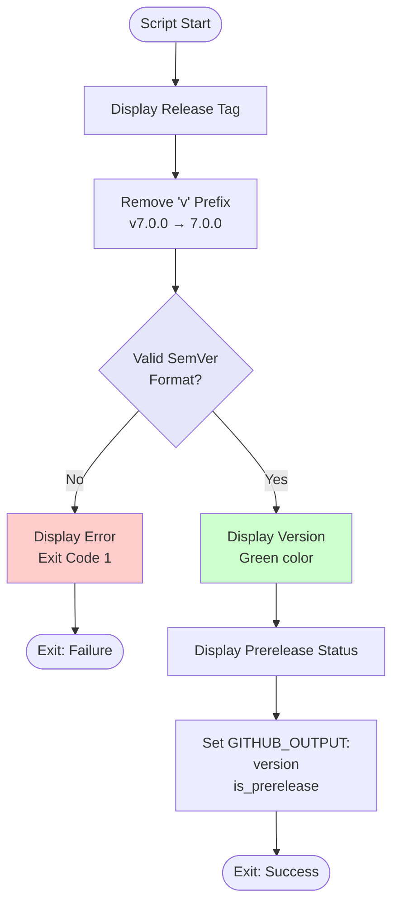

# Extract Release Version Script

## Overview

This script extracts and validates version information from a GitHub release tag, ensuring it follows semantic versioning format.

## Script Location

`.github/workflows/powershell/Extract-ReleaseVersion.ps1`

## Purpose

Parses the GitHub release tag, removes version prefix, validates format, and outputs version information for use in subsequent workflow steps.

## When It's Used

- **Release Workflow**: First step after release is published to extract version from tag

## Parameters

| Parameter | Type | Required | Description |
|-----------|------|----------|-------------|
| `ReleaseTag` | string | Yes | The GitHub release tag (e.g., v7.0.0 or 7.0.0) |
| `IsPrerelease` | string | Yes | Boolean string indicating if this is a prerelease |

## How It Works



## What It Does

1. **Tag Display**
   - Shows the release tag as provided

2. **Prefix Removal**
   - Removes leading 'v' if present
   - `v7.0.0` becomes `7.0.0`
   - `7.0.0` stays `7.0.0`

3. **Version Validation**
   - Checks against SemVer pattern
   - Valid: `X.Y.Z` or `X.Y.Z-prerelease`
   - Invalid: `X.Y.Z.W` or other formats

4. **Output Generation**
   - Sets `version` output variable
   - Sets `is_prerelease` output variable

## Output

### Console Output

**Valid Version**:
```
Release tag: v7.0.0
Release version: 7.0.0
Is prerelease: false
```

**Valid Prerelease**:
```
Release tag: v7.0.0-rc.1
Release version: 7.0.0-rc.1
Is prerelease: true
```

**Invalid Version**:
```
Release tag: 7.0.0.1
::error::Invalid version format: 7.0.0.1. Expected format: X.Y.Z or X.Y.Z-prerelease
```

### GitHub Actions Output

```
version=7.0.0
is_prerelease=false
```

## Usage Examples

### Example 1: Stable Release

```powershell
.\Extract-ReleaseVersion.ps1 `
  -ReleaseTag "v7.0.0" `
  -IsPrerelease "false"
```

### Example 2: Prerelease

```powershell
.\Extract-ReleaseVersion.ps1 `
  -ReleaseTag "v7.0.0-rc.1" `
  -IsPrerelease "true"
```

### Example 3: In Workflow

```yaml
- name: Extract version from release tag
  id: version
  shell: pwsh
  run: |
    ./.github/workflows/powershell/Extract-ReleaseVersion.ps1 `
      -ReleaseTag "${{ github.event.release.tag_name }}" `
      -IsPrerelease "${{ github.event.release.prerelease }}"
```

## Implementation Details

### Regex Pattern

```powershell
'^\d+\.\d+\.\d+(-[a-zA-Z0-9\.\-]+)?$'
```

**Breakdown**:
- `^\d+\.\d+\.\d+`: Three numeric segments separated by dots
- `(-[a-zA-Z0-9\.\-]+)?`: Optional prerelease suffix after hyphen
- `$`: End of string

**Matches**:
- ✅ `7.0.0`
- ✅ `7.0.0-rc.1`
- ✅ `7.0.0-beta.2`
- ✅ `7.0.0-alpha`
- ❌ `7.0.0.1` (4 segments)
- ❌ `v7.0.0` (prefix not removed yet)
- ❌ `7.0` (only 2 segments)

### Prefix Removal

```powershell
$version = $ReleaseTag -replace '^v', ''
```

Removes only leading 'v', case-sensitive.

### Error Handling

**GitHub Actions error annotation**:
```powershell
Write-Host "::error::Invalid version format: $version..." -ForegroundColor Red
exit 1
```

Shows error in workflow UI with annotation.

## Validation Rules

### Semantic Versioning 2.0

**Required Format**: `MAJOR.MINOR.PATCH[-PRERELEASE]`

**Examples**:
- Stable: `7.0.0`, `7.1.2`, `8.0.0`
- Prerelease: `7.0.0-rc.1`, `7.0.0-beta.2`, `7.0.0-alpha`

**Prerelease Identifiers**:
- Alphanumeric with dots and hyphens
- Examples: `rc.1`, `beta.2`, `alpha`, `preview-1`

## Troubleshooting

### Issue: Invalid Version Format Error

**Symptoms**:
```
::error::Invalid version format: 7.0.0.1
```

**Cause**:
- Four-segment version number
- Non-SemVer format

**Solution**:
Use three-segment SemVer:
```
v7.0.0     ✅
v7.0.0.1   ❌
```

### Issue: Version with 'v' Prefix in Output

**Symptoms**:
Output contains `v7.0.0` instead of `7.0.0`.

**Cause**:
- Script should remove it - this would be a bug

**Solution**:
- Check script logic
- Ensure `-replace '^v', ''` is working

### Issue: Prerelease Not Detected

**Symptoms**:
`is_prerelease=false` for an RC release.

**Cause**:
- Parameter passed from GitHub event might be wrong

**Solution**:
Check GitHub event prerelease flag:
```yaml
IsPrerelease: "${{ github.event.release.prerelease }}"
```

## Related Documentation

- [workflow-versioning-releases.md](workflow-versioning-releases.md) - Parent workflow
- [script-show-version-info.md](script-show-version-info.md) - Next step in workflow

## Notes

- **Validates SemVer format** according to Semantic Versioning 2.0
- **Fails workflow** on invalid version format
- **Removes 'v' prefix** for consistency
- **Passes through prerelease flag** from GitHub event
- **Sets output variables** for subsequent steps
- **Uses GitHub Actions annotations** for errors
