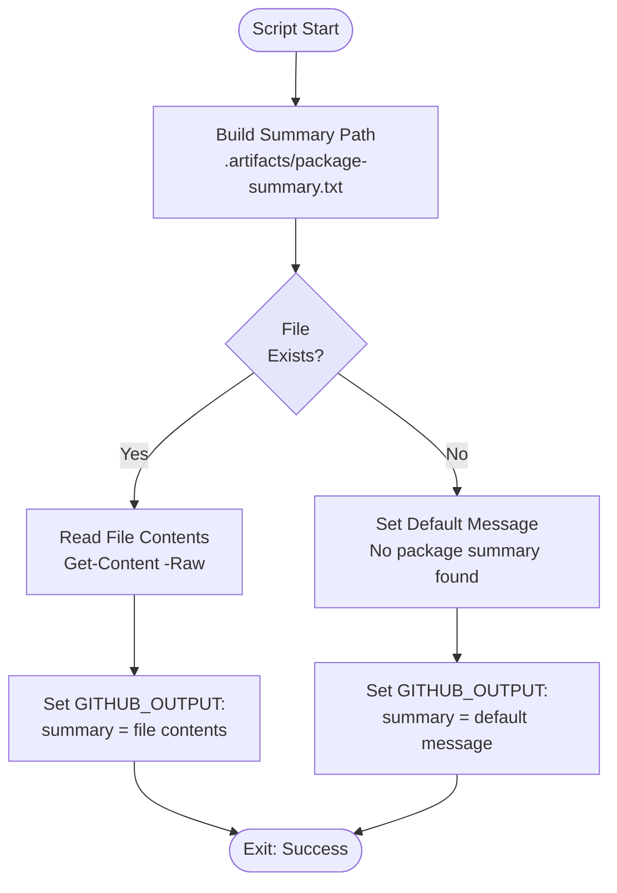

# Get Package Summary Script

## Overview

This simple script reads the package summary file from artifacts and outputs it for use in subsequent workflow steps, particularly PR creation.

## Script Location

`.github/workflows/powershell/Get-PackageSummary.ps1`

## Purpose

Retrieves the package update summary generated by UpdateThirdPartyPackages script and makes it available to the PR creation step.

## When It's Used

- **Update Packages Workflow**: After changes are committed, before PR creation

## Parameters

| Parameter | Type | Required | Description |
|-----------|------|----------|-------------|
| `WorkspacePath` | string | Yes | The GitHub workspace path |

## How It Works



## What It Does

1. **File Path Construction**
   - Builds path to package summary file
   - Location: `{WorkspacePath}\.artifacts\package-summary.txt`

2. **File Reading**
   - Checks if file exists
   - Reads entire file content if found
   - Uses default message if not found

3. **Output Variable**
   - Sets GitHub Actions output using heredoc syntax
   - Variable name: `summary`
   - Contains full file content or default message

## Output

### GitHub Actions Output

**When Summary Exists**:
```
summary<<EOF
+---------------+-----------------------------+--------------+--------------+
| File Name     | Package Name                | Old Version  | New Version  |
+---------------+-----------------------------+--------------+--------------+
| Clean.csproj  | Umbraco.Cms.Web.Website     | 13.5.1       | 13.5.2       |
| Clean.csproj  | Umbraco.Cms.Web.BackOffice  | 13.5.1       | 13.5.2       |
+---------------+-----------------------------+--------------+--------------+
EOF
```

**When Summary Not Found**:
```
summary<<EOF
No package summary found.
EOF
```

## Usage Examples

### Example 1: Basic Usage

```powershell
.\Get-PackageSummary.ps1 -WorkspacePath "C:\Projects\Clean"
```

### Example 2: In Workflow

```yaml
- name: Read package summary
  id: read-summary
  shell: pwsh
  run: |
    ./.github/workflows/powershell/Get-PackageSummary.ps1 `
      -WorkspacePath "${{ github.workspace }}"

- name: Create Pull Request
  shell: pwsh
  run: |
    ./.github/workflows/powershell/New-PackageUpdatePullRequest.ps1 `
      -PackageSummary "${{ steps.read-summary.outputs.summary }}" `
      # ... other parameters
```

## Implementation Details

### File Path

**Windows path construction**:
```powershell
$summaryPath = "$WorkspacePath\.artifacts\package-summary.txt"
```

### Heredoc Output Syntax

**Why heredoc?**
- Preserves multiline content
- Handles special characters
- No escaping needed

**Format**:
```powershell
echo "summary<<EOF" >> $env:GITHUB_OUTPUT
echo "$content" >> $env:GITHUB_OUTPUT
echo "EOF" >> $env:GITHUB_OUTPUT
```

### File Reading

**Safe reading**:
```powershell
if (Test-Path $summaryPath) {
    $content = Get-Content $summaryPath -Raw
} else {
    $content = "No package summary found."
}
```

**`-Raw` parameter**:
- Reads entire file as single string
- Preserves formatting and line breaks
- Better for ASCII tables

## Summary File Format

**Typical content**:
```
+---------------+-----------------------------+--------------+--------------+
| File Name     | Package Name                | Old Version  | New Version  |
+---------------+-----------------------------+--------------+--------------+
| Clean.csproj  | Umbraco.Cms.Web.Website     | 13.5.1       | 13.5.2       |
+---------------+-----------------------------+--------------+--------------+
```

**When no packages updated**:
```
No packages to update
```

## Troubleshooting

### Issue: Summary Output Truncated

**Symptoms**:
PR description missing package table or partial.

**Possible Causes**:
1. File read error
2. GitHub Actions output size limit
3. Encoding issues

**Solution**:
- Check workflow logs for errors
- Verify file exists with `Test-Path`
- Check file size (should be reasonable)

### Issue: Summary Shows "Not Found"

**Symptoms**:
```
summary=No package summary found.
```

**Possible Causes**:
1. UpdateThirdPartyPackages didn't run
2. UpdateThirdPartyPackages failed
3. Artifacts directory not created

**Solution**:
- Verify previous workflow steps completed
- Check if `.artifacts/` directory exists
- Review UpdateThirdPartyPackages logs

### Issue: Formatting Lost in PR

**Symptoms**:
ASCII table not displaying correctly in PR description.

**Cause**:
- Markdown rendering of code block needed

**Solution**:
PR creation script wraps in triple backticks:
````markdown
```
{package summary table}
```
````

## Related Documentation

- [workflow-update-nuget-packages.md](workflow-update-nuget-packages.md) - Parent workflow
- [script-update-third-party-packages.md](script-update-third-party-packages.md) - Generates summary file
- [script-new-package-update-pull-request.md](script-new-package-update-pull-request.md) - Consumes summary

## Notes

- **Simple pass-through** script for file content
- Uses **heredoc syntax** for multiline output
- Handles **missing file** gracefully
- Output used in **PR description** generation
- **No error exit** - always succeeds with appropriate content
- **Preserves formatting** of ASCII tables
