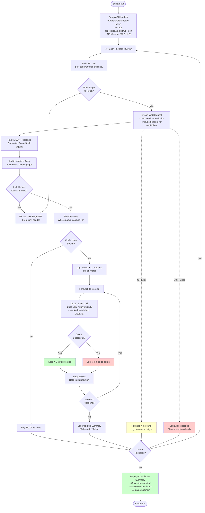

# Remove-GitHubPackageCIVersions.ps1 Documentation

PowerShell script that removes CI (Continuous Integration) versions from GitHub Packages while preserving stable releases and package containers.

## Synopsis

```powershell
Remove-GitHubPackageCIVersions.ps1 -RepositoryOwner <String> -Packages <String[]>
```

## Description

This script connects to the GitHub Packages API to delete all package versions containing "-ci" in their version string. It handles pagination to process packages with large numbers of versions and includes rate limiting protection to avoid API throttling.

The script is designed to clean up accumulated PR build packages from GitHub Packages while preserving:
- Stable release versions (e.g., `7.0.0`)
- RC/beta/alpha versions (e.g., `7.1.0-rc.1`)
- Package containers (allowing future version publishing)

## Location

`.github/workflows/powershell/Remove-GitHubPackageCIVersions.ps1`

## Parameters

### -RepositoryOwner

**Type**: String
**Required**: Yes
**Description**: The GitHub repository owner or organization name.

**Example**:
```powershell
-RepositoryOwner "prjseal"
```

### -Packages

**Type**: String[]
**Required**: Yes
**Description**: Array of package names to clean up. Package names are case-sensitive and must match exactly as they appear in GitHub Packages.

**Example**:
```powershell
-Packages @("Clean", "Clean.Core", "Clean.Headless")
```

## Environment Variables

The script requires the following environment variable to be set:

### GITHUB_TOKEN

**Type**: String
**Required**: Yes
**Description**: GitHub Personal Access Token or workflow token with `packages:write` permission.

**In GitHub Actions**:
```yaml
env:
  GITHUB_TOKEN: ${{ secrets.GITHUB_TOKEN }}
```

**Local Testing**:
```powershell
$env:GITHUB_TOKEN = "ghp_your_token_here"
```

## Examples

### Example 1: Clean Up Single Package

```powershell
$env:GITHUB_TOKEN = ${{ secrets.GITHUB_TOKEN }}

./Remove-GitHubPackageCIVersions.ps1 `
  -RepositoryOwner "prjseal" `
  -Packages @("Clean")
```

### Example 2: Clean Up Multiple Packages

```powershell
$env:GITHUB_TOKEN = ${{ secrets.GITHUB_TOKEN }}

./Remove-GitHubPackageCIVersions.ps1 `
  -RepositoryOwner "prjseal" `
  -Packages @("Clean", "Clean.Core", "Clean.Headless", "Umbraco.Community.Templates.Clean")
```

### Example 3: Clean Up with Custom Owner

```powershell
$env:GITHUB_TOKEN = ${{ secrets.GITHUB_TOKEN }}

./Remove-GitHubPackageCIVersions.ps1 `
  -RepositoryOwner "myorganization" `
  -Packages @("MyPackage")
```

## Process Flow



## Output

The script produces detailed console output during execution:

### Header
```
================================================
GitHub Packages CI Versions Cleanup
================================================
Repository Owner: prjseal
Target: Versions containing '-ci'
```

### Processing Each Package
```
Processing package: Clean
  Fetching versions from: https://api.github.com/users/prjseal/packages/nuget/clean/versions?per_page=100
    Fetched 100 versions (Total so far: 100)
    Found next page, continuing...
    Fetched 50 versions (Total so far: 150)
  Found 95 CI version(s) out of 150 total versions
    Deleting version: 7.0.1-ci.0000042 (ID: 123456)
    ✓ Deleted: 7.0.1-ci.0000042
    Deleting version: 7.0.1-ci.0000043 (ID: 123457)
    ✓ Deleted: 7.0.1-ci.0000043
    ...
  Summary for Clean: 95 deleted, 0 failed
```

### Package Not Found
```
Processing package: NonExistentPackage
  Package 'NonExistentPackage' not found (may not exist yet)
```

### No CI Versions
```
Processing package: Clean.Core
  Fetching versions from: https://api.github.com/users/prjseal/packages/nuget/clean.core/versions?per_page=100
    Fetched 5 versions (Total so far: 5)
  No CI versions found for Clean.Core (Total versions: 5)
```

### Completion Summary
```
================================================
CI Versions Cleanup Complete
================================================

Note: Only CI versions (containing '-ci') were deleted.
Stable/release versions remain intact.
Package containers remain intact.
You can still publish new versions to these packages.
```

## Key Features

### 1. Pagination Support

Handles packages with unlimited numbers of versions by following GitHub API pagination:

```powershell
# Fetches 100 versions per page (maximum allowed)
$versionsUrl = "https://api.github.com/users/$RepositoryOwner/packages/nuget/$packageName/versions?per_page=100"

# Follows 'next' links in Link header
while ($currentUrl) {
    $response = Invoke-WebRequest -Uri $currentUrl -Headers $headers
    # ... extract 'next' URL from Link header
}
```

### 2. Selective Deletion

Only deletes versions matching the CI pattern:

```powershell
# Filter for CI versions only
$ciVersions = $versions | Where-Object { $_.name -match '-ci' }
```

### 3. Rate Limiting Protection

Adds delay between deletions to avoid API throttling:

```powershell
# Small delay to avoid rate limiting
Start-Sleep -Milliseconds 100
```

### 4. Error Handling

Gracefully handles missing packages and deletion failures:

```powershell
try {
    # API call
} catch {
    if ($_.Exception.Response.StatusCode -eq 404) {
        # Package not found - expected for new packages
    } else {
        # Other error - log and continue
    }
}
```

## API Endpoints Used

### List Package Versions

**Method**: GET
**URL**: `https://api.github.com/users/{owner}/packages/nuget/{package}/versions`
**Query Parameters**:
- `per_page=100`: Maximum versions per page

**Response Headers**:
- `Link`: Contains pagination URLs (next, last, etc.)

### Delete Package Version

**Method**: DELETE
**URL**: `https://api.github.com/users/{owner}/packages/nuget/{package}/versions/{version_id}`

**Response**: 204 No Content on success

## Permissions Required

The `GITHUB_TOKEN` must have the following permission:

- **packages:write** - Required to delete package versions

In GitHub Actions workflows, this permission is automatically granted to the workflow token.

## Exit Codes

| Code | Meaning |
|------|---------|
| 0 | Success - All CI versions deleted (or none found) |
| 1 | Error - Failed to fetch versions or authentication error |

## Limitations

- **No undo**: Deleted versions cannot be recovered
- **CI pattern only**: Only deletes versions matching `-ci` pattern
- **Public packages**: Does not support authenticated private feeds
- **Rate limits**: GitHub API has rate limits (typically 5000 requests/hour for authenticated users)
- **No dry run**: Always performs actual deletions (no preview mode)

## Troubleshooting

### Authentication Errors

**Error**: `Response status code does not indicate success: 401 (Unauthorized)`

**Cause**: Missing or invalid `GITHUB_TOKEN`

**Solution**:
```powershell
# Ensure token is set
$env:GITHUB_TOKEN = "your-token-here"

# Verify token has packages:write scope
```

### Package Not Found (404)

**Message**: "Package 'PackageName' not found (may not exist yet)"

**Cause**: Package hasn't been published to GitHub Packages

**Solution**: This is expected behavior. The package will be skipped.

### Rate Limiting (429)

**Error**: `Response status code does not indicate success: 429 (Too Many Requests)`

**Cause**: Exceeded GitHub API rate limit

**Solution**:
- Wait for rate limit to reset (typically 1 hour)
- The script already includes 100ms delays; for very large cleanups, consider increasing the delay

### Deletion Failures

**Error**: `Failed to delete version X.X.X-ci.X`

**Causes**:
- Network error
- Insufficient permissions
- Version already deleted

**Solution**: Check the error message for specifics. The script continues with remaining versions even if one fails.

## Related Documentation

- [workflow-cleanup-github-packages.md](workflow-cleanup-github-packages.md) - Workflow documentation
- [GitHub Packages API Documentation](https://docs.github.com/en/rest/packages)
- [GitHub API Rate Limiting](https://docs.github.com/en/rest/overview/rate-limits-for-the-rest-api)

## Best Practices

1. **Test with small package first**: Start with a package that has few versions to verify behavior
2. **Check package list**: Review GitHub Packages UI before running to see what will be deleted
3. **Monitor output**: Watch the console output to ensure expected versions are being deleted
4. **Handle failures**: The script logs failures but continues; review the summary to identify issues
5. **Rate limit awareness**: For packages with 1000+ CI versions, the cleanup may take 2-3 minutes

## Version History

- **v1.0**: Initial version with pagination support and selective CI version deletion
