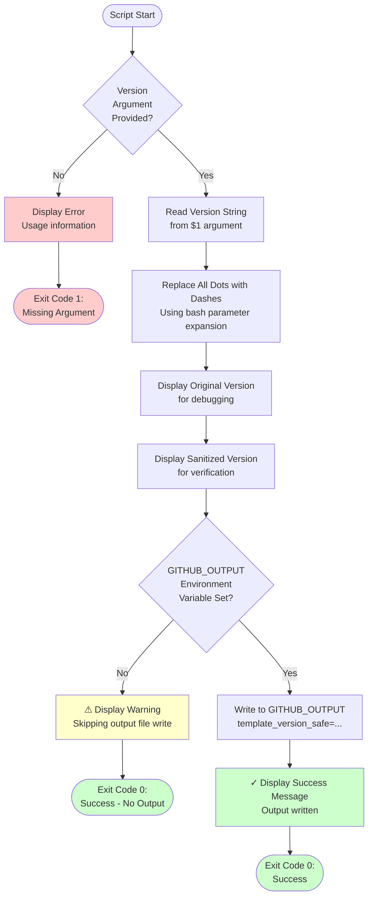

# sanitize-version-numbers.sh Documentation

Bash script that sanitizes version numbers for use in GitHub Actions artifact names by replacing dots with dashes.

## Synopsis

```bash
sanitize-version-numbers.sh <version>
```

## Description

This script transforms version strings to make them compatible with GitHub Actions artifact naming requirements. GitHub Actions artifact names cannot contain certain characters including dots (`.`), so this script replaces all dots with dashes (`-`) to create safe artifact names.

The script is designed specifically for workflows that need to create artifacts with version numbers in their names, ensuring consistent and valid artifact naming across the workflow.

## Location

`.github/workflows/scripts/sanitize-version-numbers.sh`

## Parameters

### version (Positional Argument 1)

**Type**: String
**Required**: Yes
**Description**: The version string to sanitize (e.g., "7.0.1").

**Examples**:
```bash
"7.0.1"         # Stable release version
"7.0.1-ci.42"   # CI build version with prerelease tag
"1.2.3.4"       # Multi-part version number
```

## Environment Variables

The script uses the following environment variables:

### GITHUB_OUTPUT

**Optional**: Auto-provided in GitHub Actions
**Description**: File path for workflow outputs that subsequent steps can use.

**Outputs Written**:
- `template_version_safe`: Sanitized version string with dashes instead of dots

## Examples

### Example 1: Sanitize Stable Version

```bash
./sanitize-version-numbers.sh "7.0.1"
```

**Output**:
```
Original version: 7.0.1
Sanitized version: 7-0-1
✓ Wrote template_version_safe to GITHUB_OUTPUT
```

**Result**: Creates output `template_version_safe=7-0-1`

### Example 2: Sanitize CI Build Version

```bash
./sanitize-version-numbers.sh "7.0.1-ci.42"
```

**Output**:
```
Original version: 7.0.1-ci.42
Sanitized version: 7-0-1-ci-42
✓ Wrote template_version_safe to GITHUB_OUTPUT
```

**Result**: Creates output `template_version_safe=7-0-1-ci-42`

### Example 3: GitHub Actions Usage

```yaml
- name: Sanitize Version Numbers for Artifact Names
  id: sanitize-versions
  shell: bash
  run: |
    ./.github/workflows/scripts/sanitize-version-numbers.sh "${{ steps.setup-site.outputs.clean_template_version }}"

- name: Upload Artifact
  uses: actions/upload-artifact@v4
  with:
    name: zap-scan-report-html-clean-template-${{ steps.sanitize-versions.outputs.template_version_safe }}
    path: report_html.html
```

**Result**: Creates artifact with name like `zap-scan-report-html-clean-template-7-0-1`

## Process Flow



## Output

The script produces console output and sets GitHub Actions outputs:

### Console Output

```
Original version: 7.0.1
Sanitized version: 7-0-1
✓ Wrote template_version_safe to GITHUB_OUTPUT
```

### GitHub Actions Output

When `GITHUB_OUTPUT` is set, the script appends:
```
template_version_safe=7-0-1
```

This output can be accessed in subsequent workflow steps using:
```yaml
${{ steps.sanitize-versions.outputs.template_version_safe }}
```

## Key Features

### 1. Simple String Replacement

Uses bash parameter expansion for efficient string replacement:

```bash
TEMPLATE_VERSION_SAFE="${TEMPLATE_VERSION//./-}"
```

This replaces all occurrences of `.` with `-` in a single operation.

### 2. Error Handling

Validates that required arguments are provided:

```bash
if [ -z "$1" ]; then
  echo "Error: Version argument is required"
  echo "Usage: $0 <version>"
  exit 1
fi
```

### 3. GitHub Actions Integration

Automatically detects and writes to `GITHUB_OUTPUT` when available:

```bash
if [ -n "$GITHUB_OUTPUT" ]; then
  echo "template_version_safe=${TEMPLATE_VERSION_SAFE}" >> "$GITHUB_OUTPUT"
  echo "✓ Wrote template_version_safe to GITHUB_OUTPUT"
else
  echo "⚠ GITHUB_OUTPUT not set, skipping output file write"
fi
```

### 4. Verbose Output

Provides clear feedback about the transformation:

```bash
echo "Original version: $TEMPLATE_VERSION"
echo "Sanitized version: $TEMPLATE_VERSION_SAFE"
```

## Artifact Naming Rules

GitHub Actions artifact names have the following restrictions:

**Allowed Characters**:
- Letters (a-z, A-Z)
- Numbers (0-9)
- Hyphens (-)
- Underscores (_)

**Not Allowed**:
- Dots (.)
- Spaces ( )
- Special characters (@, #, $, %, etc.)

This script specifically handles the dot restriction, which is the most common issue with version numbers.

## Exit Codes

| Code | Meaning |
|------|---------|
| 0 | Success - Version sanitized successfully |
| 1 | Error - Missing required argument |

## Workflow Integration

The script is designed to integrate with workflows that create versioned artifacts:

### Step 1: Sanitize Version

```yaml
- name: Sanitize Version Numbers for Artifact Names
  id: sanitize-versions
  shell: bash
  run: |
    ./.github/workflows/scripts/sanitize-version-numbers.sh "${{ steps.setup-site.outputs.clean_template_version }}"
```

### Step 2: Use Sanitized Version in Artifacts

```yaml
- name: Upload ZAP Scan Report (HTML)
  uses: actions/upload-artifact@v4
  with:
    name: zap-scan-report-html-clean-template-${{ steps.sanitize-versions.outputs.template_version_safe }}
    path: report_html.html

- name: Upload ZAP Scan Report (Markdown)
  uses: actions/upload-artifact@v4
  with:
    name: zap-scan-report-markdown-clean-template-${{ steps.sanitize-versions.outputs.template_version_safe }}
    path: report_md.md

- name: Upload ZAP Scan Report (JSON)
  uses: actions/upload-artifact@v4
  with:
    name: zap-scan-report-json-clean-template-${{ steps.sanitize-versions.outputs.template_version_safe }}
    path: report_json.json
```

## Troubleshooting

### Missing Argument Error

**Error**: "Error: Version argument is required"

**Causes**:
- No version argument passed to script
- Empty string passed as argument
- Variable not expanded correctly

**Solution**:
```bash
# Check that the variable is set before calling script
echo "Version: ${{ steps.setup-site.outputs.clean_template_version }}"
./.github/workflows/scripts/sanitize-version-numbers.sh "${{ steps.setup-site.outputs.clean_template_version }}"
```

### Output Not Available in Later Steps

**Observation**: `steps.sanitize-versions.outputs.template_version_safe` is empty

**Causes**:
- Step doesn't have an `id` set
- `GITHUB_OUTPUT` not available
- Incorrect output reference syntax

**Solution**:
1. Ensure step has `id: sanitize-versions`
2. Verify script ran successfully
3. Check step output syntax: `${{ steps.sanitize-versions.outputs.template_version_safe }}`

### Artifact Upload Fails

**Error**: "Invalid artifact name"

**Causes**:
- Sanitized version contains unexpected characters
- Variable expansion failed
- Empty artifact name

**Solution**:
1. Check sanitization step output in logs
2. Verify `template_version_safe` value
3. Test artifact name format manually

## Dependencies

The script requires:

- **Bash 3.2+**: For parameter expansion syntax
- **No external commands**: Uses only bash built-ins

## Related Documentation

- [workflow-zap-security-scan.md](workflow-zap-security-scan.md) - ZAP workflow documentation
- [GitHub Actions: Storing workflow data as artifacts](https://docs.github.com/en/actions/using-workflows/storing-workflow-data-as-artifacts)
- [GitHub Actions: Defining outputs for jobs](https://docs.github.com/en/actions/using-jobs/defining-outputs-for-jobs)

## Best Practices

1. **Always sanitize before artifact creation**: Run this script before any step that creates artifacts with version numbers in the name
2. **Use descriptive step IDs**: Use `id: sanitize-versions` or similar to make outputs easy to reference
3. **Verify in logs**: Check the script output in workflow logs to ensure sanitization worked correctly
4. **Consistent naming**: Use the same sanitized version across all artifacts in a workflow run
5. **Document artifact names**: Keep artifact naming patterns consistent across workflows

## Alternative Approaches

If you need different sanitization rules:

### Replace with Underscores

```bash
TEMPLATE_VERSION_SAFE="${TEMPLATE_VERSION//./_}"
```

### Remove Dots Entirely

```bash
TEMPLATE_VERSION_SAFE="${TEMPLATE_VERSION//./}"
```

### Multiple Replacements

```bash
# Replace dots with dashes and spaces with underscores
TEMPLATE_VERSION_SAFE="${TEMPLATE_VERSION//./-}"
TEMPLATE_VERSION_SAFE="${TEMPLATE_VERSION_SAFE// /_}"
```

## Summary

The sanitize-version-numbers script provides:
- ✅ Simple, fast version string sanitization
- ✅ GitHub Actions artifact name compatibility
- ✅ Automatic GITHUB_OUTPUT integration
- ✅ Clear error messages and validation
- ✅ Verbose output for debugging
- ✅ No external dependencies
- ✅ Support for stable and prerelease versions
- ✅ Compatible with all version formats

This script is essential for workflows that need to create artifacts with version numbers in their names, ensuring consistent and valid artifact naming that complies with GitHub Actions requirements.
