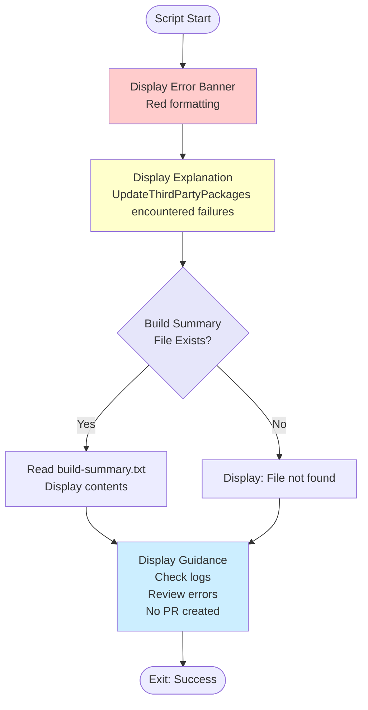

# Show Build Failure Summary Script

## Overview

This script displays a formatted build failure summary when the UpdateThirdPartyPackages script encounters build errors.

## Script Location

`.github/workflows/powershell/Show-BuildFailureSummary.ps1`

## Purpose

Provides clear, formatted error output when package updates cause build failures, helping developers quickly identify and resolve issues.

## When It's Used

- **Update Packages Workflow**: Only runs when the UpdateThirdPartyPackages step fails

## Parameters

| Parameter | Type | Required | Description |
|-----------|------|----------|-------------|
| `WorkspacePath` | string | Yes | The GitHub workspace path |

## How It Works



## What It Does

1. **Displays Error Header**
   - Red banner with failure message
   - Clear indication of workflow failure

2. **Shows Build Summary**
   - Reads `.artifacts/build-summary.txt`
   - Displays formatted build results table
   - Shows which solutions failed

3. **Provides Guidance**
   - Points to detailed logs location
   - Explains no PR will be created
   - Helps developers troubleshoot

## Output

### Console Output

**When Summary File Exists**:
```
================================================
❌ UPDATE PACKAGES WORKFLOW FAILED
================================================

The UpdateThirdPartyPackages script encountered build failures.

📋 Build Summary:
+------------------+--------------+--------------+---------+-----------+
| Solution Name    | Clean Result | Build Result | Errors  | Warnings  |
+------------------+--------------+--------------+---------+-----------+
| Clean.sln        | Success      | Failed       | 5       | 2         |
+------------------+--------------+--------------+---------+-----------+

🔍 Check the logs above for detailed error messages.
📂 Build logs are saved in .artifacts/logs/ directory.

No PR will be created due to build failures.
================================================
```

**When Summary File Not Found**:
```
================================================
❌ UPDATE PACKAGES WORKFLOW FAILED
================================================

The UpdateThirdPartyPackages script encountered build failures.

📋 Build Summary:
Build summary file not found.

🔍 Check the logs above for detailed error messages.
📂 Build logs are saved in .artifacts/logs/ directory.

No PR will be created due to build failures.
================================================
```

## Usage Examples

### Example 1: Basic Usage

```powershell
.\Show-BuildFailureSummary.ps1 -WorkspacePath "C:\Projects\Clean"
```

### Example 2: In Workflow

```yaml
- name: Build Failure Summary
  if: failure() && steps.update-packages.conclusion == 'failure'
  shell: pwsh
  run: |
    ./.github/workflows/powershell/Show-BuildFailureSummary.ps1 `
      -WorkspacePath "${{ github.workspace }}"
```

## Implementation Details

### File Read

**Build summary path**:
```powershell
$buildSummaryPath = "$WorkspacePath\.artifacts\build-summary.txt"
```

**Safe file reading**:
- Checks file existence with `Test-Path`
- Reads entire file with `Get-Content -Raw`
- Handles missing file gracefully

### Color Coding

- **Red**: Error banner and borders
- **Yellow**: Warning messages
- **Cyan**: Informational headers

### Formatting

Uses Unicode characters for visual clarity:
- ❌ - Failure indicator
- 📋 - Build summary section
- 🔍 - Troubleshooting guidance
- 📂 - Log location

## Related Documentation

- [workflow-update-nuget-packages.md](workflow-update-nuget-packages.md) - Parent workflow
- [script-update-third-party-packages.md](script-update-third-party-packages.md) - Script that may fail

## Notes

- Script **always succeeds** (exit code 0) to allow workflow to continue
- Used only for **display purposes** - doesn't affect workflow status
- Reads artifacts generated by **UpdateThirdPartyPackages.ps1**
- Provides **actionable guidance** for developers
- **No PR created** when this script runs (build failures detected)
