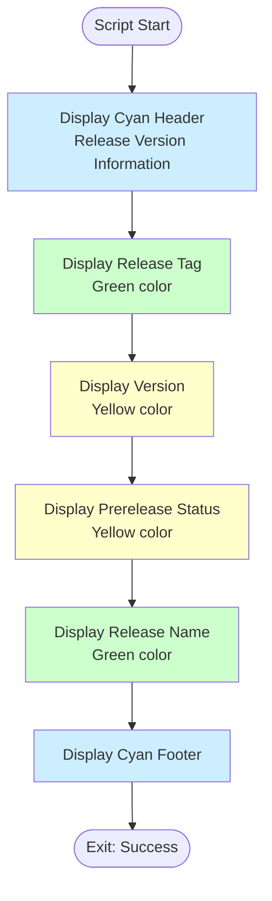

# Show Version Info Script

## Overview

This simple script displays release version information in a formatted, visually appealing way for workflow logs.

## Script Location

`.github/workflows/powershell/Show-VersionInfo.ps1`

## Purpose

Outputs formatted version information including release tag, version number, prerelease status, and release name for easy visibility in workflow logs.

## When It's Used

- **Release Workflow**: Immediately after version extraction to display version info

## Parameters

| Parameter | Type | Required | Description |
|-----------|------|----------|-------------|
| `ReleaseTag` | string | Yes | The GitHub release tag |
| `Version` | string | Yes | The extracted version number |
| `IsPrerelease` | string | Yes | Boolean string indicating if this is a prerelease |
| `ReleaseName` | string | Yes | The name of the GitHub release |

## How It Works



## What It Does

Displays formatted version information with color coding for easy reading in workflow logs.

## Output

### Console Output

```
================================================
Release Version Information
================================================
Release Tag: v7.0.0
Version: 7.0.0
Prerelease: false
Release Name: Version 7.0.0
================================================
```

## Usage Examples

### Example 1: Stable Release

```powershell
.\Show-VersionInfo.ps1 `
  -ReleaseTag "v7.0.0" `
  -Version "7.0.0" `
  -IsPrerelease "false" `
  -ReleaseName "Version 7.0.0"
```

### Example 2: Prerelease

```powershell
.\Show-VersionInfo.ps1 `
  -ReleaseTag "v7.0.0-rc.1" `
  -Version "7.0.0-rc.1" `
  -IsPrerelease "true" `
  -ReleaseName "Version 7.0.0 RC1"
```

### Example 3: In Workflow

```yaml
- name: Display version info
  shell: pwsh
  run: |
    ./.github/workflows/powershell/Show-VersionInfo.ps1 `
      -ReleaseTag "${{ github.event.release.tag_name }}" `
      -Version "${{ steps.version.outputs.version }}" `
      -IsPrerelease "${{ steps.version.outputs.is_prerelease }}" `
      -ReleaseName "${{ github.event.release.name }}"
```

## Related Documentation

- [workflow-versioning-releases.md](workflow-versioning-releases.md) - Parent workflow
- [script-extract-release-version.md](script-extract-release-version.md) - Previous step

## Notes

- **Informational only** - no actions taken
- **Color-coded output** for readability
- **Always succeeds** (no error conditions)
- Helps **workflow runners** quickly see release info
