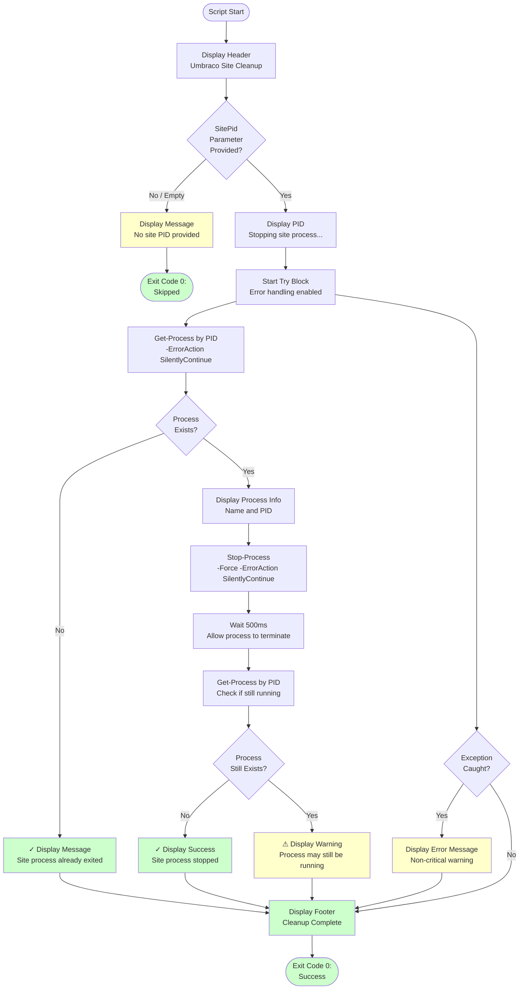

# Stop-UmbracoSite.ps1 Documentation

PowerShell script that gracefully stops a running Umbraco site process by its Process ID (PID), ensuring proper cleanup after security scanning or testing operations.

## Synopsis

```powershell
Stop-UmbracoSite.ps1
    [-SitePid <String>]
```

## Description

This script gracefully stops an Umbraco site process that was started in the background for testing or security scanning. It checks if the process exists and is still running before attempting to stop it, handles cases where the process has already exited, and provides clear feedback about the cleanup operation.

The script is specifically designed for CI/CD workflows as a cleanup step to ensure proper resource management after workflow operations complete.

## Location

`.github/workflows/powershell/Stop-UmbracoSite.ps1`

## Parameters

### -SitePid

**Type**: String
**Required**: No (Optional)
**Description**: The Process ID of the Umbraco site to stop. If not provided or empty, the script exits gracefully without attempting to stop any process.

**Examples**:
```powershell
-SitePid "12345"
-SitePid "${{ steps.setup-site.outputs.site_pid }}"
```

## Examples

### Example 1: Stop Site with PID

```powershell
./Stop-UmbracoSite.ps1 -SitePid 12345
```

**Output**:
```
==================================================
Umbraco Site Cleanup - Stop Process
==================================================

Stopping site process (PID: 12345)...

Process found: dotnet (PID: 12345)
Stopping process...
✓ Site process stopped successfully

==================================================
Cleanup Complete
==================================================
```

### Example 2: No PID Provided

```powershell
./Stop-UmbracoSite.ps1
```

**Output**:
```
==================================================
Umbraco Site Cleanup - Stop Process
==================================================

No site PID provided, skipping cleanup
```

### Example 3: Process Already Exited

```powershell
./Stop-UmbracoSite.ps1 -SitePid 99999
```

**Output**:
```
==================================================
Umbraco Site Cleanup - Stop Process
==================================================

Stopping site process (PID: 99999)...

✓ Site process already exited
```

### Example 4: GitHub Actions Usage

```yaml
- name: Cleanup - Stop Umbraco Site
  if: always()
  shell: pwsh
  run: |
    ./.github/workflows/powershell/Stop-UmbracoSite.ps1 -SitePid "${{ steps.setup-site.outputs.site_pid }}"
```

**Note**: The `if: always()` condition ensures cleanup runs even if previous steps fail.

## Process Flow



## Output

The script provides detailed, color-coded console output:

### Successful Stop

```
==================================================
Umbraco Site Cleanup - Stop Process
==================================================

Stopping site process (PID: 12345)...

Process found: dotnet (PID: 12345)
Stopping process...
✓ Site process stopped successfully

==================================================
Cleanup Complete
==================================================
```

### Process Already Exited

```
==================================================
Umbraco Site Cleanup - Stop Process
==================================================

Stopping site process (PID: 12345)...

✓ Site process already exited

==================================================
Cleanup Complete
==================================================
```

### No PID Provided

```
==================================================
Umbraco Site Cleanup - Stop Process
==================================================

No site PID provided, skipping cleanup
```

### Error Handling

```
==================================================
Umbraco Site Cleanup - Stop Process
==================================================

Stopping site process (PID: 12345)...

Error stopping process: Access denied
This is usually not critical - the process may have already exited

==================================================
Cleanup Complete
==================================================
```

## Key Features

### 1. Graceful Handling of Missing PID

Safely handles cases where no PID is provided:

```powershell
if (-not $SitePid) {
    Write-Host "No site PID provided, skipping cleanup" -ForegroundColor Yellow
    exit 0
}
```

### 2. Process Existence Check

Verifies process exists before attempting to stop:

```powershell
$process = Get-Process -Id $SitePid -ErrorAction SilentlyContinue

if ($process) {
    # Process exists, safe to stop
} else {
    # Process already exited
}
```

### 3. Force Stop with Error Suppression

Uses `-Force` to ensure process stops, with error suppression:

```powershell
Stop-Process -Id $SitePid -Force -ErrorAction SilentlyContinue
```

This prevents errors from stopping the cleanup workflow.

### 4. Verification After Stop

Confirms the process has actually stopped:

```powershell
Start-Sleep -Milliseconds 500
$stillRunning = Get-Process -Id $SitePid -ErrorAction SilentlyContinue

if (-not $stillRunning) {
    Write-Host "✓ Site process stopped successfully" -ForegroundColor Green
} else {
    Write-Host "⚠ Process may still be running" -ForegroundColor Yellow
}
```

### 5. Comprehensive Error Handling

Catches and logs errors without failing the workflow:

```powershell
try {
    # Stop process operations
}
catch {
    Write-Host "Error stopping process: $($_.Exception.Message)" -ForegroundColor Yellow
    Write-Host "This is usually not critical - the process may have already exited" -ForegroundColor Gray
}
```

### 6. Color-Coded Output

Uses color coding for better visibility:
- **Cyan**: Headers and informational messages
- **Yellow**: Warnings and non-critical messages
- **Green**: Success messages
- **Gray**: Additional context

## Exit Codes

| Code | Meaning |
|------|---------|
| 0 | Always exits with code 0 (success) regardless of outcome |

**Note**: The script always exits successfully to prevent failing the workflow during cleanup. This is by design - cleanup failures should not prevent workflow completion.

## Workflow Integration

The script is designed to integrate with workflows as a cleanup step:

### Step 1: Start Site

```yaml
- name: Setup Clean Template Site for ZAP Testing
  id: setup-site
  shell: pwsh
  run: |
    ./.github/workflows/powershell/Test-LatestWithZap.ps1 @params
```

### Step 2: Run Security Scan

```yaml
- name: Run OWASP ZAP Full Scan
  uses: zaproxy/action-full-scan@v0.13.0
  with:
    target: ${{ steps.setup-site.outputs.site_url }}
```

### Step 3: Upload Artifacts

```yaml
- name: Upload ZAP Scan Report (HTML)
  if: always()
  uses: actions/upload-artifact@v4
  with:
    name: zap-scan-report-html
    path: report_html.html
```

### Step 4: Cleanup (This Script)

```yaml
- name: Cleanup - Stop Umbraco Site
  if: always()
  shell: pwsh
  run: |
    ./.github/workflows/powershell/Stop-UmbracoSite.ps1 -SitePid "${{ steps.setup-site.outputs.site_pid }}"
```

**Important**: Always use `if: always()` to ensure cleanup runs even if previous steps fail.

## Timing Considerations

The script includes a 500ms wait after stopping the process:

```powershell
Start-Sleep -Milliseconds 500
```

This brief wait allows the operating system to fully terminate the process before verification. For most processes, this is sufficient. If you encounter processes that need more time to terminate gracefully, you can increase this value.

## Process Ownership

The script can stop processes started:
- By the same user (common in CI/CD)
- In the current session
- With appropriate permissions

On GitHub Actions runners, the workflow has sufficient permissions to stop processes it started.

## Troubleshooting

### Process Won't Stop

**Observation**: Script reports "Process may still be running"

**Causes**:
- Process is hung or unresponsive
- Process has child processes
- Insufficient permissions
- Process is in critical section

**Solution**:
1. Increase wait time after Stop-Process
2. Check for child processes
3. On Windows: Use `taskkill /F /PID <pid>` as alternative
4. On Linux: Use `kill -9 <pid>` as alternative

### Access Denied Error

**Error**: "Error stopping process: Access denied"

**Causes**:
- Process owned by different user
- Elevated privileges required
- Process protected by OS

**Solution**:
- Verify the process was started by the same workflow
- On Windows: Run with elevated privileges if needed
- Check workflow permissions

### PID Not Available

**Observation**: Script says "No site PID provided"

**Causes**:
- Setup step didn't export PID
- Setup step failed
- PID output not properly saved

**Solution**:
```yaml
# Verify PID is being output
- name: Debug PID
  if: always()
  run: echo "Site PID: ${{ steps.setup-site.outputs.site_pid }}"

- name: Cleanup - Stop Umbraco Site
  if: always()
  shell: pwsh
  run: |
    ./.github/workflows/powershell/Stop-UmbracoSite.ps1 -SitePid "${{ steps.setup-site.outputs.site_pid }}"
```

### Process Already Exited Before Cleanup

**Observation**: Script reports "Site process already exited"

**Causes**:
- Process crashed or exited normally
- Process completed its work
- Process was terminated by another step

**Action**:
This is not necessarily an error. Check:
1. Site logs (site.log, site.err) for crash information
2. Whether the process completed its intended work
3. If another step terminated it

## Dependencies

The script requires:

- **PowerShell 7+**: For cross-platform support
- **Get-Process cmdlet**: To query process information
- **Stop-Process cmdlet**: To terminate processes
- **Start-Sleep cmdlet**: For timing control

All dependencies are built into PowerShell.

## Related Documentation

- [workflow-zap-security-scan.md](workflow-zap-security-scan.md) - ZAP workflow documentation
- [script-test-latest-with-zap.md](script-test-latest-with-zap.md) - Site setup script
- [Get-Process documentation](https://learn.microsoft.com/en-us/powershell/module/microsoft.powershell.management/get-process)
- [Stop-Process documentation](https://learn.microsoft.com/en-us/powershell/module/microsoft.powershell.management/stop-process)

## Best Practices

1. **Always run with if: always()**: Ensure cleanup runs even if previous steps fail
2. **Use in cleanup steps**: Place this step after all operations that need the site
3. **Verify PID availability**: Check that setup step properly exports PID
4. **Monitor logs**: Check script output to verify successful cleanup
5. **Don't fail on cleanup errors**: The script is designed to never fail the workflow
6. **Keep timing reasonable**: 500ms wait is sufficient for most scenarios

## Alternative Approaches

If you need different cleanup behavior:

### Kill All Processes by Name

```powershell
# Stop all dotnet processes (more aggressive)
Get-Process -Name "dotnet" -ErrorAction SilentlyContinue | Stop-Process -Force
```

### Stop with Timeout

```powershell
# Try graceful stop first, then force stop
$process = Get-Process -Id $SitePid -ErrorAction SilentlyContinue
if ($process) {
    $process.CloseMainWindow()
    Start-Sleep -Seconds 5
    if (-not $process.HasExited) {
        Stop-Process -Id $SitePid -Force
    }
}
```

### Log Process Tree

```powershell
# Show process tree before stopping
$process = Get-Process -Id $SitePid -ErrorAction SilentlyContinue
if ($process) {
    Get-Process | Where-Object { $_.Parent.Id -eq $SitePid }
    Stop-Process -Id $SitePid -Force
}
```

## Summary

The Stop-UmbracoSite script provides:
- ✅ Graceful process termination
- ✅ Existence verification before stopping
- ✅ Post-stop verification
- ✅ Comprehensive error handling
- ✅ Always succeeds (never fails workflow)
- ✅ Color-coded, informative output
- ✅ Handles edge cases (missing PID, already exited)
- ✅ Works across platforms (Windows, Linux, macOS)

This script is essential for workflows that start sites in the background and need to ensure proper cleanup after operations complete, preventing resource leaks and ensuring clean workflow execution even when errors occur in previous steps.
