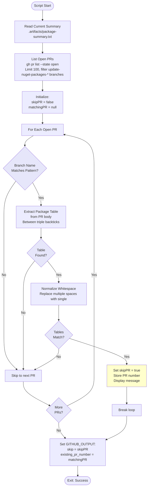

# Test Existing Pull Request Script

## Overview

This script checks for existing pull requests with identical package updates to avoid creating duplicate PRs when the same updates are found.

## Script Location

`.github/workflows/powershell/Test-ExistingPullRequest.ps1`

## Purpose

Prevents duplicate PR creation by comparing the current package update summary with existing open PRs, saving time and reducing noise.

## When It's Used

- **Update Packages Workflow**: After commit/push, before PR creation

## Parameters

| Parameter | Type | Required | Description |
|-----------|------|----------|-------------|
| `WorkspacePath` | string | Yes | The GitHub workspace path |

## How It Works



## What It Does

1. **Current Summary Loading**
   - Reads `.artifacts/package-summary.txt`
   - Contains ASCII table of package updates

2. **PR Discovery**
   - Lists all open PRs using `gh pr list`
   - Filters for branches matching `update-nuget-packages-*`
   - Retrieves PR number, branch name, and body

3. **Table Extraction**
   - Parses PR body for content between triple backticks
   - Extracts package update table from previous runs

4. **Comparison Logic**
   - Normalizes whitespace in both tables
   - Compares current summary with PR table
   - Exact match = duplicate PR

5. **Output Variables**
   - `skip`: Boolean indicating if PR creation should be skipped
   - `existing_pr_number`: Number of matching PR (if found)

## Output

### Console Output

**Duplicate PR Found**:
```
Found existing PR #123 with identical package updates. Skipping PR creation.
```

**No Duplicate Found**:
(No output - silent success)

### GitHub Actions Output

**Duplicate Found**:
```
skip=true
existing_pr_number=123
```

**No Duplicate**:
```
skip=false
existing_pr_number=
```

## Usage Examples

### Example 1: Basic Usage

```powershell
# Set up GitHub CLI authentication first
$env:GITHUB_TOKEN = "ghp_abc123..."
gh auth login --with-token

.\Test-ExistingPullRequest.ps1 -WorkspacePath "C:\Projects\Clean"
```

### Example 2: In Workflow

```yaml
- name: Check for existing similar PRs
  id: check-existing-pr
  if: ${{ github.event.inputs.dryRun != 'true' && steps.check-changes.outputs.has_changes == 'true' }}
  shell: pwsh
  env:
    GITHUB_TOKEN: ${{ secrets.PAT_TOKEN }}
  run: |
    echo $env:GITHUB_TOKEN | gh auth login --with-token
    ./.github/workflows/powershell/Test-ExistingPullRequest.ps1 `
      -WorkspacePath "${{ github.workspace }}"

- name: Create Pull Request
  if: ${{ steps.check-existing-pr.outputs.skip != 'true' }}
  # ... PR creation
```

## Implementation Details

### GitHub CLI Command

**List open PRs**:
```powershell
$existingPRs = gh pr list --state open --json number,headRefName,body --limit 100 | ConvertFrom-Json
```

**Output format**:
```json
[
  {
    "number": 123,
    "headRefName": "update-nuget-packages-20251126120000",
    "body": "This PR updates...\n```\n{package table}\n```"
  }
]
```

### Branch Pattern Matching

**Pattern**:
```powershell
if ($pr.headRefName -like "update-nuget-packages-*") {
    # Process this PR
}
```

**Matches**:
- ✅ `update-nuget-packages-20251126120000`
- ✅ `update-nuget-packages-20251125080000`
- ❌ `feature/new-updates`
- ❌ `update-packages-20251126120000`

### Table Extraction

**Regex pattern**:
```powershell
if ($prBody -match '(?s)```(.+?)```') {
    $prPackages = $matches[1].Trim()
}
```

**Explanation**:
- `(?s)`: Dot matches newlines (single-line mode)
- ` ``` `: Matches triple backticks
- `(.+?)`: Captures content (non-greedy)
- ` ``` `: Matches closing triple backticks

### Whitespace Normalization

**Purpose**: Ignore formatting differences

**Implementation**:
```powershell
$currentNormalized = $currentSummary.Trim() -replace '\s+', ' '
$prNormalized = $prPackages -replace '\s+', ' '
```

**Effect**:
```
Before: "Clean.csproj    Umbraco.Cms    13.5.1"
After:  "Clean.csproj Umbraco.Cms 13.5.1"
```

### Comparison

**Exact match check**:
```powershell
if ($currentNormalized -eq $prNormalized) {
    $skipPR = $true
    $matchingPR = $pr.number
    break
}
```

## Authentication

### GitHub Token

**Required for**:
- `gh pr list` command
- Access to private repositories

**Set via**:
```powershell
$env:GITHUB_TOKEN = "..."
gh auth login --with-token
```

**Or in workflow**:
```yaml
env:
  GITHUB_TOKEN: ${{ secrets.PAT_TOKEN }}
```

## Troubleshooting

### Issue: gh Command Not Found

**Symptoms**:
```
The term 'gh' is not recognized...
```

**Cause**:
- GitHub CLI not installed

**Solution**:
Workflow includes installation step:
```yaml
- name: Install GitHub CLI
  run: choco install gh -y
```

### Issue: Authentication Error

**Symptoms**:
```
gh: To use GitHub CLI, please authenticate...
```

**Cause**:
- GITHUB_TOKEN not set
- Token expired or invalid

**Solution**:
```powershell
echo $env:GITHUB_TOKEN | gh auth login --with-token
```

### Issue: Always Skipping PR

**Symptoms**:
```
skip=true
```
Every time, even when packages differ.

**Possible Causes**:
1. Table extraction failing
2. Whitespace normalization too aggressive
3. Pattern match incorrect

**Solution**:
- Check PR body format
- Verify triple backticks exist
- Review regex pattern

### Issue: Never Skipping PR

**Symptoms**:
Duplicate PRs created with identical changes.

**Possible Causes**:
1. Table format differs
2. Normalization not working
3. Branch pattern not matching

**Solution**:
- Ensure PR body has triple backticks
- Check branch naming consistency
- Review comparison logic

## Conditional Workflow Steps

**Skip PR creation when duplicate found**:
```yaml
- name: Create Pull Request
  if: ${{ steps.check-existing-pr.outputs.skip != 'true' }}
  # ... create PR

- name: Summary - PR Skipped
  if: ${{ steps.check-existing-pr.outputs.skip == 'true' }}
  # ... show skip message
```

## Performance Considerations

**PR Limit**:
- Queries up to 100 open PRs
- Should be sufficient for most repositories
- Increase if needed with `--limit`

**API Calls**:
- Single `gh pr list` call
- Efficient JSON output
- No per-PR API calls

## Related Documentation

- [workflow-update-nuget-packages.md](workflow-update-nuget-packages.md) - Parent workflow
- [script-get-package-summary.md](script-get-package-summary.md) - Summary generation
- [script-new-package-update-pull-request.md](script-new-package-update-pull-request.md) - PR creation
- [script-show-pull-request-skipped-summary.md](script-show-pull-request-skipped-summary.md) - Skip message

## Notes

- Prevents **duplicate PRs** with same package updates
- Uses **GitHub CLI** for PR querying
- **Normalizes whitespace** for reliable comparison
- Outputs **existing PR number** for reference
- **Breaks early** when match found (performance)
- Requires **GITHUB_TOKEN** for authentication
- Checks **up to 100 open PRs** by default
- **Skips PR creation** via workflow conditional
