# Test-LatestNuGetPackages.ps1 Documentation

PowerShell script that tests the Clean package against Umbraco CMS by creating a fresh project, installing packages from various sources, and running automated browser tests.

## Synopsis

```powershell
Test-LatestNuGetPackages.ps1
    -WorkspacePath <String>
    [-PackageSource <String>]
    [-UmbracoTemplateSource <String>]
    [-UmbracoVersion <String>]
    [-CleanVersion <String>]
```

## Description

This script orchestrates comprehensive integration testing of the Clean package with Umbraco CMS. It supports flexible version selection and multiple package sources (NuGet, GitHub Packages, MyGet), automatically sets up a complete Umbraco environment, and validates functionality using Playwright browser automation.

The script handles:
- Version detection from multiple sources
- Umbraco project creation and configuration
- Package installation with authentication
- Site startup and health monitoring
- Browser-based functional testing
- Screenshot capture for verification

## Location

`.github/workflows/powershell/Test-LatestNuGetPackages.ps1`

## Parameters

### -WorkspacePath

**Type**: String
**Required**: Yes
**Description**: The GitHub workspace root path where test directories will be created.

**Example**:
```powershell
-WorkspacePath "${{ github.workspace }}"
-WorkspacePath "C:\Projects\Clean"
```

### -PackageSource

**Type**: String
**Required**: No
**Default**: `nuget`
**Valid Values**: `nuget`, `github-packages`
**Description**: Source to download the Clean package from.

**Examples**:
```powershell
-PackageSource "nuget"           # Official NuGet.org releases
-PackageSource "github-packages" # CI builds from GitHub Packages
```

### -UmbracoTemplateSource

**Type**: String
**Required**: No
**Default**: `nuget`
**Valid Values**: `nuget`, `nightly-feed`
**Description**: Source to download Umbraco templates and packages from.

**Examples**:
```powershell
-UmbracoTemplateSource "nuget"        # Stable releases
-UmbracoTemplateSource "nightly-feed" # Pre-releases from MyGet
```

### -UmbracoVersion

**Type**: String
**Required**: No
**Default**: Empty (auto-detect latest)
**Description**: Specific Umbraco version to test. If not provided, fetches latest from selected source.

**Examples**:
```powershell
-UmbracoVersion "15.0.0"      # Stable release
-UmbracoVersion "16.0.0-rc2"  # Release candidate
-UmbracoVersion ""            # Auto-detect latest
```

### -CleanVersion

**Type**: String
**Required**: No
**Default**: Empty (auto-detect latest)
**Description**: Specific Clean package version to test. If not provided, fetches latest from selected source.

**Examples**:
```powershell
-CleanVersion "7.0.0"         # Stable release
-CleanVersion "7.0.1-ci.42"   # CI build
-CleanVersion ""              # Auto-detect latest
```

## Environment Variables

The script uses the following environment variables:

### GITHUB_TOKEN

**Required**: When using `github-packages` source
**Description**: GitHub authentication token with `packages:read` permission.

**Example**:
```powershell
$env:GITHUB_TOKEN = ${{ secrets.GITHUB_TOKEN }}
```

### GITHUB_REPOSITORY

**Optional**: Auto-detected in GitHub Actions
**Description**: Repository in format `owner/repo`, used to determine package owner.

**Example**:
```powershell
$env:GITHUB_REPOSITORY = "prjseal/Clean"
```

### GITHUB_OUTPUT

**Optional**: Auto-provided in GitHub Actions
**Description**: File path for workflow outputs (umbraco_version, clean_version).

## Examples

### Example 1: Test Latest Stable Versions

```powershell
./Test-LatestNuGetPackages.ps1 -WorkspacePath "C:\workspace"
```

**Result**: Fetches latest stable Umbraco and Clean from NuGet.org

### Example 2: Test with Specific Versions

```powershell
./Test-LatestNuGetPackages.ps1 `
  -WorkspacePath "C:\workspace" `
  -UmbracoVersion "15.0.0" `
  -CleanVersion "7.0.0"
```

**Result**: Tests exact version combination

### Example 3: Test CI Build from GitHub Packages

```powershell
$env:GITHUB_TOKEN = "ghp_your_token"

./Test-LatestNuGetPackages.ps1 `
  -WorkspacePath "C:\workspace" `
  -PackageSource "github-packages" `
  -CleanVersion "7.0.1-ci.42"
```

**Result**: Tests specific CI build against latest stable Umbraco

### Example 4: Test with Umbraco Pre-Release

```powershell
./Test-LatestNuGetPackages.ps1 `
  -WorkspacePath "C:\workspace" `
  -UmbracoTemplateSource "nightly-feed" `
  -UmbracoVersion "16.0.0-rc2"
```

**Result**: Tests Clean with upcoming Umbraco release

### Example 5: Complete GitHub Packages Test

```powershell
$env:GITHUB_TOKEN = ${{ secrets.GITHUB_TOKEN }}
$env:GITHUB_REPOSITORY = "prjseal/Clean"

./Test-LatestNuGetPackages.ps1 `
  -WorkspacePath "${{ github.workspace }}" `
  -PackageSource "github-packages" `
  -UmbracoTemplateSource "nightly-feed"
```

**Result**: Tests latest Clean CI build with latest Umbraco nightly

## Process Flow

```mermaid
flowchart TD
    Start([Script Start]) --> ParseParams[Parse Parameters<br/>Set defaults]

    ParseParams --> DisplayConfig[Display Configuration<br/>- Package source<br/>- Template source]

    DisplayConfig --> GetUmbraco{Umbraco Version<br/>Provided?}

    GetUmbraco -->|No| DetectUmbracoSource{Template<br/>Source?}
    DetectUmbracoSource -->|NuGet| FetchUmbracoNuGet[Fetch from NuGet API<br/>Filter stable versions<br/>Select latest]
    DetectUmbracoSource -->|Nightly Feed| FetchUmbracoNightly[Fetch from MyGet API<br/>Include pre-releases<br/>Select latest]

    GetUmbraco -->|Yes| UseUmbraco[Use Provided Version]

    FetchUmbracoNuGet --> GetClean
    FetchUmbracoNightly --> GetClean
    UseUmbraco --> GetClean

    GetClean{Clean Version<br/>Provided?}

    GetClean -->|No| DetectCleanSource{Package<br/>Source?}
    DetectCleanSource -->|NuGet| FetchCleanNuGet[Fetch from NuGet API<br/>Filter stable versions<br/>Select latest]
    DetectCleanSource -->|GitHub Packages| FetchCleanGH[Fetch from GitHub Packages API<br/>Authenticate with token<br/>Prefer stable, fallback to latest]

    GetClean -->|Yes| UseClean[Use Provided Version]

    FetchCleanNuGet --> SetOutputs
    FetchCleanGH --> SetOutputs
    UseClean --> SetOutputs

    SetOutputs[Save Versions to GITHUB_OUTPUT<br/>For workflow artifact naming]

    SetOutputs --> CreateDir[Create Test Directory<br/>Remove if exists<br/>Set as working directory]

    CreateDir --> InstallTemplateSource{Template<br/>Source?}

    InstallTemplateSource -->|NuGet| InstallTemplatesNuGet[dotnet new install<br/>Umbraco.Templates@version]
    InstallTemplateSource -->|Nightly Feed| InstallTemplatesNightly[dotnet new install<br/>--add-source MyGet URL]

    InstallTemplatesNuGet --> CreateUmbraco
    InstallTemplatesNightly --> CreateUmbraco

    CreateUmbraco[Create Umbraco Project<br/>- dotnet new sln<br/>- dotnet new umbraco<br/>- SQLite database<br/>- Admin credentials]

    CreateUmbraco --> ConfigureSource{Package<br/>Source?}

    ConfigureSource -->|NuGet| InstallCleanNuGet[Install Clean Package<br/>dotnet add package]
    ConfigureSource -->|GitHub Packages| ConfigureGH[Configure GitHub Packages<br/>- Extract repository owner<br/>- Add authenticated source<br/>- Store credentials]

    ConfigureGH --> InstallCleanGH[Install Clean Package<br/>dotnet add package --source URL]

    InstallCleanNuGet --> StartSite
    InstallCleanGH --> StartSite

    StartSite[Start Umbraco Site<br/>- Start-Process dotnet run<br/>- Redirect output to logs<br/>- Monitor for 180s]

    StartSite --> WaitLoop{Site<br/>Listening?}

    WaitLoop -->|Timeout| ShowTimeout[Output Logs<br/>Display error/output files]
    ShowTimeout --> End1([Exit Code 1:<br/>Site Failed])

    WaitLoop -->|Process Exited| ShowExit[Output Logs<br/>Display exit code]
    ShowExit --> End2([Exit Code 1:<br/>Process Died])

    WaitLoop -->|Yes - Found URL| WaitBuffer[Wait 5 Seconds<br/>Ensure fully ready]

    WaitBuffer --> VerifyProcess{Process<br/>Still Running?}

    VerifyProcess -->|No| ShowPostExit[Output Logs<br/>Process exited after detection]
    ShowPostExit --> End3([Exit Code 1:<br/>Premature Exit])

    VerifyProcess -->|Yes| InstallPlaywright[Install Playwright<br/>- npm init -y<br/>- npm install playwright<br/>- npx playwright install chromium]

    InstallPlaywright --> CreateScript[Create Playwright Test<br/>Call Write-PlaywrightTestScript.ps1]

    CreateScript --> RunPlaywright[Run Playwright Tests<br/>- Set SITE_URL environment<br/>- node test.js<br/>- Capture exit code]

    RunPlaywright --> StopSite[Stop Umbraco Site<br/>Stop-Process gracefully]

    StopSite --> CheckResult{Playwright<br/>Exit Code?}

    CheckResult -->|Non-Zero| ShowTestFail[Display Error<br/>Show exit code]
    ShowTestFail --> End4([Exit With<br/>Playwright Code])

    CheckResult -->|Zero| ShowSuccess[Display Success Summary<br/>- Umbraco version<br/>- Clean version<br/>- Test complete]

    ShowSuccess --> End5([Exit Code 0:<br/>Success])

    style ShowTimeout fill:#ffcccc
    style ShowExit fill:#ffcccc
    style ShowPostExit fill:#ffcccc
    style ShowTestFail fill:#ffcccc
    style End1 fill:#ffcccc
    style End2 fill:#ffcccc
    style End3 fill:#ffcccc
    style End4 fill:#ffcccc
    style ShowSuccess fill:#ccffcc
    style End5 fill:#ccffcc
```



## Output

The script produces detailed console output:

### Header
```
================================================
Testing NuGet Packages
================================================
Clean Package Source: NuGet.org
Umbraco Template Source: NuGet.org
```

### Version Detection
```
Fetching latest Umbraco.Cms version from NuGet...
Latest Umbraco version: 15.0.0

Fetching latest Clean package version from NuGet...
Latest Clean version: 7.0.0
```

### Project Creation
```
Installing Umbraco templates version 15.0.0...
Creating test Umbraco project...
Umbraco project created successfully
```

### Package Installation
```
Installing Clean package version 7.0.0 from NuGet...
Clean package installed successfully
```

### Site Startup
```
Starting Umbraco site...
Site process started with PID: 12345
Waiting for site to start (timeout: 180s)...
Site is running at: https://localhost:44359
Waiting additional 5 seconds for site to be fully ready...
Site process is still running (PID: 12345)
```

### Playwright Testing
```
Installing Playwright...
Installing Playwright browsers...
Creating Playwright test script...
Running Playwright tests...
Testing site at: https://localhost:44359
Navigating to home page...
Screenshot saved: 01-home.png
Found 5 internal links to test
Navigating to: https://localhost:44359/about
Screenshot saved: 02-about.png
...
Testing complete!
```

### Completion
```
Stopping site process...
Site process stopped

================================================
NuGet Package Testing Complete
Umbraco Version: 15.0.0
Clean Package Version: 7.0.0
================================================
```

## Key Features

### 1. Multi-Source Version Detection

Automatically fetches latest versions from different sources:

```powershell
# NuGet: Stable versions only
$versions = Invoke-RestMethod -Uri "https://api.nuget.org/v3-flatcontainer/clean/index.json"
$latest = $versions | Where-Object { $_ -notmatch '-' } | Select-Object -Last 1

# MyGet: Include pre-releases
$versions = Invoke-RestMethod -Uri "$nightlyFeedUrl/umbraco.cms/index.json"
$latest = $versions | Select-Object -Last 1

# GitHub Packages: With authentication, prefer stable
$versions = Invoke-RestMethod -Uri $url -Headers @{ Authorization = "Bearer $token" }
$stable = $versions | Where-Object { $_ -notmatch '-' } | Select-Object -Last 1
```

### 2. GitHub Packages Authentication

Securely configures GitHub Packages with credentials:

```powershell
# Configure authenticated source
dotnet nuget add source $ghPackagesUrl `
  --name "GitHubPackages" `
  --username "github" `
  --password "$env:GITHUB_TOKEN" `
  --store-password-in-clear-text

# Install using full URL to avoid path issues
dotnet add package Clean --version $version --source $ghPackagesUrl
```

### 3. Site Startup Monitoring

Monitors site startup with timeout and health checks:

```powershell
# Wait for site to start (max 180 seconds)
while (-not $siteStarted) {
    # Check timeout
    if ((Get-Date) - $startTime -gt (New-TimeSpan -Seconds 180)) {
        # Output logs and exit
    }

    # Check if process exited prematurely
    if ($process.HasExited) {
        # Output logs and exit
    }

    # Look for "Now listening on:" in logs
    if ($logContent -match "Now listening on:\s*(https://[^\s]+)") {
        $siteUrl = $matches[1]
        $siteStarted = $true
    }

    Start-Sleep -Seconds 2
}
```

### 4. Process Lifecycle Management

Ensures proper cleanup of site process:

```powershell
# Start process in background
$process = Start-Process -FilePath "dotnet" `
    -ArgumentList "run --project TestLatestProject" `
    -RedirectStandardOutput $logFile `
    -RedirectStandardError $errFile `
    -NoNewWindow `
    -PassThru

# ... run tests ...

# Always stop process, even if tests fail
if (-not $process.HasExited) {
    Stop-Process -Id $process.Id -Force
}
```

## API Endpoints Used

### NuGet.org Package Index
**Method**: GET
**URL**: `https://api.nuget.org/v3-flatcontainer/{package}/index.json`
**Response**: JSON array of version strings

### MyGet Nightly Feed
**Method**: GET
**URL**: `https://www.myget.org/f/umbracoprereleases/api/v3/index.json`
**Response**: NuGet v3 service index

### GitHub Packages
**Method**: GET
**URL**: `https://nuget.pkg.github.com/{owner}/index.json`
**Headers**: `Authorization: Bearer {token}`
**Response**: NuGet v3 service index

## Exit Codes

| Code | Meaning |
|------|---------|
| 0 | Success - All tests passed |
| 1 | Error - Site failed to start, process exited, or version detection failed |
| {N} | Playwright test exit code (passed through from node test.js) |

## Output Files

The script creates the following in the test directory:

| File/Directory | Description |
|----------------|-------------|
| `test-latest/` | Test workspace directory |
| `test-latest/site.log` | Umbraco site standard output |
| `test-latest/site.err` | Umbraco site error output |
| `test-latest/test.js` | Generated Playwright test script |
| `test-latest/screenshots/` | Browser test screenshots |
| `test-latest/TestLatestProject/` | Umbraco project directory |

## Troubleshooting

### Version Detection Failed

**Error**: "Could not determine latest version from [source]"

**Causes**:
- API endpoint unreachable
- Invalid response format
- Network connectivity issues

**Solution**:
- Specify exact version using `-UmbracoVersion` or `-CleanVersion`
- Verify internet connectivity
- Check if source URL is accessible

### GitHub Packages 404 Error

**Error**: "Error fetching from GitHub Packages: 404 (Not Found)"

**Causes**:
- Package not published to GitHub Packages yet
- Invalid repository owner
- Missing package name

**Solution**:
- Verify package exists in GitHub Packages UI
- Check `GITHUB_REPOSITORY` environment variable
- Ensure package has been published

### Site Startup Timeout

**Error**: "Timeout reached! Site failed to start."

**Causes**:
- Package compatibility issues
- Database initialization failure
- Missing dependencies
- Port conflict

**Solution**:
1. Review `site.log` and `site.err` files
2. Test versions locally
3. Check system resources
4. Verify package compatibility

### Playwright Installation Failed

**Error**: npm install errors

**Causes**:
- Network issues
- npm registry unavailable
- Disk space

**Solution**:
- Check network connectivity
- Verify disk space available
- Try running locally to isolate issue

## Dependencies

The script requires the following to be pre-installed:

- **.NET 10 SDK**: For Umbraco project creation and package management
- **Node.js 20+**: For Playwright installation
- **npm**: For Playwright package installation
- **PowerShell 7+**: For script execution

## Related Documentation

- [workflow-test-umbraco-latest.md](workflow-test-umbraco-latest.md) - Workflow documentation
- [script-write-playwright-test-script.md](script-write-playwright-test-script.md) - Playwright test generator
- [GitHub Packages Documentation](https://docs.github.com/en/packages)
- [MyGet Umbraco Feed](https://www.myget.org/feed/umbracoprereleases/package/nuget/Umbraco.Cms)

## Best Practices

1. **Use latest by default**: Let script auto-detect unless debugging specific versions
2. **Specify versions for debugging**: Pin versions when reproducing issues
3. **Test before releases**: Run with specific versions before publishing
4. **Monitor logs**: Check site.log and site.err for detailed diagnostics
5. **Clean workspace**: Script automatically removes old test directory
6. **Verify screenshots**: Visual verification helps identify rendering issues

## Version History

- **v1.0**: Initial version with NuGet support
- **v2.0**: Added GitHub Packages support
- **v3.0**: Added MyGet nightly feed support
- **v4.0**: Added process lifecycle improvements and better error handling
