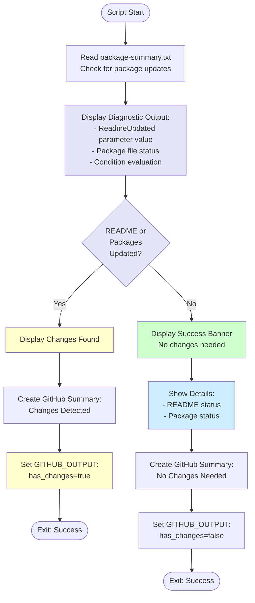

# Test Workflow Changes Script

## Overview

This script checks if any changes were made by the workflow (README updates or package updates) and determines whether to proceed with creating a pull request.

## Script Location

`.github/workflows/powershell/Test-WorkflowChanges.ps1`

## Purpose

Prevents unnecessary PR creation when no updates are found, providing a clear summary when the repository is already up-to-date. Uses string comparison directly for reliable change detection and includes comprehensive diagnostic logging for troubleshooting.

## When It's Used

- **Update Packages Workflow**: After package updates complete successfully, before commit step

## Parameters

| Parameter | Type | Required | Description |
|-----------|------|----------|-------------|
| `ReadmeUpdated` | string | Yes | Boolean string ("true"/"false") indicating if README was updated |
| `WorkspacePath` | string | Yes | The GitHub workspace path |
| `EnvVersions` | string | Yes | Environment variable versions for display purposes |

## How It Works



## What It Does

1. **Diagnostic Output**
   - Displays ReadmeUpdated input parameter value (string)
   - Shows package summary file existence check
   - Logs condition evaluation step-by-step
   - Shows variable types for debugging

2. **README Check (String Comparison)**
   - **Critical**: Uses string comparison directly: `$ReadmeUpdated -ne 'true'`
   - **No boolean conversion** to avoid PowerShell type issues
   - Displays status clearly in logs

3. **Package Check**
   - Reads `.artifacts/package-summary.txt`
   - Checks if content contains "No packages to update"
   - Sets `packagesUpdated` boolean flag (works correctly for packages)

4. **Decision Logic**
   - Combines string comparison with boolean check: `($ReadmeUpdated -ne 'true') -and (-not $packagesUpdated)`
   - If both false: Display "No Changes" summary and create GitHub Action summary
   - If either true: Display "Changes Found" and create GitHub Action summary with details
   - Shows which branch (no changes vs changes detected) is being entered

5. **Output Variables**
   - Sets `has_changes` GitHub Actions output (`true`/`false`)
   - Used by workflow to conditionally run commit/PR steps

6. **GitHub Action Summary**
   - Creates professional summary at workflow level using `$GITHUB_STEP_SUMMARY`
   - Shows status, what changed, and next actions

## Output

### Console Output

**No Changes Needed**:
```
================================================
Checking for Workflow Changes
================================================
ReadmeUpdated input parameter: 'false'
Package summary file found. Packages updated: False

README updated: false (string)
Packages updated: False (boolean)

Condition evaluation:
  ReadmeUpdated -ne 'true' = True
  -not packagesUpdated = True
  Combined: True
================================================

ENTERING: No changes block

================================================
✅ No Changes Needed - Workflow Complete
================================================

📋 Summary:
  • README: Already up-to-date with latest Umbraco 13 version(s)
  • NuGet Packages: All packages are already at their latest versions

No branch created, no commits made, no PR needed.
================================================

Setting has_changes=false
```

**Changes Found**:
```
================================================
Checking for Workflow Changes
================================================
ReadmeUpdated input parameter: 'true'
Package summary file found. Packages updated: False

README updated: true (string)
Packages updated: False (boolean)

Condition evaluation:
  ReadmeUpdated -ne 'true' = False
  -not packagesUpdated = True
  Combined: False
================================================

ENTERING: Changes detected block

Changes detected - will proceed with commit and PR creation
Setting has_changes=true
```

### GitHub Actions Output

**No changes**:
```
has_changes=false
```

**Changes found**:
```
has_changes=true
```

## Usage Examples

### Example 1: No Updates

```powershell
.\Test-WorkflowChanges.ps1 `
  -ReadmeUpdated "false" `
  -WorkspacePath "C:\Projects\Clean" `
  -EnvVersions "13"
```

### Example 2: README Updated

```powershell
.\Test-WorkflowChanges.ps1 `
  -ReadmeUpdated "true" `
  -WorkspacePath "C:\Projects\Clean" `
  -EnvVersions "13"
```

### Example 3: Multiple Versions

```powershell
.\Test-WorkflowChanges.ps1 `
  -ReadmeUpdated "false" `
  -WorkspacePath "C:\Projects\Clean" `
  -EnvVersions "13,17"
```

### Example 4: In Workflow

```yaml
- name: Check if any changes were made
  id: check-changes
  if: success()
  shell: pwsh
  run: |
    ./.github/workflows/powershell/Test-WorkflowChanges.ps1 `
      -ReadmeUpdated "${{ steps.update-readme.outputs.readme_updated }}" `
      -WorkspacePath "${{ github.workspace }}" `
      -EnvVersions "${{ env.UMBRACO_MAJOR_VERSIONS }}"
```

## Implementation Details

### String Comparison Approach (Critical Fix)

**Why String Comparison**:
PowerShell boolean conversion (`$ReadmeUpdated -eq 'true'`) was unreliably producing String types instead of Boolean types, causing the condition `(-not $readmeUpdated -and -not $packagesUpdated)` to fail even when both were false.

**Solution**:
Use string comparison directly without conversion:

```powershell
# Check if README was NOT updated (for no changes condition)
if (($ReadmeUpdated -ne 'true') -and (-not $packagesUpdated)) {
    # No changes detected
}

# Check if README WAS updated (for changes list)
if ($ReadmeUpdated -eq 'true') {
    $changesList += "README updated"
}
```

**Benefits**:
- Reliable: String comparison is predictable
- Debuggable: Diagnostic logs show string vs boolean types
- Consistent: Same pattern used across all scripts

### Package Update Detection

**File path**:
```powershell
$summaryPath = "$WorkspacePath\.artifacts\package-summary.txt"
```

**Check logic**:
```powershell
$packagesUpdated = $false
if (Test-Path $summaryPath) {
    $content = Get-Content $summaryPath -Raw
    $packagesUpdated = $content -notmatch 'No packages to update'
}
```

**Note**: Boolean works correctly for packages because it's created directly from PowerShell operations, not passed as a string parameter.

### Version Display Formatting

**Single version**:
```
Umbraco 13
```

**Multiple versions**:
```
Umbraco 13 and 17
```

### Exit Behavior

- Script **always exits with code 0** (success)
- Workflow continues regardless of changes found
- Subsequent steps use `has_changes` output to decide execution

## Conditional Workflow Steps

Steps that use this output:

```yaml
- name: Commit and push changes
  if: ${{ steps.check-changes.outputs.has_changes == 'true' }}
  # ...

- name: Check for existing similar PRs
  if: ${{ steps.check-changes.outputs.has_changes == 'true' }}
  # ...

- name: Create Pull Request
  if: ${{ steps.check-changes.outputs.has_changes == 'true' }}
  # ...
```

## Troubleshooting

### Issue: Workflow Proceeds When No Changes (FIXED)

**Symptoms**:
- Logs show `README updated: False` and `Packages updated: False`
- But workflow still creates branch and attempts to create PR
- Error: "No commits between main and branch"

**Root Cause** (Historical):
PowerShell boolean conversion was failing. The expression `$ReadmeUpdated -eq 'true'` was producing a String type instead of Boolean, causing `-not $readmeUpdated` to evaluate incorrectly.

**Fix Applied**:
Changed from boolean conversion to direct string comparison:
```powershell
# Before (broken):
$readmeUpdated = $ReadmeUpdated -eq 'true'
if (-not $readmeUpdated -and -not $packagesUpdated)

# After (fixed):
if (($ReadmeUpdated -ne 'true') -and (-not $packagesUpdated))
```

**How to Verify Fix**:
Check diagnostic output in logs - should show:
```
Condition evaluation:
  ReadmeUpdated -ne 'true' = True
  -not packagesUpdated = True
  Combined: True

ENTERING: No changes block
```

### Issue: Always Shows No Changes

**Symptoms**:
```
has_changes=false
```
Even when packages should be updated.

**Possible Causes**:
1. Package summary file not generated
2. UpdateThirdPartyPackages didn't run
3. Dry run mode enabled

**Solution**:
- Check if `.artifacts/package-summary.txt` exists
- Verify UpdateThirdPartyPackages step completed
- Ensure dry run mode is disabled
- Review diagnostic output to see which check is failing

### Issue: Version Display Incorrect

**Symptoms**:
Shows "Umbraco 13 and" instead of proper formatting.

**Cause**:
- Empty version in list
- Trailing comma in EnvVersions

**Solution**:
```yaml
# Wrong
EnvVersions: "13,"

# Correct
EnvVersions: "13"
```

### Issue: Diagnostic Output Shows Type Mismatch

**Symptoms**:
```
README updated: false
  Type: String, Value: 'False'
```

**Meaning**:
This is **expected behavior** with the new string comparison approach. The diagnostic output is designed to show that `ReadmeUpdated` is intentionally kept as a string for reliable comparison.

**Action**:
No action needed - this is the correct behavior after the fix.

## Related Documentation

- [workflow-update-nuget-packages.md](workflow-update-nuget-packages.md) - Parent workflow
- [script-update-readme-versions-multiple.md](script-update-readme-versions-multiple.md) - README updates
- [script-update-third-party-packages.md](script-update-third-party-packages.md) - Package updates

## Notes

- Script is a **decision point** in the workflow
- **Early exit** when no changes prevents unnecessary operations
- Provides **clear feedback** to workflow runners with comprehensive diagnostics
- **Saves resources** by skipping commit/PR steps when not needed
- Output variable used by **conditional steps** in workflow
- **Critical Fix**: Uses string comparison to avoid PowerShell type conversion issues
- **Defensive Programming**: Multiple validation layers with diagnostic logging
- **GitHub Action Summaries**: Provides professional workflow-level status reports
