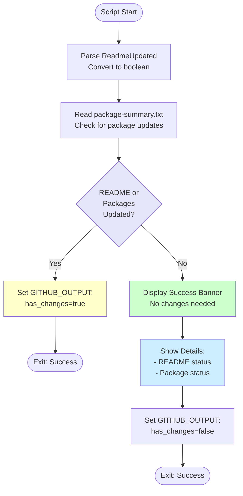

# Test Workflow Changes Script

## Overview

This script checks if any changes were made by the workflow (README updates or package updates) and determines whether to proceed with creating a pull request.

## Script Location

`.github/workflows/powershell/Test-WorkflowChanges.ps1`

## Purpose

Prevents unnecessary PR creation when no updates are found, providing a clear summary when the repository is already up-to-date.

## When It's Used

- **Update Packages Workflow**: After package updates complete successfully, before commit step

## Parameters

| Parameter | Type | Required | Description |
|-----------|------|----------|-------------|
| `ReadmeUpdated` | string | Yes | Boolean string ("true"/"false") indicating if README was updated |
| `WorkspacePath` | string | Yes | The GitHub workspace path |
| `EnvVersions` | string | Yes | Environment variable versions for display purposes |

## How It Works



## What It Does

1. **README Check**
   - Parses `ReadmeUpdated` parameter
   - Converts string to boolean
   - Displays status

2. **Package Check**
   - Reads `.artifacts/package-summary.txt`
   - Checks if content contains "No packages to update"
   - Sets `packagesUpdated` flag

3. **Decision Logic**
   - If both false: Display "No Changes" summary
   - If either true: Set `has_changes=true` for next steps

4. **Output Variable**
   - Sets `has_changes` GitHub Actions output
   - Used by workflow to conditionally run commit/PR steps

## Output

### Console Output

**No Changes Needed**:
```
README updated: false
Packages updated: false

================================================
✅ No Changes Needed - Workflow Complete
================================================

📋 Summary:
  • README: Already up-to-date with latest Umbraco 13 version(s)
  • NuGet Packages: All packages are already at their latest versions

No branch created, no commits made, no PR needed.
================================================
```

**Changes Found**:
```
README updated: true
Packages updated: false
```

### GitHub Actions Output

**No changes**:
```
has_changes=false
```

**Changes found**:
```
has_changes=true
```

## Usage Examples

### Example 1: No Updates

```powershell
.\Test-WorkflowChanges.ps1 `
  -ReadmeUpdated "false" `
  -WorkspacePath "C:\Projects\Clean" `
  -EnvVersions "13"
```

### Example 2: README Updated

```powershell
.\Test-WorkflowChanges.ps1 `
  -ReadmeUpdated "true" `
  -WorkspacePath "C:\Projects\Clean" `
  -EnvVersions "13"
```

### Example 3: Multiple Versions

```powershell
.\Test-WorkflowChanges.ps1 `
  -ReadmeUpdated "false" `
  -WorkspacePath "C:\Projects\Clean" `
  -EnvVersions "13,17"
```

### Example 4: In Workflow

```yaml
- name: Check if any changes were made
  id: check-changes
  if: success()
  shell: pwsh
  run: |
    ./.github/workflows/powershell/Test-WorkflowChanges.ps1 `
      -ReadmeUpdated "${{ steps.update-readme.outputs.readme_updated }}" `
      -WorkspacePath "${{ github.workspace }}" `
      -EnvVersions "${{ env.UMBRACO_MAJOR_VERSIONS }}"
```

## Implementation Details

### Package Update Detection

**File path**:
```powershell
$summaryPath = "$WorkspacePath\.artifacts\package-summary.txt"
```

**Check logic**:
```powershell
if (Test-Path $summaryPath) {
    $content = Get-Content $summaryPath -Raw
    $packagesUpdated = $content -notmatch 'No packages to update'
}
```

### Version Display Formatting

**Single version**:
```
Umbraco 13
```

**Multiple versions**:
```
Umbraco 13 and 17
```

### Exit Behavior

- Script **always exits with code 0** (success)
- Workflow continues regardless of changes found
- Subsequent steps use `has_changes` output to decide execution

## Conditional Workflow Steps

Steps that use this output:

```yaml
- name: Commit and push changes
  if: ${{ steps.check-changes.outputs.has_changes == 'true' }}
  # ...

- name: Check for existing similar PRs
  if: ${{ steps.check-changes.outputs.has_changes == 'true' }}
  # ...

- name: Create Pull Request
  if: ${{ steps.check-changes.outputs.has_changes == 'true' }}
  # ...
```

## Troubleshooting

### Issue: Always Shows No Changes

**Symptoms**:
```
has_changes=false
```
Even when packages should be updated.

**Possible Causes**:
1. Package summary file not generated
2. UpdateThirdPartyPackages didn't run
3. Dry run mode enabled

**Solution**:
- Check if `.artifacts/package-summary.txt` exists
- Verify UpdateThirdPartyPackages step completed
- Ensure dry run mode is disabled

### Issue: Version Display Incorrect

**Symptoms**:
Shows "Umbraco 13 and" instead of proper formatting.

**Cause**:
- Empty version in list
- Trailing comma in EnvVersions

**Solution**:
```yaml
# Wrong
EnvVersions: "13,"

# Correct
EnvVersions: "13"
```

## Related Documentation

- [workflow-update-nuget-packages.md](workflow-update-nuget-packages.md) - Parent workflow
- [script-update-readme-versions-multiple.md](script-update-readme-versions-multiple.md) - README updates
- [script-update-third-party-packages.md](script-update-third-party-packages.md) - Package updates

## Notes

- Script is a **decision point** in the workflow
- **Early exit** when no changes prevents unnecessary operations
- Provides **clear feedback** to workflow runners
- **Saves resources** by skipping commit/PR steps when not needed
- Output variable used by **conditional steps** in workflow
