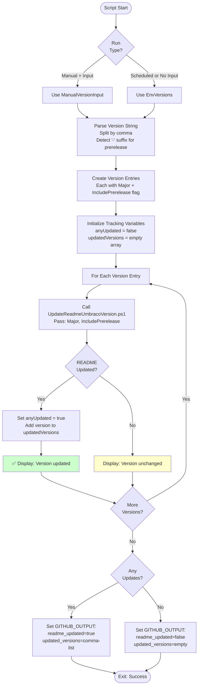

# Update README Versions Multiple Script

## Overview

This script updates README files with the latest Umbraco versions for multiple major versions simultaneously, supporting both stable and prerelease versions.

## Script Location

`.github/workflows/powershell/Update-ReadmeVersionsMultiple.ps1`

## Purpose

Processes multiple Umbraco major versions and updates README files with the latest version information, coordinating with the UpdateReadmeUmbracoVersion.ps1 script for each version.

## When It's Used

- **Update Packages Workflow**: Before updating NuGet packages to ensure README reflects latest Umbraco versions

## Parameters

| Parameter | Type | Required | Default | Description |
|-----------|------|----------|---------|-------------|
| `IsScheduled` | bool | Yes | - | Whether this is a scheduled run vs manual trigger |
| `ManualVersionInput` | string | No | "" | Manual version input (comma-separated, e.g., "13" or "13-,17") |
| `EnvVersions` | string | Yes | - | Environment variable versions (fallback for scheduled runs) |
| `WorkspacePath` | string | Yes | - | The GitHub workspace path |

## How It Works



## What It Does

1. **Version Source Determination**
   - Manual runs with input: Uses `ManualVersionInput` parameter
   - Scheduled runs or manual without input: Uses `EnvVersions` parameter
   - Displays which source is being used

2. **Version Parsing**
   - Splits comma-separated version string
   - Detects `-` suffix to enable prerelease for that version
   - Examples:
     - `"13"` → Major: 13, IncludePrerelease: false
     - `"17-"` → Major: 17, IncludePrerelease: true
     - `"13,17-"` → Two entries with different prerelease settings

3. **Version Processing**
   - Calls UpdateReadmeUmbracoVersion.ps1 for each version
   - Tracks which versions were updated
   - Accumulates results across all versions

4. **Output Generation**
   - Sets GitHub Actions output variables
   - `readme_updated`: true/false
   - `updated_versions`: comma-separated list of updated versions

## Output

### Console Output

**Manual Run with Input**:
```
Manual run - using umbracoVersions input: 13,17-
Processing Umbraco versions: 13, 17

Processing Umbraco version 13 (IncludePrerelease=False)...
✅ Umbraco 13 section updated

Processing Umbraco version 17 (IncludePrerelease=True)...
✅ Umbraco 17 section updated
```

**Scheduled Run**:
```
Scheduled run - using UMBRACO_MAJOR_VERSIONS env variable: 13
Processing Umbraco versions: 13

Processing Umbraco version 13 (IncludePrerelease=True)...
ℹ️  Umbraco 13 section unchanged
```

**No Updates**:
```
Processing Umbraco versions: 13

Processing Umbraco version 13 (IncludePrerelease=False)...
ℹ️  Umbraco 13 section unchanged
```

### GitHub Actions Output

**When Updates Found**:
```
readme_updated=true
updated_versions=13,17
```

**When No Updates**:
```
readme_updated=false
updated_versions=
```

## Usage Examples

### Example 1: Scheduled Run

```powershell
.\Update-ReadmeVersionsMultiple.ps1 `
  -IsScheduled $true `
  -ManualVersionInput "" `
  -EnvVersions "13" `
  -WorkspacePath "${{ github.workspace }}"
```

### Example 2: Manual Run with Versions

```powershell
.\Update-ReadmeVersionsMultiple.ps1 `
  -IsScheduled $false `
  -ManualVersionInput "13,17-" `
  -EnvVersions "13" `
  -WorkspacePath "${{ github.workspace }}"
```

### Example 3: Manual Run without Version Input

```powershell
.\Update-ReadmeVersionsMultiple.ps1 `
  -IsScheduled $false `
  -ManualVersionInput "" `
  -EnvVersions "13" `
  -WorkspacePath "${{ github.workspace }}"
```

### Example 4: In Workflow

```yaml
- name: Update README with latest Umbraco versions
  id: update-readme
  shell: pwsh
  run: |
    $isScheduled = '${{ github.event_name }}' -eq 'schedule'
    ./.github/workflows/powershell/Update-ReadmeVersionsMultiple.ps1 `
      -IsScheduled:$isScheduled `
      -ManualVersionInput '${{ github.event.inputs.umbracoVersions }}' `
      -EnvVersions '${{ env.UMBRACO_MAJOR_VERSIONS }}' `
      -WorkspacePath "${{ github.workspace }}"
```

## Version Syntax

### Basic Version

```
13
```
- Major version 13
- Stable versions only (IncludePrerelease=false)

### Prerelease Version

```
17-
```
- Major version 17
- Include prerelease versions (IncludePrerelease=true)
- The trailing `-` is the prerelease indicator

### Multiple Versions

```
13,17
```
- Umbraco 13 (stable only)
- Umbraco 17 (stable only)

### Mixed Stable and Prerelease

```
13,17-
```
- Umbraco 13 (stable only)
- Umbraco 17 (include prerelease)

## Implementation Details

### Version Entry Structure

Each version is converted to an entry object:

```powershell
[PSCustomObject]@{
    Major             = "13"
    IncludePrerelease = $false
}
```

### UpdateReadmeUmbracoVersion.ps1 Call

For each version entry:

```powershell
$result = & "$WorkspacePath\.github\workflows\powershell\UpdateReadmeUmbracoVersion.ps1" `
    -RootPath $WorkspacePath `
    -UmbracoMajorVersion $version `
    -IncludePrerelease:$prFlag
```

Returns object with `Updated` property (bool).

### GitHub Actions Output

Uses multiline string syntax:

```powershell
echo "readme_updated=true" >> $env:GITHUB_OUTPUT
echo "updated_versions=13,17" >> $env:GITHUB_OUTPUT
```

## Files Modified

The script coordinates updates to:
- `README.md`
- `umbraco-marketplace-readme.md`
- `umbraco-marketplace-readme-clean.md`

Actual file modifications are performed by UpdateReadmeUmbracoVersion.ps1.

## Troubleshooting

### Issue: Wrong Version Source Used

**Symptoms**:
```
Manual run - using UMBRACO_MAJOR_VERSIONS env variable: 13
```
Expected manual input to be used.

**Cause**:
- `ManualVersionInput` is empty or whitespace

**Solution**:
- Provide explicit version in manual trigger
- Or leave empty to use environment default

### Issue: Prerelease Not Applied

**Symptoms**:
Version 17 is using stable when prerelease expected.

**Cause**:
- Missing `-` suffix in version string

**Solution**:
```powershell
# Wrong
-ManualVersionInput "17"

# Correct for prerelease
-ManualVersionInput "17-"
```

### Issue: Invalid Version String

**Symptoms**:
No versions processed or empty version list.

**Cause**:
- Invalid format (spaces, special characters)

**Solution**:
Use comma-separated major versions only:
```
"13,17"     ✅ Correct
"13, 17"    ✅ Correct (spaces trimmed)
"13.5.2"    ❌ Wrong (only major version)
"v13"       ❌ Wrong (no prefix)
```

## Related Documentation

- [workflow-update-nuget-packages.md](workflow-update-nuget-packages.md) - Parent workflow
- UpdateReadmeUmbracoVersion.ps1 - Called by this script for each version

## Notes

- Script supports **multiple Umbraco major versions** simultaneously
- Each version can have **different prerelease settings**
- **Scheduled runs** always use environment variables
- **Manual runs** can override with input parameter
- Output variables used by **subsequent workflow steps** for PR creation
- Version processing is **independent** - one failure doesn't affect others
