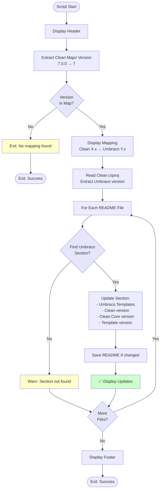

# Update README Versions Script

## Overview

This script updates README files with the latest Clean and Umbraco version information following a release, mapping Clean versions to appropriate Umbraco versions.

## Script Location

`.github/workflows/powershell/Update-ReadmeVersions.ps1`

## Purpose

Updates installation commands in README files with the correct Clean package version and corresponding Umbraco version for the appropriate Umbraco major version section.

## When It's Used

- **Release Workflow**: After version extraction, before building packages

## Parameters

| Parameter | Type | Required | Description |
|-----------|------|----------|-------------|
| `Version` | string | Yes | The Clean package version (e.g., 7.0.0 or 7.0.0-rc1) |

## How It Works



## What It Does

1. **Version Mapping**
   - Extracts Clean major version
   - Maps to Umbraco major version:
     - Clean 4.x → Umbraco 13
     - Clean 7.x → Umbraco 17
   - Exits gracefully if no mapping exists

2. **Umbraco Version Detection**
   - Reads `template/Clean/Clean.csproj`
   - Extracts Umbraco.Cms.Web.Website version

3. **README Updates**
   - Finds appropriate Umbraco section (`## Umbraco 13` or `## Umbraco 17`)
   - Updates installation commands:
     - `dotnet new install Umbraco.Templates::{version}`
     - `dotnet add package Clean --version {version}`
     - `dotnet add package Clean.Core --version {version}`
     - `dotnet new install Umbraco.Community.Templates.Clean::{version}`

4. **Multiple Files**
   - Updates `README.md`
   - Updates `umbraco-marketplace-readme.md`
   - Updates `umbraco-marketplace-readme-clean.md`

## Output

### Console Output

```
================================================
Updating README Files with Latest Versions
================================================
Clean version: 7.0.0
Mapped Clean 7.x -> Umbraco 17.x

Reading Umbraco version from template/Clean/Clean.csproj...
Found Umbraco version: 17.0.1

Updating README.md...
✅ Updated README.md
   - Umbraco.Templates: 17.0.1
   - Clean: 7.0.0
   - Clean.Core: 7.0.0
   - Umbraco.Community.Templates.Clean: 7.0.0

Updating umbraco-marketplace-readme.md...
✅ Updated umbraco-marketplace-readme.md
   - Umbraco.Templates: 17.0.1
   - Clean: 7.0.0
   - Clean.Core: 7.0.0
   - Umbraco.Community.Templates.Clean: 7.0.0

================================================
README files updated successfully
================================================
```

## Usage Examples

### Example 1: Clean 7.x Release

```powershell
.\Update-ReadmeVersions.ps1 -Version "7.0.0"
```

Updates Umbraco 17 section in all README files.

### Example 2: Clean 4.x Release

```powershell
.\Update-ReadmeVersions.ps1 -Version "4.2.1"
```

Updates Umbraco 13 section in all README files.

### Example 3: Prerelease

```powershell
.\Update-ReadmeVersions.ps1 -Version "7.0.0-rc.1"
```

Updates with prerelease version.

### Example 4: In Workflow

```yaml
- name: Update README files with latest versions
  shell: pwsh
  run: |
    ./.github/workflows/powershell/Update-ReadmeVersions.ps1 `
      -Version "${{ steps.version.outputs.version }}"
```

## Implementation Details

### Version Mapping

```powershell
$umbracoMajorMap = @{
    4 = 13
    7 = 17
}
```

**Why only 4 and 7?**
- Clean v5 (Umbraco 15) and v6 (Umbraco 16) are no longer maintained
- Only actively supported versions have mappings

### Regex Pattern for Sections

```powershell
"(?ms)$umbracoSectionHeader.*?(?=(^## |\z))"
```

**Breakdown**:
- `(?ms)`: Multiline + dotall mode
- `$umbracoSectionHeader`: Start marker (e.g., "## Umbraco 17")
- `.*?`: Content (non-greedy)
- `(?=(^## |\z))`: Lookahead for next section or end of file

### Update Patterns

**Umbraco.Templates**:
```powershell
-replace "dotnet new install Umbraco\.Templates::\S+",
         "dotnet new install Umbraco.Templates::$umbracoVersion"
```

**Clean Package**:
```powershell
-replace "(dotnet add .* package Clean --version )\S+",
         "`${1}$cleanVersion"
```

**Clean Template**:
```powershell
-replace "dotnet new install Umbraco\.Community\.Templates\.Clean::\S+",
         "dotnet new install Umbraco.Community.Templates.Clean::$cleanVersion"
```

### Error Handling

Script uses `try-catch` to handle errors gracefully:
- Continues workflow on error
- Displays warnings
- Doesn't fail release process

## Files Modified

1. **README.md** - Main repository README
2. **umbraco-marketplace-readme.md** - Umbraco marketplace listing
3. **umbraco-marketplace-readme-clean.md** - Clean-specific marketplace README

## Troubleshooting

### Issue: Section Not Found

**Symptoms**:
```
⚠️  Could not find section '## Umbraco 17' in README.md
```

**Cause**:
- README doesn't have section for this Umbraco version
- Section header format differs

**Solution**:
- Add appropriate section to README
- Ensure header matches exactly: `## Umbraco {major}`

### Issue: No Mapping Found

**Symptoms**:
```
⚠️  No Umbraco version mapping found for Clean 5.x
```

**Cause**:
- Releasing Clean version without mapping
- Version 5 and 6 are no longer maintained

**Solution**:
- Normal for unmaintained versions
- Add mapping if supporting new version

### Issue: Umbraco Version Not Found

**Symptoms**:
```
⚠️  Could not find Umbraco.Cms.Web.Website PackageReference
```

**Cause**:
- Clean.csproj structure changed
- File path incorrect

**Solution**:
- Verify `template/Clean/Clean.csproj` exists
- Check PackageReference format

## Related Documentation

- [workflow-versioning-releases.md](workflow-versioning-releases.md) - Parent workflow
- [script-extract-release-version.md](script-extract-release-version.md) - Version extraction

## Notes

- Updates **installation commands** in README files
- Maps **Clean versions to Umbraco versions**
- **Non-failing** - warnings only on error
- Updates **multiple README files** in single pass
- **Preserves formatting** - only updates version numbers
- **Section-specific** - updates only relevant Umbraco major version section
- **Regex-based** - flexible pattern matching for version updates
