# Update Third-Party Packages Script

## Overview

This comprehensive script updates NuGet package references in .csproj files to their latest versions, builds all solutions to verify compatibility, and generates detailed summary reports.

## Script Location

`.github/workflows/powershell/UpdateThirdPartyPackages.ps1`

## Purpose

Automatically updates third-party NuGet packages across all .csproj files in the repository, excluding internal packages, and verifies changes by building all solutions with comprehensive error reporting.

## When It's Used

- **Update Packages Workflow**: Main package update step after README updates

## Parameters

| Parameter | Type | Required | Default | Description |
|-----------|------|----------|---------|-------------|
| `RootPath` | string | No | Current directory | Repository root path |
| `DryRun` | switch | No | false | If set, no files changed, no commands executed |
| `IncludePrerelease` | switch | No | false | If set, uses latest including prerelease versions |
| `IgnorePackages` | string[] | No | @() | Exact package IDs to skip (case-insensitive) |
| `IgnorePatterns` | string[] | No | @() | Regex patterns for package IDs to skip |
| `InternalPackages` | string[] | No | @() | Exact internal package IDs to skip |
| `InternalPatterns` | string[] | No | @() | Regex patterns for internal packages |
| `KillRunning` | switch | No | false | Stop running processes from RootPath before building |

## How It Works

```mermaid
flowchart TD
    Start([Script Start]) --> Initialize[Initialize<br/>Version cache<br/>Artifacts directory]

    Initialize --> ScanCsproj[Scan for .csproj Files]

    ScanCsproj --> FoundFiles{Files<br/>Found?}
    FoundFiles -->|No| Error1[❌ Fail: No .csproj files]
    FoundFiles -->|Yes| LoopProjects[For Each .csproj File]

    LoopProjects --> ReadXML[Read XML<br/>Parse PackageReference nodes]

    ReadXML --> FilterPackages{Has Version<br/>Attribute?}
    FilterPackages -->|No| NextPackage[Skip: CPM or child Version]
    FilterPackages -->|Yes| CheckIgnore{In Ignore<br/>List?}

    CheckIgnore -->|Yes| NextPackage
    CheckIgnore -->|No| CheckInternal{Internal<br/>Package?}

    CheckInternal -->|Yes| NextPackage
    CheckInternal -->|No| QueryNuGet[Query NuGet API<br/>Get latest version<br/>Filter nightly builds]

    QueryNuGet --> VersionFound{Version<br/>Found?}
    VersionFound -->|No| Warn1[⚠️ Warn: No version found]
    VersionFound -->|Yes| Compare{Current =<br/>Latest?}

    Compare -->|Yes| AlreadyLatest[ℹ️ Already latest]
    Compare -->|No| UpdateVersion[Update Version Attribute<br/>Track change]

    Warn1 --> NextPackage
    AlreadyLatest --> NextPackage
    UpdateVersion --> NextPackage

    NextPackage --> MorePackages{More<br/>Packages?}
    MorePackages -->|Yes| FilterPackages
    MorePackages -->|No| SaveXML{Changes<br/>Made?}

    SaveXML -->|Yes| WriteFile[Save .csproj File]
    SaveXML -->|No| NextProject
    WriteFile --> NextProject

    NextProject --> MoreProjects{More<br/>Projects?}
    MoreProjects -->|Yes| LoopProjects
    MoreProjects -->|No| GenerateTable[Generate Package Update Table]

    GenerateTable --> AnyChanges{Packages<br/>Updated?}
    AnyChanges -->|No| DisplayNoChanges[Display: No packages to update<br/>Skip build section]
    DisplayNoChanges --> End1([Exit: Success])

    AnyChanges -->|Yes| ScanSolutions[Scan for .sln Files]

    ScanSolutions --> LoopSolutions[For Each .sln File]

    LoopSolutions --> Clean[dotnet clean]
    Clean --> CleanResult{Clean<br/>Success?}
    CleanResult -->|No| WarnClean[⚠️ Warn: Clean failed]
    CleanResult -->|Yes| Build[dotnet build<br/>Capture stdout/stderr]
    WarnClean --> Build

    Build --> BuildResult{Build<br/>Success?}
    BuildResult -->|No| DisplayErrors[Display Build Errors<br/>Show last 50 lines<br/>Highlight errors/warnings]
    BuildResult -->|Yes| NextSolution

    DisplayErrors --> NextSolution
    NextSolution --> MoreSolutions{More<br/>Solutions?}
    MoreSolutions -->|Yes| LoopSolutions
    MoreSolutions -->|No| GenerateBuildTable[Generate Build Summary Table]

    GenerateBuildTable --> AnyFailures{Build<br/>Failures?}
    AnyFailures -->|Yes| FailWorkflow[❌ Exit Code 1<br/>Display failure summary]
    AnyFailures -->|No| Success[✅ All builds successful]

    Success --> End2([Exit: Success])
    FailWorkflow --> End3([Exit: Failure])

    style Error1 fill:#ffcccc
    style FailWorkflow fill:#ffcccc
    style Success fill:#ccffcc
    style AlreadyLatest fill:#e6e6e6
    style DisplayNoChanges fill:#ffffcc
    style WarnClean fill:#ffffcc
    style Warn1 fill:#ffffcc
    style DisplayErrors fill:#ffffcc
    style FoundFiles fill:#e6e6fa
    style FilterPackages fill:#e6e6fa
    style CheckIgnore fill:#e6e6fa
    style CheckInternal fill:#e6e6fa
    style VersionFound fill:#e6e6fa
    style Compare fill:#e6e6fa
    style SaveXML fill:#e6e6fa
    style MorePackages fill:#e6e6fa
    style MoreProjects fill:#e6e6fa
    style AnyChanges fill:#e6e6fa
    style CleanResult fill:#e6e6fa
    style BuildResult fill:#e6e6fa
    style MoreSolutions fill:#e6e6fa
    style AnyFailures fill:#e6e6fa
```



## What It Does

### 1. Package Discovery and Updating

**Scans .csproj files**:
- Recursively finds all .csproj files in RootPath
- Reads XML and locates `<PackageReference>` nodes
- Only processes packages with `Version` attribute (skips CPM scenarios)

**Filters packages**:
- Skips packages in IgnorePackages list
- Skips packages matching IgnorePatterns regex
- Skips internal packages (InternalPackages and InternalPatterns)
- Default internal pattern: `Clean.*`

**Queries NuGet**:
- Discovers all configured NuGet sources
- Queries each source for package versions
- Filters out nightly builds (versions with `-build`)
- Caches results to avoid duplicate queries

**Version selection**:
- **Stable mode** (IncludePrerelease=false): Latest stable version only
- **Prerelease mode** (IncludePrerelease=true): Prioritizes stable > rc > beta > alpha

**Updates files**:
- Modifies Version attribute in-place
- Tracks all changes for reporting
- Saves .csproj files with updates

### 2. Solution Building

**Discovers solutions**:
- Recursively finds all .sln files
- Processes each solution independently

**Clean step**:
- Runs `dotnet clean` for each solution
- Logs stdout/stderr to timestamped files
- Warnings displayed but doesn't block build

**Build step**:
- Runs `dotnet build` with minimal verbosity
- Captures all output for error analysis
- Logs saved to `.artifacts/logs/` directory

**Error extraction**:
- Parses MSBuild error summary (e.g., "5 Error(s)")
- Extracts error lines matching diagnostic patterns
- Displays last 50 lines of output on failure
- Color-codes errors (red), warnings (yellow), info (gray)

### 3. Reporting

**Package Update Table**:
```
+---------------+-----------------------------+--------------+--------------+
| File Name     | Package Name                | Old Version  | New Version  |
+---------------+-----------------------------+--------------+--------------+
| Clean.csproj  | Umbraco.Cms.Web.Website     | 13.5.1       | 13.5.2       |
| Clean.csproj  | Umbraco.Cms.Web.BackOffice  | 13.5.1       | 13.5.2       |
+---------------+-----------------------------+--------------+--------------+
```

**Build Summary Table**:
```
+------------------+--------------+--------------+---------+-----------+
| Solution Name    | Clean Result | Build Result | Errors  | Warnings  |
+------------------+--------------+--------------+---------+-----------+
| Clean.sln        | Success      | Success      | 0       | 3         |
+------------------+--------------+--------------+---------+-----------+
```

## Output

### Console Output

**Package Updates Found**:
```
[2025-11-26T12:00:00] [INFO] Starting package update... IncludePrerelease=True, DryRun=False
[2025-11-26T12:00:01] [INFO] Scanning for csproj files in template folder...
[2025-11-26T12:00:01] [INFO] Found 5 csproj files.
[2025-11-26T12:00:02] [INFO] Querying 1 source(s) for package 'Umbraco.Cms.Web.Website'
[2025-11-26T12:00:02] [INFO]   Querying source 'nuget.org': https://api.nuget.org/v3-flatcontainer/umbraco.cms.web.website/index.json
[2025-11-26T12:00:03] [INFO]   Found 150 version(s) in 'nuget.org'
[2025-11-26T12:00:03] [INFO] Excluded 25 nightly build version(s) for Umbraco.Cms.Web.Website
[2025-11-26T12:00:03] [INFO] Selected version 13.5.2 for Umbraco.Cms.Web.Website (IncludePrerelease=false, 125 stable versions available)
[2025-11-26T12:00:03] [INFO] Package Umbraco.Cms.Web.Website: 13.5.1 -> 13.5.2

===== PACKAGE UPDATE RESULTS =====
+---------------+-----------------------------+--------------+--------------+
| File Name     | Package Name                | Old Version  | New Version  |
+---------------+-----------------------------+--------------+--------------+
| Clean.csproj  | Umbraco.Cms.Web.Website     | 13.5.1       | 13.5.2       |
+---------------+-----------------------------+--------------+--------------+

===== BUILD SUMMARY =====
+------------------+--------------+--------------+---------+-----------+
| Solution Name    | Clean Result | Build Result | Errors  | Warnings  |
+------------------+--------------+--------------+---------+-----------+
| Clean.sln        | Success      | Success      | 0       | 2         |
+------------------+--------------+--------------+---------+-----------+

All builds completed successfully! ✅
```

**No Updates Needed**:
```
[2025-11-26T12:00:00] [INFO] Starting package update... IncludePrerelease=False, DryRun=False
[2025-11-26T12:00:01] [INFO] Found 5 csproj files.
[2025-11-26T12:00:05] [INFO] Package Umbraco.Cms.Web.Website is already at latest version 13.5.2

===== PACKAGE UPDATE RESULTS =====
No packages to update

No packages to update - skipping build section
```

**Build Failure**:
```
========================================
BUILD FAILED: Clean.sln
========================================

Top error lines:
  Clean.csproj(45,15): error CS0246: The type or namespace name 'InvalidType' could not be found

Build output (last 50 lines):
  ...error lines highlighted in red...
  ...warning lines highlighted in yellow...

Full logs saved to:
  StdOut: .artifacts/logs/Clean__20251126_120000.build.stdout.txt
  StdErr: .artifacts/logs/Clean__20251126_120000.build.stderr.txt
========================================

================================================
ERROR: 1 solution(s) failed to build
================================================
  - Clean.sln

Please review the error details above.
Build logs are saved in: .artifacts/logs
================================================
```

### Artifacts Generated

| File | Description |
|------|-------------|
| `.artifacts/package-summary.txt` | ASCII table of all package updates |
| `.artifacts/build-summary.txt` | Build results for all solutions |
| `.artifacts/logs/{solution}__{timestamp}.clean.stdout.txt` | Clean command stdout |
| `.artifacts/logs/{solution}__{timestamp}.clean.stderr.txt` | Clean command stderr |
| `.artifacts/logs/{solution}__{timestamp}.build.stdout.txt` | Build command stdout |
| `.artifacts/logs/{solution}__{timestamp}.build.stderr.txt` | Build command stderr |

## Usage Examples

### Example 1: Update to Latest Stable

```powershell
.\UpdateThirdPartyPackages.ps1 `
  -RootPath "C:\Projects\Clean" `
  -IncludePrerelease:$false
```

### Example 2: Update Including Prerelease

```powershell
.\UpdateThirdPartyPackages.ps1 `
  -RootPath "C:\Projects\Clean" `
  -IncludePrerelease:$true
```

### Example 3: Dry Run

```powershell
.\UpdateThirdPartyPackages.ps1 `
  -RootPath "C:\Projects\Clean" `
  -DryRun
```

### Example 4: With Ignore Patterns

```powershell
.\UpdateThirdPartyPackages.ps1 `
  -RootPath "C:\Projects\Clean" `
  -IgnorePackages "Microsoft.NET.Test.Sdk","xunit" `
  -IgnorePatterns "^Microsoft\.Extensions\."
```

### Example 5: In Workflow

```yaml
- name: Run UpdateThirdPartyPackages script
  id: update-packages
  shell: pwsh
  run: |
    $dryRunFlag = if ('${{ github.event.inputs.dryRun }}' -eq 'true') { $true } else { $false }
    $includePrereleaseFlag = if ('${{ github.event.inputs.includePrerelease }}' -eq 'true') { $true } else { $false }

    ./.github/workflows/powershell/UpdateThirdPartyPackages.ps1 `
      -RootPath "${{ github.workspace }}" `
      -DryRun:$dryRunFlag `
      -IncludePrerelease:$includePrereleaseFlag
```

## Implementation Details

### NuGet Source Discovery

**Automatic source detection**:
- Runs `dotnet nuget list source`
- Parses enabled sources
- For v3 feeds, queries service index for PackageBaseAddress
- Uses flatcontainer API for faster version lookups

**Supported sources**:
- nuget.org (default)
- Custom sources added via Configure-CustomNuGetSourcesFromInput.ps1
- MyGet, Azure DevOps Artifacts, GitHub Packages

### Version Selection Algorithm

**Stable mode**:
```powershell
$stable = $versions | Where-Object { $_ -notmatch '-' }
$chosen = $stable[-1]  # Last item (highest version)
```

**Prerelease mode**:
1. Parse version into base + prerelease tag + number
2. Assign priority: stable=100, rc=70, beta=50, alpha=30, other=40
3. Sort by base version (descending), then priority+number (descending)
4. Select first item

### Nightly Build Filtering

Excludes versions matching `-build` pattern:
```
17.0.0-build.20251124.1  ❌ Excluded
17.0.0-rc.1              ✅ Included
17.0.0                   ✅ Included
```

### Build Error Detection

**MSBuild summary extraction**:
```powershell
$errCount = [regex]::Match($output, '(?mi)^\s*(\d+)\s+Error\(s\)')
$warnCount = [regex]::Match($output, '(?mi)^\s*(\d+)\s+Warning\(s\)')
```

**Diagnostic pattern matching**:
```powershell
$errorLines = $output | Where-Object {
  $_ -match "(:\s*error\s*[A-Z]?\d{3,}|^error\s)"
}
```

## Exit Codes

| Code | Meaning |
|------|---------|
| 0 | Success - all builds passed or no updates needed |
| 1 | Failure - one or more builds failed |

## Troubleshooting

### Issue: No Versions Found for Package

**Symptoms**:
```
[WARN] No versions found for PackageName in any configured source (after filtering)
```

**Possible Causes**:
1. Package not in configured sources
2. All versions are nightly builds
3. Network/connectivity issue

**Solution**:
- Verify package exists on nuget.org
- Check custom NuGet sources configuration
- Review network connectivity

### Issue: Internal Packages Being Updated

**Symptoms**:
Clean.Core being updated when it shouldn't be.

**Cause**:
- InternalPatterns not configured

**Solution**:
```powershell
-InternalPatterns "^Clean\."
```

### Issue: Build Fails After Update

**Symptoms**:
```
ERROR: 1 solution(s) failed to build
```

**Possible Causes**:
1. Breaking changes in new package version
2. Incompatible package combinations
3. Missing dependencies

**Solution**:
1. Review build logs in `.artifacts/logs/`
2. Check package release notes for breaking changes
3. Consider using `-IgnorePackages` to exclude problematic package
4. Test with `-DryRun` first

### Issue: Prerelease Not Selected

**Symptoms**:
Stable version selected when prerelease expected.

**Cause**:
- `IncludePrerelease` switch not provided

**Solution**:
```powershell
-IncludePrerelease:$true  # Note the colon for switch parameters
```

### Issue: Builds Taking Too Long

**Symptoms**:
Workflow timeout or very long execution.

**Solution**:
- Use `-KillRunning` to stop orphaned processes
- Consider splitting into multiple solutions
- Check for hung processes on Windows runner

## Performance Considerations

**Version caching**:
- Each package queried only once
- Results cached in memory hashtable
- Significantly reduces API calls

**Parallel queries**:
- Multiple NuGet sources queried for each package
- Results merged and deduplicated

**Build optimization**:
- Minimal verbosity (`-v:m`)
- Summary console logger
- Separate stdout/stderr capture

## Related Documentation

- [workflow-update-nuget-packages.md](workflow-update-nuget-packages.md) - Parent workflow
- [script-configure-custom-nuget-sources-from-input.md](script-configure-custom-nuget-sources-from-input.md) - Custom sources
- [script-show-build-failure-summary.md](script-show-build-failure-summary.md) - Failure handling

## Notes

- Script **modifies .csproj files** in-place (unless DryRun)
- **Builds all solutions** to verify compatibility
- **Exits with code 1** if any build fails (stops workflow)
- **Generates artifacts** for PR creation and debugging
- **Filters nightly builds** automatically
- **Supports multiple NuGet sources** including custom feeds
- **Thread-safe** version caching for performance
