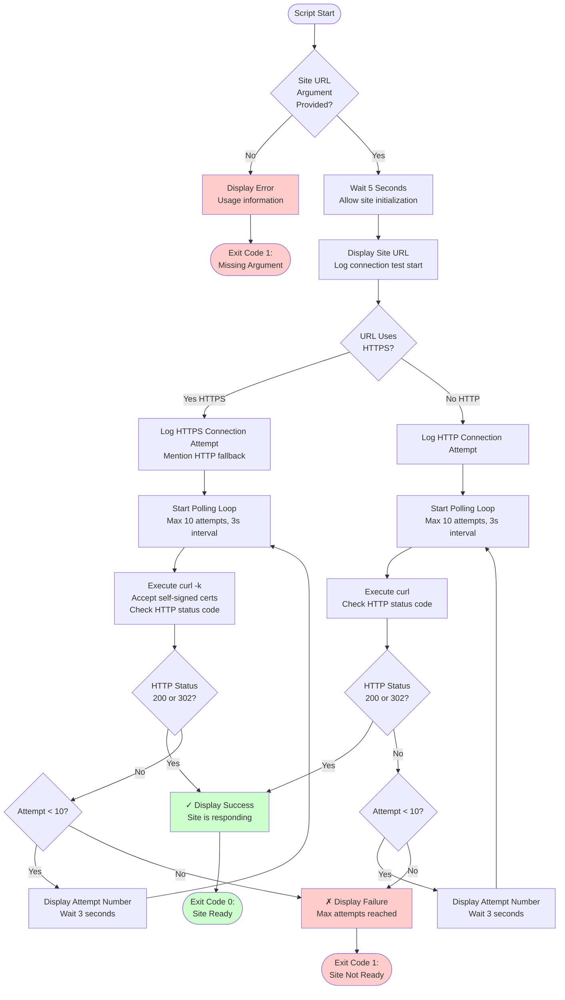

# wait-site-readiness.sh Documentation

Bash script that waits for an Umbraco site to be fully ready for OWASP ZAP security scanning by polling the site URL and verifying it responds with a successful HTTP status code.

## Synopsis

```bash
wait-site-readiness.sh <site_url>
```

## Description

This script ensures an Umbraco site is not only started but fully initialized and responding to requests before OWASP ZAP begins its security scan. It performs connectivity tests, polls the site URL multiple times with intervals, and validates HTTP response codes to confirm the site is ready.

The script is specifically designed for CI/CD workflows where a site is started in the background and needs to be verified as ready before proceeding with security scanning or testing.

## Location

`.github/workflows/scripts/wait-site-readiness.sh`

## Parameters

### site_url (Positional Argument 1)

**Type**: String (URL)
**Required**: Yes
**Description**: The URL of the site to check (supports both HTTP and HTTPS).

**Examples**:
```bash
"https://localhost:5001"  # HTTPS with custom port
"http://localhost:5000"   # HTTP with custom port
"https://localhost:44359" # HTTPS with random port
```

## Behavior

The script performs the following checks:

1. **Initial Wait**: Waits 5 seconds after being called to ensure site has time to initialize
2. **URL Testing**: Attempts to connect to the provided site URL
3. **HTTP/HTTPS Handling**: Works with both HTTP and HTTPS URLs
4. **Polling**: Polls the site up to 10 times with 3-second intervals (30 seconds total)
5. **Status Validation**: Accepts HTTP status codes 200 (OK) or 302 (Redirect) as success
6. **Certificate Handling**: For HTTPS, uses `-k` flag to accept self-signed certificates

## Exit Codes

| Code | Meaning |
|------|---------|
| 0 | Success - Site is ready and responding |
| 1 | Error - Missing argument or site failed to respond after maximum attempts |

## Examples

### Example 1: Wait for HTTPS Site

```bash
./wait-site-readiness.sh "https://localhost:5001"
```

**Output**:
```
Waiting additional time to ensure site is fully ready for ZAP scan...
Site URL: https://localhost:5001
Testing site connectivity...
Attempting to connect to: http://localhost:5001
Waiting for site to respond (attempt 1/10)...
Waiting for site to respond (attempt 2/10)...
✓ Site is responding!
```

**Exit Code**: 0

### Example 2: Wait for HTTP Site

```bash
./wait-site-readiness.sh "http://localhost:5000"
```

**Output**:
```
Waiting additional time to ensure site is fully ready for ZAP scan...
Site URL: http://localhost:5000
Testing site connectivity...
Site is using HTTP, attempting to connect to: http://localhost:5000
Waiting for site to respond (attempt 1/10)...
✓ Site is responding!
```

**Exit Code**: 0

### Example 3: Site Fails to Respond

```bash
./wait-site-readiness.sh "https://localhost:9999"
```

**Output**:
```
Waiting additional time to ensure site is fully ready for ZAP scan...
Site URL: https://localhost:9999
Testing site connectivity...
Attempting to connect to: http://localhost:9999
Waiting for site to respond (attempt 1/10)...
Waiting for site to respond (attempt 2/10)...
...
Waiting for site to respond (attempt 10/10)...
✗ Site failed to respond after 10 attempts
```

**Exit Code**: 1

### Example 4: GitHub Actions Usage

```yaml
- name: Wait for Site Readiness
  run: |
    ./.github/workflows/scripts/wait-site-readiness.sh "${{ steps.setup-site.outputs.site_url }}"

- name: Run OWASP ZAP Full Scan
  uses: zaproxy/action-full-scan@v0.13.0
  with:
    target: ${{ steps.setup-site.outputs.site_url }}
```

## Process Flow



## Output

The script provides detailed console output for monitoring:

### Successful Readiness Check

```
Waiting additional time to ensure site is fully ready for ZAP scan...
Site URL: https://localhost:5001
Testing site connectivity...
Attempting to connect to: http://localhost:5001
Waiting for site to respond (attempt 1/10)...
Waiting for site to respond (attempt 2/10)...
✓ Site is responding!
```

### Failed Readiness Check

```
Waiting additional time to ensure site is fully ready for ZAP scan...
Site URL: https://localhost:9999
Testing site connectivity...
Attempting to connect to: http://localhost:9999
Waiting for site to respond (attempt 1/10)...
Waiting for site to respond (attempt 2/10)...
Waiting for site to respond (attempt 3/10)...
Waiting for site to respond (attempt 4/10)...
Waiting for site to respond (attempt 5/10)...
Waiting for site to respond (attempt 6/10)...
Waiting for site to respond (attempt 7/10)...
Waiting for site to respond (attempt 8/10)...
Waiting for site to respond (attempt 9/10)...
Waiting for site to respond (attempt 10/10)...
✗ Site failed to respond after 10 attempts
```

## Key Features

### 1. Initial Stabilization Wait

Waits 5 seconds before polling to allow site initialization:

```bash
echo "Waiting additional time to ensure site is fully ready for ZAP scan..."
sleep 5
```

This prevents premature polling while the site is still initializing.

### 2. HTTPS/HTTP Handling

Automatically handles both protocols:

```bash
if [[ $SITE_URL == https://* ]]; then
  # Use -k flag to accept self-signed certificates
  curl -k -s -o /dev/null -w "%{http_code}" "$SITE_URL"
else
  # Standard HTTP request
  curl -s -o /dev/null -w "%{http_code}" "$SITE_URL"
fi
```

### 3. Flexible Status Code Acceptance

Accepts both 200 (OK) and 302 (Redirect) as valid responses:

```bash
if curl -k -s -o /dev/null -w "%{http_code}" "$SITE_URL" | grep -q "200\|302"; then
  echo "✓ Site is responding!"
  exit 0
fi
```

This handles sites that redirect to a default page on startup.

### 4. Polling with Retry Logic

Polls up to 10 times with 3-second intervals:

```bash
for i in {1..10}; do
  if curl -k -s -o /dev/null -w "%{http_code}" "$SITE_URL" | grep -q "200\|302"; then
    echo "✓ Site is responding!"
    exit 0
  fi
  echo "Waiting for site to respond (attempt $i/10)..."
  sleep 3
done
```

Total timeout: 35 seconds (5s initial wait + 30s polling)

### 5. Clear Error Handling

Provides clear success/failure messages:

```bash
if [ -z "$1" ]; then
  echo "Error: Site URL argument is required"
  echo "Usage: $0 <site_url>"
  exit 1
fi
```

## Timing Configuration

The script uses the following timing parameters:

| Parameter | Value | Purpose |
|-----------|-------|---------|
| Initial wait | 5 seconds | Allow site to initialize |
| Poll interval | 3 seconds | Time between connectivity checks |
| Max attempts | 10 | Maximum number of polls |
| Total timeout | ~35 seconds | Initial wait + (10 attempts × 3 seconds) |

## Accepted HTTP Status Codes

The script accepts the following HTTP status codes as indicating site readiness:

| Status Code | Meaning | Why Accepted |
|-------------|---------|--------------|
| 200 | OK | Site is fully operational and responding |
| 302 | Found (Redirect) | Site is operational but redirecting to another page (common for default pages) |

## Workflow Integration

The script is designed to integrate with workflows that start a site and then need to scan it:

### Step 1: Start Site

```yaml
- name: Setup Clean Template Site for ZAP Testing
  id: setup-site
  shell: pwsh
  run: |
    ./.github/workflows/powershell/Test-LatestWithZap.ps1 @params
```

### Step 2: Sanitize Version (Optional)

```yaml
- name: Sanitize Version Numbers for Artifact Names
  id: sanitize-versions
  shell: bash
  run: |
    ./.github/workflows/scripts/sanitize-version-numbers.sh "${{ steps.setup-site.outputs.clean_template_version }}"
```

### Step 3: Wait for Site Readiness (This Script)

```yaml
- name: Wait for Site Readiness
  run: |
    ./.github/workflows/scripts/wait-site-readiness.sh "${{ steps.setup-site.outputs.site_url }}"
```

### Step 4: Run Security Scan

```yaml
- name: Run OWASP ZAP Full Scan
  uses: zaproxy/action-full-scan@v0.13.0
  with:
    target: ${{ steps.setup-site.outputs.site_url }}
```

## Troubleshooting

### Site Never Responds

**Observation**: Script times out after 10 attempts

**Causes**:
- Site failed to start
- Port conflict
- Database initialization issues
- Site URL is incorrect
- Firewall blocking connection

**Solution**:
1. Check previous step (site startup) for errors
2. Verify site URL is correct
3. Check site logs (site.log, site.err)
4. Verify port is not already in use: `netstat -an | grep <port>`
5. Test site URL manually with `curl`

### Missing Argument Error

**Error**: "Error: Site URL argument is required"

**Causes**:
- No URL argument passed to script
- Empty string passed as argument
- Variable not expanded correctly

**Solution**:
```yaml
# Verify the output exists before calling script
- name: Debug Site URL
  run: echo "Site URL: ${{ steps.setup-site.outputs.site_url }}"

- name: Wait for Site Readiness
  run: |
    ./.github/workflows/scripts/wait-site-readiness.sh "${{ steps.setup-site.outputs.site_url }}"
```

### HTTPS Certificate Errors

**Observation**: Site fails to respond but works with HTTP

**Causes**:
- Self-signed certificate issues
- Certificate validation failures
- Missing `-k` flag in curl

**Solution**:
The script automatically uses `-k` flag for HTTPS:
```bash
curl -k -s -o /dev/null -w "%{http_code}" "$SITE_URL"
```

If issues persist, check if the site is actually listening on HTTPS.

### Site Responds Too Slowly

**Observation**: 10 attempts is not enough

**Causes**:
- Slow database initialization
- Large site with many dependencies
- Resource constraints

**Solution**:
Modify the script to increase polling:
```bash
# Change from {1..10} to {1..20} for 20 attempts (60 seconds)
for i in {1..20}; do
```

Or increase the interval:
```bash
# Change from 3 to 5 seconds
sleep 5
```

## Dependencies

The script requires:

- **Bash 3.2+**: For bash syntax and loops
- **curl**: For HTTP connectivity testing
- **grep**: For pattern matching HTTP status codes

All dependencies are typically pre-installed on GitHub Actions runners.

## Related Documentation

- [workflow-zap-security-scan.md](workflow-zap-security-scan.md) - ZAP workflow documentation
- [script-test-latest-with-zap.md](script-test-latest-with-zap.md) - Site setup script
- [curl documentation](https://curl.se/docs/manpage.html)
- [HTTP status codes](https://developer.mozilla.org/en-US/docs/Web/HTTP/Status)

## Best Practices

1. **Always wait after startup**: Call this script after starting a site in the background
2. **Check site logs on failure**: If readiness check fails, examine site.log and site.err
3. **Verify URL format**: Ensure URL includes protocol (http:// or https://)
4. **Monitor timing**: Check workflow logs to see how many attempts were needed
5. **Adjust timeout if needed**: For slow-starting sites, consider increasing max attempts
6. **Test locally first**: Verify site starts correctly on local machine before relying on CI

## Alternative Approaches

If you need different readiness criteria:

### Wait for Specific Content

```bash
# Wait for specific text in response
if curl -k -s "$SITE_URL" | grep -q "Expected Content"; then
  echo "✓ Site is responding with expected content!"
  exit 0
fi
```

### Check Health Endpoint

```bash
# Wait for health check endpoint
if curl -k -s "$SITE_URL/health" | grep -q "healthy"; then
  echo "✓ Health check passed!"
  exit 0
fi
```

### Accept More Status Codes

```bash
# Accept 200, 301, 302, 303
if curl -k -s -o /dev/null -w "%{http_code}" "$SITE_URL" | grep -q "200\|301\|302\|303"; then
  echo "✓ Site is responding!"
  exit 0
fi
```

## Summary

The wait-site-readiness script provides:
- ✅ Reliable site readiness verification
- ✅ Automatic HTTPS/HTTP handling
- ✅ Self-signed certificate support
- ✅ Configurable polling with retries
- ✅ Clear success/failure messages
- ✅ Flexible status code acceptance (200, 302)
- ✅ Short total timeout (~35 seconds)
- ✅ No external dependencies beyond standard tools

This script is essential for workflows that start sites in the background and need to ensure they are fully operational before proceeding with security scanning, testing, or other operations. It prevents race conditions and ensures reliable, consistent workflow execution.
