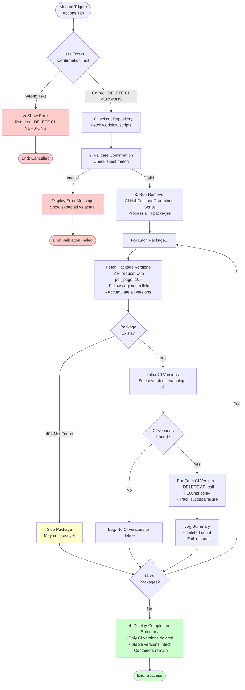

# Cleanup GitHub Packages Workflow Documentation

This document describes the automated cleanup workflow for removing CI versions from GitHub Packages, helping to reduce storage costs while preserving stable releases.

## Overview

The cleanup workflow allows manual deletion of all CI (Continuous Integration) versions from GitHub Packages while keeping:
- ✅ Stable release versions (e.g., `7.0.0`, `7.1.0`)
- ✅ RC and beta versions (e.g., `7.1.0-rc.1`)
- ✅ Package containers (so you can publish new versions)

This is useful for removing accumulated PR build packages (e.g., `7.0.1-ci.42`) that are no longer needed after merging.

## Workflow File

Location: `.github/workflows/cleanup-github-packages.yml`

## When Does It Run?

The workflow triggers **manually only**:
- Navigate to **Actions** tab on GitHub
- Select **"Cleanup - GitHub Packages CI Versions"** workflow
- Click **"Run workflow"** button
- Type confirmation text: `DELETE CI VERSIONS`
- Click **"Run workflow"** button to execute

**Note**: The workflow will not run automatically on any events (no scheduled runs, no triggers on push/PR).

## What It Does

The cleanup workflow performs the following operations:

### 1. **Validation**

Requires typing `DELETE CI VERSIONS` exactly to confirm the deletion. This safety measure prevents accidental execution.

### 2. **Package Cleanup**

Cleans up CI versions from four packages:

| Package | Description |
|---------|-------------|
| `Umbraco.Community.Templates.Clean` | dotnet CLI template for creating new projects |
| `Clean` | Main package with Umbraco starter content, views, and assets |
| `Clean.Core` | Core library with models and services |
| `Clean.Headless` | API controllers for headless CMS functionality |

### 3. **Pagination Support**

The workflow handles packages with any number of versions:
- Fetches up to **100 versions per page** from GitHub API
- Automatically follows pagination links for packages with > 100 versions
- Accumulates all versions before filtering

### 4. **Selective Deletion**

- **Deletes**: Versions containing `-ci` in the name (e.g., `7.0.1-ci.42`)
- **Preserves**: All other versions (stable releases, RC, beta, etc.)
- **Keeps**: Package containers intact for future publishing

## Process Flow



## Scripts Used

The workflow uses the following PowerShell script:

### Remove-GitHubPackageCIVersions.ps1

**Purpose**: Removes all CI versions from specified GitHub Packages using pagination.

**Location**: `.github/workflows/powershell/Remove-GitHubPackageCIVersions.ps1`

**Documentation**: [script-remove-github-package-ci-versions.md](script-remove-github-package-ci-versions.md)

**Parameters**:
- `-RepositoryOwner` (required): GitHub repository owner/organization name
- `-Packages` (required): Array of package names to clean up

**Features**:
- ✅ GitHub API pagination support (handles 100+ versions)
- ✅ Selective deletion (only `-ci` versions)
- ✅ Error handling for missing packages
- ✅ Rate limiting protection (100ms delay between deletions)
- ✅ Detailed progress logging

**Example**:
```powershell
./Remove-GitHubPackageCIVersions.ps1 `
  -RepositoryOwner "prjseal" `
  -Packages @("Clean", "Clean.Core", "Clean.Headless", "Umbraco.Community.Templates.Clean")
```

## How to Use

### Step 1: Navigate to Actions Tab

Go to your repository on GitHub and click the **Actions** tab.

### Step 2: Select the Workflow

In the left sidebar, find and click **"Cleanup - GitHub Packages CI Versions"**.

### Step 3: Run the Workflow

1. Click the **"Run workflow"** dropdown button (top right)
2. In the confirmation field, type: `DELETE CI VERSIONS`
3. Click the green **"Run workflow"** button

### Step 4: Monitor Progress

The workflow will run and show progress for each package:

```
Processing package: Clean
  Fetching versions from: https://api.github.com/users/prjseal/packages/nuget/clean/versions?per_page=100
    Fetched 100 versions (Total so far: 100)
    Found next page, continuing...
    Fetched 50 versions (Total so far: 150)
  Found 95 CI version(s) out of 150 total versions
    Deleting version: 7.0.1-ci.42 (ID: 12345)
    ✓ Deleted: 7.0.1-ci.42
    ...
  Summary for Clean: 95 deleted, 0 failed
```

## What Gets Deleted

### Will Be Deleted ❌

Versions matching the pattern `*-ci*`:
- `7.0.1-ci.42`
- `7.0.1-ci.123`
- `7.1.0-ci.5`
- Any version with `-ci` in the name

### Will Be Preserved ✅

All other versions:
- Stable releases: `7.0.0`, `7.1.0`, `8.0.0`
- RC versions: `7.1.0-rc.1`, `8.0.0-rc.2`
- Beta versions: `7.1.0-beta.1`
- Alpha versions: `7.1.0-alpha.1`
- Package containers remain intact

## Example Scenarios

### Scenario 1: Clean Up After Merging PRs

**Before**:
- 50 PR builds accumulated: `7.0.1-ci.1` through `7.0.1-ci.50`
- 1 stable release: `7.0.0`

**After Cleanup**:
- 0 CI builds
- 1 stable release: `7.0.0` (preserved)
- Package container: Clean (intact)

### Scenario 2: Mixed Versions

**Before**:
- Stable: `7.0.0`
- RC: `7.1.0-rc.1`
- CI builds: `7.1.0-ci.1`, `7.1.0-ci.2`, `7.1.0-ci.3`

**After Cleanup**:
- Stable: `7.0.0` ✅
- RC: `7.1.0-rc.1` ✅
- CI builds: 0 (all deleted)

### Scenario 3: Package with 200+ CI Versions

**Before**:
- 250 versions total (200 CI builds, 50 stable/RC)

**Process**:
1. Fetches page 1: 100 versions
2. Fetches page 2: 100 versions
3. Fetches page 3: 50 versions
4. Filters to find 200 CI versions
5. Deletes each CI version with 100ms delay

**After Cleanup**:
- 50 stable/RC versions ✅
- 0 CI builds
- Package container intact

## Permissions

The workflow requires the following GitHub permissions:

- **packages: write** - To delete package versions via GitHub API

These permissions are automatically granted to the `GITHUB_TOKEN` when the workflow runs.

## Limitations

- **Manual execution only**: Cannot be scheduled or triggered automatically
- **No undo**: Deleted versions cannot be recovered
- **Public packages only**: Does not support authenticated private package feeds
- **Rate limiting**: Large cleanups (1000+ versions) may take time due to 100ms delays

## Troubleshooting

### Confirmation Text Not Matching

**Error**: "Confirmation text does not match. Workflow cancelled."

**Solution**: Type exactly `DELETE CI VERSIONS` (case-sensitive) in the confirmation field.

### Package Not Found (404)

**Message**: "Package 'PackageName' not found (may not exist yet)"

**Reason**: The package hasn't been published to GitHub Packages yet.

**Action**: No action needed - this is expected for packages not yet published.

### No CI Versions Found

**Message**: "No CI versions found for PackageName (Total versions: 5)"

**Reason**: The package has no versions containing `-ci` in the name.

**Action**: No action needed - no CI versions to clean up.

## Related Documentation

- [general-consuming-packages.md](general-consuming-packages.md) - How to install packages from GitHub Packages
- [workflow-pr.md](workflow-pr.md) - PR workflow that creates CI packages
- [script-remove-github-package-ci-versions.md](script-remove-github-package-ci-versions.md) - Script documentation

## Best Practices

1. **Run periodically**: Clean up after major development cycles or before releases
2. **Check before cleanup**: Review the packages tab to see what will be deleted
3. **Keep recent CI builds**: If actively testing, delay cleanup until testing is complete
4. **Monitor storage**: GitHub Packages has storage limits; regular cleanup helps stay within quotas

## Future Enhancements

Potential improvements for future versions:

- **Dry run mode**: Preview what would be deleted without actually deleting
- **Age-based filtering**: Delete CI versions older than X days
- **Count-based retention**: Keep only the N most recent CI versions
- **Scheduled cleanup**: Optional automatic cleanup on a schedule
- **Selective package cleanup**: Choose which packages to clean instead of all four
