# Delete Issues by Label Workflow Documentation

This document describes the cleanup workflow for bulk deletion of GitHub issues based on labels, helping to maintain a clean issue tracker by removing issues that are no longer needed (e.g., automated scan results, duplicates, or obsolete reports).

## Overview

The delete issues workflow allows manual deletion of GitHub issues filtered by:
- ✅ **Labels**: One or more labels (comma-separated)
- ✅ **Status**: Open, closed, or all issues
- ✅ **Confirmation**: Safety check to prevent accidental deletions

This is useful for cleaning up:
- Automated security scan issues that have been resolved
- Duplicate issues created during testing
- Bulk-created issues that are no longer relevant

## Workflow File

Location: `.github/workflows/delete-issues-by-label.yml`

## When Does It Run?

The workflow triggers **manually only**:
- Navigate to **Actions** tab on GitHub
- Select **"Cleanup - Delete Issues by Label"** workflow
- Click **"Run workflow"** button
- Configure inputs:
  - **labels**: Comma-separated list of labels (e.g., "zap-scan,bug")
  - **status**: Issue status to filter by (open/closed/all)
  - **confirm**: Type `DELETE ISSUES` to confirm
- Click **"Run workflow"** button to execute

**Note**: The workflow will not run automatically on any events (no scheduled runs, no triggers on push/PR).

## What It Does

The workflow performs the following operations:

### 1. **Validation**

Requires typing `DELETE ISSUES` exactly to confirm the deletion. This safety measure prevents accidental execution.

### 2. **Issue Discovery**

Uses GitHub CLI (`gh`) to search for issues matching:
- **Label filter**: Issues must have ALL specified labels
- **Status filter**: Open, closed, or all issues
- **Limit**: Up to 1000 issues per execution

### 3. **Bulk Deletion**

Deletes each matching issue using the GitHub CLI delete command:
- Issues are deleted one by one
- Success/failure is logged for each issue
- Total count of deleted issues is displayed

## Process Flow

```mermaid
flowchart TD
    Start([Manual Trigger<br/>Actions Tab]) --> Input{User Enters<br/>Inputs}

    Input -->|Configure| Labels[Input: Labels<br/>e.g., 'zap-scan,bug']
    Labels --> Status[Input: Status<br/>open/closed/all]
    Status --> Confirm{Input: Confirmation<br/>Type DELETE ISSUES}

    Confirm -->|Wrong Text| Fail[❌ Show Error<br/>Required: DELETE ISSUES]
    Fail --> End1([End: Cancelled])

    Confirm -->|Correct| Checkout[1. Checkout Repository]

    Checkout --> Validate[2. Validate Confirmation<br/>Check exact match]

    Validate -->|Invalid| FailMsg[Display Error Message<br/>- Show expected vs actual<br/>- Exit with error code]
    FailMsg --> End2([End: Validation Failed])

    Validate -->|Valid| Search[3. Search for Issues<br/>gh issue list --label --state --limit 1000]

    Search --> CheckIssues{Issues<br/>Found?}

    CheckIssues -->|No| NoIssues[ℹ️ Log: No issues found<br/>with specified labels/status]
    NoIssues --> End3([End: No Action Needed])

    CheckIssues -->|Yes| CountIssues[Count Issues<br/>Display total count]

    CountIssues --> DeleteLoop[For Each Issue...<br/>gh issue delete --yes]

    DeleteLoop --> CheckDelete{Delete<br/>Successful?}

    CheckDelete -->|Success| LogSuccess[✅ Log: Successfully deleted issue #N]
    CheckDelete -->|Failure| LogFailure[⚠️ Log: Failed to delete issue #N]

    LogSuccess --> NextIssue{More<br/>Issues?}
    LogFailure --> NextIssue

    NextIssue -->|Yes| DeleteLoop
    NextIssue -->|No| Complete[✨ Display Completion Summary<br/>Show total deleted count]

    Complete --> End4([End: Success])

    style Fail fill:#ffcccc
    style FailMsg fill:#ffcccc
    style End1 fill:#ffcccc
    style End2 fill:#ffcccc
    style LogFailure fill:#ffffcc
    style Complete fill:#ccffcc
    style End3 fill:#ccffcc
    style End4 fill:#ccffcc
```



## Required Secrets

The workflow requires a Personal Access Token (PAT) with delete permissions:

### Setup Instructions:

1. **Create a PAT** at [github.com/settings/tokens/new](https://github.com/settings/tokens/new)
   - Select scopes: `repo` (full control of private repositories)
   - This includes the necessary `delete_repo` permission for deleting issues

2. **Add the PAT as a repository secret**:
   - Go to repository **Settings** > **Secrets and variables** > **Actions**
   - Click **"New repository secret"**
   - Name: `PAT_TOKEN`
   - Value: Your personal access token
   - Click **"Add secret"**

**Important**: The default `GITHUB_TOKEN` does **not** have permission to delete issues. A PAT with `repo` scope is required.

## Scripts Used

This workflow uses **inline bash commands** directly in the workflow file. It does not use separate PowerShell scripts.

### Main Commands

1. **Validation command**:
   ```bash
   if [ "${{ inputs.confirm }}" != "DELETE ISSUES" ]; then
     echo "❌ Confirmation text does not match. Workflow cancelled."
     exit 1
   fi
   ```

2. **Label parsing**:
   ```bash
   IFS=',' read -ra LABELS <<< "${{ inputs.labels }}"
   ```

3. **Issue search**:
   ```bash
   gh issue list --label "$LABEL_FILTER" --state ${{ inputs.status }} --limit 1000 --json number --jq '.[].number'
   ```

4. **Issue deletion**:
   ```bash
   gh issue delete "$issue_number" --yes
   ```

## How to Use

### Step 1: Navigate to Actions Tab

Go to your repository on GitHub and click the **Actions** tab.

### Step 2: Select the Workflow

In the left sidebar, find and click **"Cleanup - Delete Issues by Label"**.

### Step 3: Run the Workflow

1. Click the **"Run workflow"** dropdown button (top right)
2. Configure the inputs:
   - **labels**: Enter comma-separated labels (e.g., `zap-scan,bug`)
   - **status**: Select issue status (`open`, `closed`, or `all`)
   - **confirm**: Type `DELETE ISSUES`
3. Click the green **"Run workflow"** button

### Step 4: Monitor Progress

The workflow will run and show progress for each issue:

```
🔍 Searching for open issues with labels: zap-scan,bug
📋 Found 15 issue(s) to delete
🗑️  Deleting issue #123...
✅ Successfully deleted issue #123
🗑️  Deleting issue #124...
✅ Successfully deleted issue #124
...
✨ Completed! Deleted 15 issue(s).
```

## Examples

### Example 1: Delete All ZAP Security Scan Issues

**Inputs**:
- **labels**: `zap-scan`
- **status**: `open`
- **confirm**: `DELETE ISSUES`

**Result**: All open issues with the `zap-scan` label will be deleted.

### Example 2: Delete Closed Issues with Multiple Labels

**Inputs**:
- **labels**: `duplicate,wontfix`
- **status**: `closed`
- **confirm**: `DELETE ISSUES`

**Result**: All closed issues that have BOTH the `duplicate` AND `wontfix` labels will be deleted.

### Example 3: Delete All Issues (Open and Closed) with Label

**Inputs**:
- **labels**: `obsolete`
- **status**: `all`
- **confirm**: `DELETE ISSUES`

**Result**: All issues (regardless of status) with the `obsolete` label will be deleted.

## Label Filtering Behavior

### Single Label
```
labels: "zap-scan"
```
Matches: Issues with the `zap-scan` label

### Multiple Labels (AND logic)
```
labels: "zap-scan,bug"
```
Matches: Issues that have **both** `zap-scan` **AND** `bug` labels

### Whitespace Handling
```
labels: "zap-scan, bug, critical"
```
The workflow automatically trims whitespace, so this is equivalent to `zap-scan,bug,critical`.

## Permissions

The workflow requires the following GitHub permissions:

- **issues: write** - To delete issues via GitHub CLI
- **contents: read** - To checkout the repository

**Important**: A PAT with `repo` scope must be configured as `PAT_TOKEN` secret.

## Limitations

- **Manual execution only**: Cannot be scheduled or triggered automatically
- **No undo**: Deleted issues cannot be recovered (they are permanently deleted, not just closed)
- **1000 issue limit**: Maximum 1000 issues can be deleted per workflow run
- **Requires PAT**: The default `GITHUB_TOKEN` lacks delete permissions
- **Sequential deletion**: Issues are deleted one by one (not in bulk)
- **AND logic only**: Multiple labels use AND logic (issue must have all specified labels)

## Troubleshooting

### Confirmation Text Not Matching

**Error**: "❌ Confirmation text does not match. Workflow cancelled."

**Solution**: Type exactly `DELETE ISSUES` (case-sensitive, with space) in the confirmation field.

### No Issues Found

**Message**: "ℹ️  No open issues found with the specified label(s)."

**Reason**:
- No issues exist with the specified labels
- The status filter doesn't match any issues
- Labels are misspelled

**Action**:
- Check the spelling of your labels
- Verify issues exist with those labels in the Issues tab
- Try using `all` for the status to search both open and closed issues

### PAT_TOKEN Not Configured

**Error**: "Error: authentication required"

**Reason**: The `PAT_TOKEN` secret is not configured in repository settings.

**Solution**: Follow the "Required Secrets" section above to create and add a PAT.

### Permission Denied

**Error**: "Resource not accessible by integration"

**Reason**: The PAT doesn't have sufficient permissions.

**Solution**: Ensure your PAT has the `repo` scope (which includes delete permissions).

### Failed to Delete Individual Issue

**Message**: "⚠️  Failed to delete issue #123"

**Reason**:
- Issue may have already been deleted
- Network connectivity issues
- API rate limiting

**Action**: The workflow continues with remaining issues. Check the specific issue manually if needed.

## Safety Considerations

⚠️ **Important Safety Notes**:

1. **No Undo**: Deleted issues are **permanently removed** and cannot be recovered. They will not appear in the closed issues list.

2. **Double Check Labels**: Before running, verify in the Issues tab which issues have the labels you're targeting.

3. **Test with Closed Issues First**: Consider filtering by `closed` status first to test the label filter before deleting open issues.

4. **Start Small**: If unsure, create a unique test label, apply it to a few test issues, and run the workflow on that label first.

5. **Confirmation Required**: Always type the confirmation text exactly as `DELETE ISSUES` - this is your last checkpoint before deletion.

## Related Documentation

- [workflow-zap-security-scan.md](workflow-zap-security-scan.md) - Workflow that creates ZAP scan issues
- [script-create-zap-alert-issues.md](script-create-zap-alert-issues.md) - Script that creates security scan issues

## Use Cases

### 1. Cleaning Up ZAP Security Scan Issues

After fixing security vulnerabilities found by ZAP scans:

```
labels: zap-scan
status: closed
confirm: DELETE ISSUES
```

This removes resolved security scan issues that have been closed.

### 2. Removing Duplicate Issues

After consolidating duplicate issues:

```
labels: duplicate
status: all
confirm: DELETE ISSUES
```

This removes all issues marked as duplicates.

### 3. Cleaning Test Issues

After a testing period:

```
labels: test,automation
status: all
confirm: DELETE ISSUES
```

This removes issues created during automated testing.

## Best Practices

1. **Regular cleanup**: Schedule periodic cleanups after security scans or development cycles
2. **Use specific labels**: Create dedicated labels for issues intended to be bulk-deleted
3. **Review first**: Always check the Issues tab to confirm which issues will be affected
4. **Close before delete**: Consider closing issues first, reviewing them, then deleting closed issues
5. **Document deletions**: Note in team communications when bulk deletions occur
6. **Backup important data**: If issues contain important information, export or document them before deletion

## Alternative Approaches

If you need more control or safety:

1. **Manual deletion**: Delete issues individually through the GitHub UI
2. **Close instead of delete**: Close issues to archive them without permanent deletion
3. **GitHub CLI locally**: Run `gh issue delete` commands from your local machine with more control
4. **Archive with labels**: Add an "archived" label instead of deleting, then delete later if needed

## Future Enhancements

Potential improvements for future versions:

- **Dry run mode**: Preview which issues would be deleted without actually deleting them
- **Date-based filtering**: Delete issues older than X days
- **OR logic for labels**: Support issues with ANY of the specified labels (not just ALL)
- **Issue export**: Export issue data before deletion for backup
- **Exclude labels**: Support excluding issues with certain labels
- **Better progress reporting**: Show deletion progress in real-time with percentages
