# Pull Request Workflow Documentation

This document describes the automated PR workflow for the Clean Umbraco starter kit, including build, testing, and package publication processes.

## Overview

The PR workflow automatically builds, tests, and publishes development packages to GitHub Packages whenever a pull request is opened or updated against the `main` branch. This ensures that all changes are validated before merging and provides immediate access to pre-release packages for testing.

## Workflow File

Location: `.github/workflows/pr-build-packages.yml`

## Custom NuGet Sources

The PR workflow supports specifying custom NuGet package sources directly in the PR description. This is useful for testing with pre-release packages from feeds like Umbraco's development feed, MyGet, or Azure DevOps.

### How to Use

Add one or more `nuget-source:` lines anywhere in your PR description:

```
Testing with Umbraco RC packages

nuget-source: https://www.myget.org/F/umbraco-dev/api/v3/index.json

This PR updates to use Umbraco 17 RC packages that aren't on NuGet yet.
```

### Format

```
nuget-source: <URL>
```

- Each source must be on its own line
- Multiple sources are supported
- The URL should point to a NuGet v3 feed (ending in `/index.json`)

### Examples

**Single Custom Source**:
```
nuget-source: https://www.myget.org/F/umbraco-dev/api/v3/index.json
```

**Multiple Custom Sources**:
```
nuget-source: https://www.myget.org/F/umbraco-dev/api/v3/index.json
nuget-source: https://pkgs.dev.azure.com/myorg/_packaging/myfeed/nuget/v3/index.json
```

**In Context**:
```markdown
## Description
This PR updates dependencies to test Umbraco 17.0.0-rc4.

## NuGet Sources
nuget-source: https://www.myget.org/F/umbraco-dev/api/v3/index.json

## Changes
- Updated Umbraco.Cms.Web.Website to 17.0.0-rc4
- Fixed compatibility issues
```

### What Happens

When the PR workflow runs:

1. The pipeline reads the PR description
2. Extracts all `nuget-source:` URLs
3. Adds them as NuGet sources before building packages
4. All package restore operations will use these sources
5. The sources are named `CustomSource1`, `CustomSource2`, etc.

### Workflow Output

You'll see output like this in the workflow logs:

```
================================================
Checking PR Description for Custom NuGet Sources
================================================

Found 1 custom NuGet source(s):

Adding NuGet source:
  Name: CustomSource1
  URL:  https://www.myget.org/F/umbraco-dev/api/v3/index.json
  ✅ Successfully added CustomSource1

================================================
NuGet Source Configuration Complete
================================================

All configured NuGet sources:
  1. nuget.org [Enabled]
  2. CustomSource1 [Enabled]
```

### Common Use Cases

**Testing Umbraco RC Versions**:
```
nuget-source: https://www.myget.org/F/umbraco-dev/api/v3/index.json
```

**Azure DevOps Artifacts Feed**:
```
nuget-source: https://pkgs.dev.azure.com/myorg/_packaging/myfeed/nuget/v3/index.json
```

**MyGet Private Feed** (public feeds only - authenticated feeds not supported):
```
nuget-source: https://www.myget.org/F/myfeed/api/v3/index.json
```

### Limitations

- Only public NuGet feeds are supported (no authentication)
- Sources are only available during the PR build workflow
- Sources are not persisted to the repository's NuGet.config
- Invalid URLs will cause warnings but won't fail the build

## When Does It Run?

The workflow triggers automatically on:
- **Pull Request opened** to the `main` branch
- **Pull Request updated** (new commits pushed)
- **Pull Request synchronized** (rebased or updated)

## What It Does

The PR workflow performs the following operations:

### 1. **Automatic Version Management**

The workflow queries NuGet.org to determine the next appropriate version number:

```
Latest stable version: 7.0.0
Next PR build version: 7.0.1-ci.{build-number}

Latest prerelease version: 7.1.0-rc.1
Next PR build version: 7.1.0-ci.{build-number}
```

**Version Format**: `{base-version}-ci.{build-number}`

**Examples**:
- If latest is `7.0.0` (stable), PR build #42 creates `7.0.1-ci.42`
- If latest is `7.1.0-rc.1` (prerelease), PR build #42 creates `7.1.0-ci.42`

This ensures PR builds always have unique, sortable version numbers that won't conflict with official releases.

### 2. **Package Building**

The workflow builds **four NuGet packages**:

| Package | Description |
|---------|-------------|
| `Clean` | Main package with Umbraco starter content, views, and assets |
| `Clean.Core` | Core library with models and services |
| `Clean.Headless` | API controllers for headless CMS functionality |
| `Umbraco.Community.Templates.Clean` | dotnet CLI template for `dotnet new` |

**Build Command**:
```powershell
./.github/workflows/powershell/CreateNuGetPackages.ps1 -Version "7.0.1-ci.42"
```

### 3. **Publishing to GitHub Packages**

All packages are automatically published to **GitHub Packages** (not NuGet.org), making them available for:
- Testing before official release
- Installing in test environments
- Validating changes in real projects

**Package Feed URL**: `https://nuget.pkg.github.com/{owner}/index.json`

See [general-consuming-packages.md](general-consuming-packages.md) for installation instructions.

### 4. **Comprehensive Automated Testing**

The workflow performs **two complete end-to-end tests**:

#### Test 1: Package Installation Testing

1. Creates a fresh Umbraco project using official templates
2. Installs the Clean package from GitHub Packages
3. Starts the Umbraco site
4. Uses Playwright to:
   - Navigate the home page
   - Discover and visit up to 10 internal links
   - Test the Umbraco login page
   - Capture full-page screenshots of each page

**Location**: `test-installation/` directory
**Screenshots**: Uploaded as workflow artifacts

#### Test 2: Template Installation Testing

1. Installs the Clean dotnet template from GitHub Packages
2. Creates a project using `dotnet new umbraco-starter-clean`
3. Starts the site created from the template
4. Uses Playwright to:
   - Navigate the home page
   - Discover and visit up to 10 internal links
   - Test the Umbraco login page
   - Capture full-page screenshots of each page

**Location**: `test-template/` directory
**Screenshots**: Uploaded as workflow artifacts

### 5. **Artifacts**

The workflow uploads the following artifacts for every PR:

| Artifact | Description | Naming Pattern |
|----------|-------------|----------------|
| NuGet Packages | All four `.nupkg` files | `nuget-packages-{version}` |
| Package Test Screenshots | Screenshots from package installation test | `package-test-screenshots-{version}` |
| Template Test Screenshots | Screenshots from template installation test | `template-screenshots-{version}` |

**Access**: Available in the "Actions" tab of the PR for download and review.

## Workflow Steps

Here's the complete sequence:

```mermaid
flowchart TD
    Start([PR Opened/Updated]) --> Checkout[1. Checkout Repository<br/>Fetch full git history]
    Checkout --> DotNet[2. Setup .NET 10<br/>Install .NET 10 SDK]

    DotNet --> CheckPR{3. Custom NuGet<br/>Sources in PR?}
    CheckPR -->|Yes| ConfigSources[Configure Custom Sources<br/>- Parse nuget-source: lines from PR<br/>- Add to NuGet config<br/>- List configured sources]
    CheckPR -->|No| GetVersion[4. Get Latest NuGet Version]
    ConfigSources --> GetVersion

    GetVersion --> VersionCalc[Create CI Build Version<br/>- Query NuGet.org for latest Clean<br/>- Parse semantic version<br/>- Create: base-ci.build-number]
    VersionCalc --> DisplayVer[5. Display Version Info<br/>Show base, build number, full version]

    DisplayVer --> BuildPkgs[6. Run CreateNuGetPackages Script<br/>- Build all 4 packages<br/>- Output to .artifacts/nuget/]
    BuildPkgs --> UploadArtifacts[7. Upload NuGet Packages as Artifacts<br/>Available in Actions tab]

    UploadArtifacts --> Publish[8. Publish to GitHub Packages<br/>- Add GitHub Packages source<br/>- Push each package<br/>- Track failures]

    Publish --> PublishCheck{All Packages<br/>Published?}
    PublishCheck -->|No| PublishFail[Fail Build<br/>Display failed packages]
    PublishFail --> End1([End: Publish Failed])

    PublishCheck -->|Yes| TestPkg[9. Test Package Installation<br/>- Create fresh Umbraco project<br/>- Install Clean from GitHub Packages<br/>- Start site max 180s<br/>- Install Playwright + Chromium]

    TestPkg --> PlaywrightPkg[Run Browser Tests - Package<br/>- Navigate home page<br/>- Discover internal links<br/>- Visit up to 10 pages<br/>- Test Umbraco login<br/>- Capture screenshots]

    PlaywrightPkg --> UploadPkgScreens[10. Upload Package Test Screenshots<br/>Save as workflow artifact]

    UploadPkgScreens --> TestTemplate[11. Test Template Installation<br/>- Install Clean template<br/>- Create project: dotnet new umbraco-starter-clean<br/>- Start site max 180s<br/>- Install Playwright + Chromium]

    TestTemplate --> PlaywrightTemplate[Run Browser Tests - Template<br/>- Navigate home page<br/>- Discover internal links<br/>- Visit up to 10 pages<br/>- Test Umbraco login<br/>- Capture screenshots]

    PlaywrightTemplate --> UploadTemplateScreens[12. Upload Template Screenshots<br/>Save as workflow artifact]

    UploadTemplateScreens --> TestPeriod[13. Test Template with Period in Name<br/>Issue #11 Fix Verification<br/>- Create project: Company.Website<br/>- Start site max 180s<br/>- Run browser tests]

    TestPeriod --> PlaywrightPeriod[Run Browser Tests - Period Name<br/>- Navigate home page<br/>- Discover internal links<br/>- Visit up to 10 pages<br/>- Test Umbraco login<br/>- Capture screenshots]

    PlaywrightPeriod --> UploadPeriodScreens[14. Upload Period Name Screenshots<br/>Save as workflow artifact]

    UploadPeriodScreens --> Summary[15. Build Summary<br/>- Display version, PR number, branch<br/>- List generated packages<br/>- Show GitHub Packages link]

    Summary --> End2([End: Success])

    style PublishFail fill:#ffcccc
    style Summary fill:#ccffcc
    style End2 fill:#ccffcc
    style End1 fill:#ffcccc
    style PublishCheck fill:#e6e6fa
    style CheckPR fill:#e6e6fa
    style PlaywrightPkg fill:#ffe6cc
    style PlaywrightTemplate fill:#ffe6cc
    style PlaywrightPeriod fill:#ffe6cc
    style TestPkg fill:#e6f3ff
    style TestTemplate fill:#e6f3ff
    style TestPeriod fill:#e6f3ff
```



## Technical Details

### Environment

- **OS**: Windows (windows-latest)
- **.NET Version**: 10.0.x
- **Node.js**: Latest LTS (for Playwright)
- **Browser**: Chromium (via Playwright)

### Timeouts

- **Site Startup**: 180 seconds maximum
- **Page Navigation**: 30 seconds per page
- **Full Workflow**: ~10-15 minutes typical

### Authentication

- **GitHub Packages**: Uses `GITHUB_TOKEN` secret (automatically provided by GitHub Actions)
- **NuGet.org**: Not used in PR workflow (only release workflow)

### Version Sorting Logic

The workflow uses sophisticated version parsing to handle both stable and prerelease versions:

1. Fetches all versions from NuGet.org
2. Parses each version into `{base-version}` + `{prerelease-suffix}`
3. Sorts by version number (descending), then by prerelease status
4. If latest is **stable**: increments patch version for CI builds
5. If latest is **prerelease**: uses base version without suffix for CI builds

**Example 1 - Latest is Stable**:
```
Latest: 7.0.0
CI Build: 7.0.1-ci.42
```

**Example 2 - Latest is Prerelease**:
```
Latest: 7.1.0-rc.1
CI Build: 7.1.0-ci.42
```

This ensures CI builds always sort correctly between stable releases and official prereleases.

## Using PR Build Packages

To install packages from a PR build:

1. **Configure GitHub Packages source**:
   ```bash
   dotnet nuget add source https://nuget.pkg.github.com/OWNER/index.json \
     --name GitHubPackages \
     --username YOUR_GITHUB_USERNAME \
     --password YOUR_GITHUB_PAT \
     --store-password-in-clear-text
   ```

2. **Install the package**:
   ```bash
   dotnet add package Clean --version 7.0.1-ci.42 --source GitHubPackages
   ```

3. **Or install the template**:
   ```bash
   dotnet new install Umbraco.Community.Templates.Clean::7.0.1-ci.42 \
     --nuget-source https://nuget.pkg.github.com/OWNER/index.json
   ```

See [general-consuming-packages.md](general-consuming-packages.md) for detailed instructions.

## Reviewing PR Builds

When reviewing a PR, check:

1. **Build Status**: Green checkmark means all tests passed
2. **Version Number**: Should follow expected pattern
3. **Artifacts**: Download and inspect screenshots to verify rendering
4. **Packages**: Available at `https://github.com/{owner}/{repo}/packages`

### Accessing Artifacts

1. Go to the PR in GitHub
2. Click the "Checks" tab
3. Click on the workflow run
4. Scroll to "Artifacts" section
5. Download:
   - `nuget-packages-{version}` - The actual .nupkg files
   - `package-test-screenshots-{version}` - Package test screenshots
   - `template-screenshots-{version}` - Template test screenshots

## Troubleshooting

### Common Issues

**Version API Failure**:
- If NuGet.org API is unavailable, workflow falls back to reading version from .csproj files
- Checks files in order: `Clean.Blog.csproj`, `Clean.csproj`, `Clean.Core.csproj`, `Clean.Headless.csproj`, `template-pack.csproj`
- Only defaults to `1.0.0-ci.{build}` if no .csproj files contain version information
- Check workflow logs for "Error fetching version from NuGet" and "Falling back to version from .csproj files..."

**Site Startup Timeout**:
- Site has 180 seconds to start
- Check `site.log` and `site.err` files in test directories
- May indicate database migration or configuration issues

**Playwright Test Failures**:
- Check uploaded screenshots for rendering issues
- Look for 404s or broken pages
- Verify navigation structure hasn't broken

**GitHub Packages Push Failures**:
- The workflow will **fail** if any package fails to publish
- Failed packages are tracked and displayed in error messages
- Usually caused by authentication issues
- Requires `GITHUB_TOKEN` with package write permissions
- May occur if duplicate version already exists (uses `--skip-duplicate`)
- Check workflow logs for "Failed to publish" error messages and exit code details

### Logs and Debugging

The workflow provides detailed colored output:
- **Cyan**: Section headers
- **Yellow**: In-progress operations
- **Green**: Success messages
- **Red**: Error messages

Each major step displays:
- Version information
- Package names and counts
- Site URLs
- Test progress
- Screenshot saves

## Related Documentation

- [workflow-versioning-releases.md](workflow-versioning-releases.md) - Release process and version strategy
- [general-consuming-packages.md](general-consuming-packages.md) - How to consume development packages
- [README.md](../README.md) - Project overview and installation

## Differences from Release Workflow

| Feature | PR Workflow | Release Workflow |
|---------|-------------|------------------|
| **Trigger** | Pull requests to main | GitHub Release published |
| **Version Format** | `{version}-ci.{build}` | `{version}` (from git tag) |
| **Publish Target** | GitHub Packages | NuGet.org |
| **Testing** | Full E2E with screenshots | None (pre-tested in PR) |
| **Documentation Updates** | None | Updates README files |
| **Commit Back** | No | Yes (version updates) |

## Best Practices

### For Contributors

1. **Wait for Green**: Ensure workflow passes before requesting review
2. **Check Screenshots**: Review artifacts to verify visual rendering
3. **Test Locally**: Install PR packages to validate in real scenarios
4. **Breaking Changes**: Document any breaking changes that affect package consumers

### For Reviewers

1. **Review Artifacts**: Download and inspect screenshots
2. **Check Version**: Verify version number is appropriate
3. **Test Package**: Consider installing the PR package to test functionality
4. **Validate Tests**: Ensure new features are covered by the automated tests

### For Maintainers

1. **Monitor Workflow**: Keep an eye on build times and success rates
2. **Update Dependencies**: Regularly update Playwright and .NET SDK versions
3. **Expand Tests**: Add more page coverage as the site grows
4. **Clean Up Packages**: Periodically clean old CI packages from GitHub Packages

## Summary

The PR workflow provides:
- ✅ Automatic versioning for every PR build
- ✅ Immediate access to test packages via GitHub Packages
- ✅ Comprehensive end-to-end testing with browser automation
- ✅ Visual validation through automated screenshots
- ✅ Both package and template installation testing
- ✅ Clear, colored logging for easy debugging
- ✅ Artifact preservation for reviewer inspection

This ensures high quality and prevents regressions before code reaches production.

## Workflow Steps

The PR build workflow is triggered when a pull request is opened or updated targeting the main branch, and performs the following sequence:

```mermaid
flowchart TD
    Start([Pull Request to Main]) --> Checkout[1. Checkout Repository<br/>Checkout PR head SHA<br/>Fetch full git history]
    Checkout --> DotNet[2. Setup .NET 10<br/>Install .NET 10 SDK]
    
    DotNet --> CustomSources[3. Configure Custom NuGet Sources<br/>Parse PR description<br/>Add custom sources if present]
    
    CustomSources --> GetVersion[4. Get Build Version<br/>Query NuGet.org for latest<br/>Generate CI version]
    
    GetVersion --> ShowVersion[5. Display Version Info<br/>Show base version, build number, full version]
    
    ShowVersion --> CreatePackages[6. Create NuGet Packages<br/>Start Umbraco<br/>Download package via API<br/>Fix BlockList labels<br/>Update .csproj versions<br/>Build in dependency order]
    
    CreatePackages --> UploadArtifacts[7. Upload Package Artifacts<br/>Save .nupkg files to workflow]
    
    UploadArtifacts --> PublishGH[8. Publish to GitHub Packages<br/>Push all packages<br/>Skip duplicates]
    
    PublishGH --> TestPackage[9. Test Package Installation<br/>Create Umbraco project<br/>Install Clean package<br/>Start site<br/>Run Playwright tests]
    
    TestPackage --> UploadPkgScreenshots[10. Upload Package Test Screenshots<br/>Save screenshots as artifacts<br/>Always runs]
    
    UploadPkgScreenshots --> TestTemplate[11. Test Template Installation<br/>Install template<br/>Create project from template<br/>Start site<br/>Run Playwright tests]
    
    TestTemplate --> UploadTplScreenshots[12. Upload Template Screenshots<br/>Save screenshots as artifacts<br/>Always runs]
    
    UploadTplScreenshots --> TestPeriod[13. Test Period Name Template<br/>Verify Issue #11 fix<br/>Create project: Company.Website<br/>Run same tests]
    
    TestPeriod --> UploadPeriodScreenshots[14. Upload Period Test Screenshots<br/>Save screenshots as artifacts<br/>Always runs]
    
    UploadPeriodScreenshots --> Summary[15. Build Summary<br/>Display version, packages, links<br/>Always runs]
    
    Summary --> End([End: Success])
    
    style TestPackage fill:#e6f3ff
    style TestTemplate fill:#e6f3ff
    style TestPeriod fill:#e6f3ff
    style Summary fill:#ccffcc
```



## Scripts Used

The PR build workflow uses the following PowerShell scripts:

| Script | Purpose | Documentation |
|--------|---------|---------------|
| Configure-CustomNuGetSources.ps1 | Parses PR description for custom NuGet sources | [Link](script-configure-custom-nuget-sources.md) |
| Get-BuildVersion.ps1 | Queries NuGet.org and generates CI build version | [Link](script-get-build-version.md) |
| Show-BuildVersionInfo.ps1 | Displays formatted version information | [Link](script-show-build-version-info.md) |
| CreateNuGetPackages.ps1 | Creates all NuGet packages | [Link](script-create-nuget-packages.md) |
| Publish-ToGitHubPackages.ps1 | Publishes packages to GitHub Packages | [Link](script-publish-to-github-packages.md) |
| Test-PackageInstallation.ps1 | Tests Clean package installation end-to-end | [Link](script-test-package-installation.md) |
| Test-TemplateInstallation.ps1 | Tests Clean template installation end-to-end | [Link](script-test-template-installation.md) |
| Show-BuildSummary.ps1 | Displays final build summary | [Link](script-show-build-summary.md) |

## Testing Strategy

The workflow implements comprehensive testing:

### 1. Package Installation Test

**What**: Tests installing Clean package into existing Umbraco project  
**How**: Creates Umbraco project, installs Clean package, starts site  
**Validates**: Package installation, site functionality, backoffice integration

### 2. Template Installation Test

**What**: Tests using Clean template to create new project  
**How**: Installs template, creates project, starts site  
**Validates**: Template installation, project generation, site functionality

### 3. Period Name Test (Issue #11)

**What**: Tests template with period in project name  
**How**: Creates project named "Company.Website"  
**Validates**: Fix for Issue #11 works correctly

All tests use Playwright for automated browser testing and generate screenshots for visual verification.

