# Scheduled - Test Umbraco with Latest Clean Package Workflow Documentation

This document describes the automated testing workflow that validates the Clean package with various versions of Umbraco from different sources, ensuring compatibility and functionality.

## Overview

The test workflow allows both manual and scheduled testing of the Clean package against Umbraco CMS. It supports flexible version selection and multiple package sources, enabling comprehensive integration testing before releases.

**Key Features**:
- ✅ Test with latest stable versions or specific versions
- ✅ Support for multiple package sources (NuGet, GitHub Packages, MyGet nightly feed)
- ✅ Automated end-to-end testing with Playwright
- ✅ Screenshot capture for visual verification
- ✅ Scheduled weekly testing on Monday mornings

## Workflow File

Location: `.github/workflows/test-umbraco-latest.yml`

## When Does It Run?

The workflow triggers in two ways:

### 1. Manual Trigger (workflow_dispatch)

Navigate to **Actions** tab → Select **"Scheduled - Test Umbraco with Latest Clean Package"** → Click **"Run workflow"**

Configure test parameters:
- **Umbraco source**: Choose between `nuget` or `nightly-feed`
- **Package source**: Choose between `nuget` or `github-packages`
- **Umbraco version**: Specify exact version or leave blank for latest
- **Package version**: Specify exact version or leave blank for latest

### 2. Scheduled Execution

Runs automatically **every Monday at 9:00 AM UTC** to ensure ongoing compatibility with the latest versions.

## What It Does

The test workflow performs comprehensive integration testing:

### 1. **Version Detection**

Automatically determines the latest versions from configured sources or uses specified versions:

**Umbraco Version Sources**:
- **NuGet** (default): Latest stable release (e.g., `15.0.0`)
- **Nightly Feed**: Latest pre-release from MyGet (e.g., `16.0.0-rc2`)

**Clean Package Sources**:
- **NuGet** (default): Latest stable release (e.g., `7.0.0`)
- **GitHub Packages**: Latest CI or stable build (e.g., `7.0.1-ci.42`)

### 2. **Project Setup**

1. Installs Umbraco templates from selected source
2. Creates fresh Umbraco project with SQLite database
3. Installs Clean package from selected source
4. Configures authentication for GitHub Packages if needed

### 3. **Site Testing**

1. Starts Umbraco site in background (max 180 seconds timeout)
2. Waits for site to become available
3. Validates site is running and accessible

### 4. **Browser Automation Testing**

Uses Playwright with Chromium to:
- Navigate the home page
- Discover internal links automatically
- Visit up to 10 pages across the site
- Test Umbraco admin login page
- Capture full-page screenshots of each page

### 5. **Artifact Upload**

Screenshots are uploaded as workflow artifacts with naming pattern:
`umbraco-latest-screenshots-{umbraco-version}-clean-{clean-version}`

## Process Flow

```mermaid
flowchart TD
    Start([Trigger:<br/>Manual or Scheduled]) --> Checkout[1. Checkout Repository<br/>Fetch workflow scripts]

    Checkout --> SetupDotNet[2. Setup .NET 10<br/>Install .NET 10 SDK]

    SetupDotNet --> SetupNode[3. Setup Node.js 20<br/>For Playwright]

    SetupNode --> RunScript[4. Run Test-LatestNuGetPackages Script<br/>Pass all parameters]

    RunScript --> DetermineSource{Determine<br/>Package Sources}

    DetermineSource --> UmbracoSource{Umbraco<br/>Template Source?}

    UmbracoSource -->|NuGet| FetchUmbracoNuGet[Fetch Latest from NuGet<br/>Stable versions only]
    UmbracoSource -->|Nightly Feed| FetchUmbracoNightly[Fetch Latest from MyGet<br/>Include pre-releases]
    UmbracoSource -->|Specific Version| UseUmbracoVersion[Use Specified Version]

    FetchUmbracoNuGet --> InstallTemplates
    FetchUmbracoNightly --> InstallTemplates
    UseUmbracoVersion --> InstallTemplates

    InstallTemplates[5. Install Umbraco Templates<br/>From selected source]

    InstallTemplates --> CleanSource{Clean<br/>Package Source?}

    CleanSource -->|NuGet| FetchCleanNuGet[Fetch Latest from NuGet<br/>Stable versions only]
    CleanSource -->|GitHub Packages| FetchCleanGH[Fetch Latest from GitHub Packages<br/>With authentication]
    CleanSource -->|Specific Version| UseCleanVersion[Use Specified Version]

    FetchCleanNuGet --> CreateProject
    FetchCleanGH --> ConfigureGH[Configure GitHub Packages<br/>Add authenticated source]
    ConfigureGH --> CreateProject
    UseCleanVersion --> CreateProject

    CreateProject[6. Create Umbraco Project<br/>- dotnet new umbraco<br/>- SQLite database<br/>- Administrator account]

    CreateProject --> InstallClean[7. Install Clean Package<br/>From selected source]

    InstallClean --> StartSite[8. Start Umbraco Site<br/>- Background process<br/>- Monitor logs<br/>- Max 180s timeout]

    StartSite --> WaitSite{Site Started<br/>Successfully?}

    WaitSite -->|No - Timeout| ShowLogs[Display Error Logs]
    ShowLogs --> End1([End: Site Failed to Start])

    WaitSite -->|Yes| VerifyRunning[9. Verify Site Still Running<br/>Wait additional 5 seconds]

    VerifyRunning --> ProcessCheck{Site Process<br/>Still Active?}

    ProcessCheck -->|No| ProcessFail[Log Exit Code<br/>Display site logs]
    ProcessFail --> End2([End: Process Exited])

    ProcessCheck -->|Yes| InstallPlaywright[10. Install Playwright<br/>- npm init<br/>- npm install playwright<br/>- Install Chromium browser]

    InstallPlaywright --> CreateTestScript[11. Create Playwright Test Script<br/>Call Write-PlaywrightTestScript.ps1]

    CreateTestScript --> RunTests[12. Run Playwright Tests<br/>- node test.js<br/>- Navigate pages<br/>- Capture screenshots]

    RunTests --> TestResult{Tests<br/>Passed?}

    TestResult -->|Failed| StopSiteFail[Stop Umbraco Site]
    StopSiteFail --> End3([End: Tests Failed])

    TestResult -->|Passed| StopSiteSuccess[13. Stop Umbraco Site<br/>Graceful shutdown]

    StopSiteSuccess --> UploadScreenshots[14. Upload Screenshots as Artifacts<br/>Name includes both versions]

    UploadScreenshots --> End4([End: Success])

    style ShowLogs fill:#ffcccc
    style ProcessFail fill:#ffcccc
    style End1 fill:#ffcccc
    style End2 fill:#ffcccc
    style End3 fill:#ffcccc
    style UploadScreenshots fill:#ccffcc
    style End4 fill:#ccffcc
```



## Input Parameters

All input parameters are optional with sensible defaults:

### umbraco-source

**Type**: Choice (radio button)
**Options**: `nuget` (default), `nightly-feed`
**Description**: Source to download Umbraco templates from

**Use Cases**:
- `nuget`: Test with stable Umbraco releases
- `nightly-feed`: Test with upcoming Umbraco pre-releases from MyGet

**MyGet Feed**: `https://www.myget.org/f/umbracoprereleases/api/v3/index.json`

### package-source

**Type**: Choice (radio button)
**Options**: `nuget` (default), `github-packages`
**Description**: Source to download Clean package from

**Use Cases**:
- `nuget`: Test with official published releases
- `github-packages`: Test with CI builds from pull requests

### umbraco-version

**Type**: String
**Default**: Empty (uses latest)
**Description**: Specific Umbraco version to test

**Examples**:
- Leave blank: Auto-detect latest version from selected source
- `15.0.0`: Test with Umbraco 15.0.0
- `16.0.0-rc2`: Test with specific release candidate

### package-version

**Type**: String
**Default**: Empty (uses latest)
**Description**: Specific Clean package version to test

**Examples**:
- Leave blank: Auto-detect latest version from selected source
- `7.0.0`: Test with Clean 7.0.0
- `7.0.1-ci.42`: Test with specific CI build

## Scripts Used

The workflow uses the following PowerShell scripts:

### Test-LatestNuGetPackages.ps1

**Purpose**: Main testing script that orchestrates the entire test process.

**Location**: `.github/workflows/powershell/Test-LatestNuGetPackages.ps1`

**Documentation**: [script-test-latest-nuget-packages.md](script-test-latest-nuget-packages.md)

**Parameters**:
- `-WorkspacePath` (required): GitHub workspace path
- `-PackageSource` (optional): `nuget` or `github-packages`
- `-UmbracoTemplateSource` (optional): `nuget` or `nightly-feed`
- `-UmbracoVersion` (optional): Specific Umbraco version
- `-CleanVersion` (optional): Specific Clean package version

**Features**:
- ✅ Automatic version detection from multiple sources
- ✅ GitHub Packages authentication
- ✅ Site startup monitoring with timeout
- ✅ Playwright installation and test execution
- ✅ Process lifecycle management

### Write-PlaywrightTestScript.ps1

**Purpose**: Generates the Playwright JavaScript test file for browser automation.

**Location**: `.github/workflows/powershell/Write-PlaywrightTestScript.ps1`

**Documentation**: [script-write-playwright-test-script.md](script-write-playwright-test-script.md)

**Parameters**:
- `-OutputPath` (required): Path where test.js should be created

**Generated Test**:
- Navigates to home page
- Discovers internal links
- Visits up to 10 pages
- Tests Umbraco login page
- Captures full-page screenshots

## Example Usage Scenarios

### Scenario 1: Test Latest Stable Versions

**Configuration**:
```yaml
umbraco-source: nuget
package-source: nuget
umbraco-version: (blank)
package-version: (blank)
```

**Result**: Tests latest stable Umbraco with latest stable Clean from NuGet.org

### Scenario 2: Test with Umbraco Pre-Release

**Configuration**:
```yaml
umbraco-source: nightly-feed
package-source: nuget
umbraco-version: (blank)
package-version: (blank)
```

**Result**: Tests latest Umbraco nightly build with latest stable Clean

### Scenario 3: Test CI Build from PR

**Configuration**:
```yaml
umbraco-source: nuget
package-source: github-packages
umbraco-version: (blank)
package-version: 7.0.1-ci.42
```

**Result**: Tests specific Clean CI build against latest stable Umbraco

### Scenario 4: Test Specific Version Combination

**Configuration**:
```yaml
umbraco-source: nuget
package-source: nuget
umbraco-version: 15.0.0
package-version: 7.0.0
```

**Result**: Tests exact version combination for regression testing

### Scenario 5: Test Upcoming Umbraco with Current Clean

**Configuration**:
```yaml
umbraco-source: nightly-feed
package-source: nuget
umbraco-version: 16.0.0-rc2
package-version: 7.0.0
```

**Result**: Validates Clean compatibility with upcoming Umbraco release

## Scheduled Testing

### Weekly Monday Testing

The workflow runs automatically every Monday at 9:00 AM UTC with default settings:
- **Umbraco source**: NuGet
- **Package source**: NuGet
- **Versions**: Latest stable versions

This ensures continuous validation that Clean works with the latest Umbraco releases.

## Artifacts

### Screenshots

**Artifact Name**: `umbraco-latest-screenshots-{umbraco-version}-clean-{clean-version}`

**Example**: `umbraco-latest-screenshots-15.0.0-clean-7.0.0`

**Contents**: Full-page PNG screenshots of:
- `01-home.png`: Home page
- `02-{page}.png` through `11-{page}.png`: Discovered pages
- `{N}-umbraco-login.png`: Umbraco admin login page

**Retention**: 90 days (GitHub default)

**Access**: Actions tab → Workflow run → Artifacts section

## Permissions

The workflow requires the following GitHub permissions:

- **contents: read** - To checkout repository and access scripts
- **packages: read** - To download packages from GitHub Packages (when using that source)

## Troubleshooting

### Site Failed to Start

**Error**: "Timeout reached! Site failed to start."

**Causes**:
- Package compatibility issues
- Database initialization failure
- Port already in use
- Insufficient resources

**Solution**:
1. Check site output log in workflow output
2. Verify version compatibility
3. Try running locally with same versions

### GitHub Packages Authentication Failed

**Error**: "Error fetching from GitHub Packages: 401 (Unauthorized)"

**Cause**: Missing or invalid GITHUB_TOKEN

**Solution**: Ensure workflow has `packages: read` permission (already configured)

### Package Not Found

**Error**: "Could not find Clean package in GitHub Packages"

**Cause**: Package/version doesn't exist in selected source

**Solution**:
- Verify package exists in GitHub Packages
- Check version number is correct
- Ensure package was published successfully

### Playwright Tests Failed

**Error**: "Playwright tests failed with exit code: 1"

**Causes**:
- Page navigation timeout
- JavaScript errors on pages
- Network errors

**Solution**:
1. Download screenshot artifacts to see what was captured
2. Check if site is accessible at the reported URL
3. Review Playwright console output in logs

### MyGet Feed Unavailable

**Error**: "Error fetching from nightly feed"

**Cause**: MyGet feed temporarily unavailable or version doesn't exist

**Solution**:
- Verify MyGet feed URL is accessible
- Specify exact version instead of using latest
- Try again later if feed is temporarily down

## Related Documentation

- [workflow-pr.md](workflow-pr.md) - PR workflow that creates CI packages
- [workflow-cleanup-github-packages.md](workflow-cleanup-github-packages.md) - Cleanup workflow for CI versions
- [script-test-latest-nuget-packages.md](script-test-latest-nuget-packages.md) - Main test script
- [script-write-playwright-test-script.md](script-write-playwright-test-script.md) - Playwright test generator
- [general-consuming-packages.md](general-consuming-packages.md) - Installing packages from GitHub Packages

## Best Practices

1. **Test before major releases**: Run manually with specific versions before releasing
2. **Validate PR changes**: Use `github-packages` source to test CI builds from PRs
3. **Monitor weekly runs**: Review automated Monday test results for regressions
4. **Download screenshots**: Visual verification helps identify UI issues
5. **Test with nightly builds**: Catch breaking changes early in Umbraco development
6. **Use specific versions for debugging**: Reproduce issues by specifying exact version combinations

## Future Enhancements

Potential improvements for future versions:

- **Matrix testing**: Test multiple Umbraco versions simultaneously
- **Performance benchmarking**: Measure page load times
- **Accessibility testing**: Automated WCAG compliance checks
- **Visual regression testing**: Compare screenshots across versions
- **Mobile browser testing**: Test with mobile viewports
- **Test result reporting**: Generate HTML test reports
- **Slack/Teams notifications**: Alert on test failures
