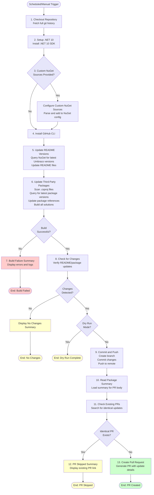

# Update NuGet Packages Workflow Documentation

This document describes the automated workflow for updating NuGet packages and Umbraco versions in the Clean starter kit.

## Overview

The update NuGet packages workflow automatically checks for and applies updates to third-party NuGet packages and Umbraco versions. It runs on a daily schedule and can also be triggered manually with custom options. When updates are found, the workflow automatically creates a pull request with the changes.

## Workflow File

Location: `.github/workflows/update-packages.yml`

## When Does It Run?

The workflow triggers in two ways:

### 1. Scheduled Runs (Automatic)
- **Schedule**: Daily at 8:00 AM UTC
- **Configuration**: Uses environment variables defined in the workflow
  - `SCHEDULED_INCLUDE_PRERELEASE`: Whether to include prerelease versions (default: `true`)
  - `UMBRACO_MAJOR_VERSIONS`: Comma-separated Umbraco major versions to track (default: `13`)

### 2. Manual Runs (Workflow Dispatch)
- **Trigger**: Manually from GitHub Actions UI
- **Parameters**:
  - `dryRun`: Run without making changes (default: `false`)
  - `includePrerelease`: Include prerelease versions (default: `false`)
  - `umbracoVersions`: Comma-separated Umbraco major versions (default: `13`)
  - `nugetSources`: Custom NuGet source URLs (default: empty)

## What It Does

The workflow performs the following operations:

### 1. **Update README with Latest Umbraco Versions**

Updates README files with the latest available Umbraco versions for the specified major versions.

**Script**: [Update-ReadmeVersionsMultiple.ps1](script-update-readme-versions-multiple.md)

**What happens**:
- Queries NuGet.org for latest Umbraco versions
- Updates README.md, umbraco-marketplace-readme.md, and umbraco-marketplace-readme-clean.md
- Supports multiple Umbraco major versions simultaneously
- Respects prerelease settings per version

### 2. **Update Third-Party NuGet Packages**

Scans all .csproj files and updates third-party package references to their latest versions.

**Script**: [UpdateThirdPartyPackages.ps1](script-update-third-party-packages.md)

**What happens**:
- Scans all .csproj files in the repository
- Queries NuGet.org and configured custom sources for latest versions
- Updates package references (excluding internal packages)
- Filters out nightly build versions
- Cleans and builds all solutions to verify compatibility
- Generates detailed package update summary tables

### 3. **Check for Changes**

Determines if any files were modified by the update process.

**Script**: [Test-WorkflowChanges.ps1](script-test-workflow-changes.md)

**What happens**:
- Checks if README files were updated (using string comparison)
- Checks if packages were updated (by parsing package summary file)
- Outputs comprehensive diagnostic information for debugging
- Displays "No Changes Needed" summary if nothing was updated
- Sets `has_changes` output variable for workflow conditionals
- **Critical Fix**: Uses string comparison directly instead of boolean conversion to avoid PowerShell type conversion issues

### 4. **Commit and Push Changes**

Creates a new branch and commits the changes when updates are found.

**Script**: [Invoke-CommitAndPush.ps1](script-invoke-commit-and-push.md)

**What happens**:
- **Early Exit Check**: Verifies both README and package flags before proceeding
- Creates a timestamped branch (e.g., `update-nuget-packages-20251126120000`)
- Commits changes with appropriate message based on what was updated
- Adds `[skip ci]` for README-only updates to avoid unnecessary CI builds
- Performs final git diff check to ensure changes exist before committing
- Pushes branch to remote repository using PAT token authentication
- **Defense-in-Depth**: Multiple validation layers prevent empty commits and unnecessary branch creation

### 5. **Check for Existing Similar PRs**

Prevents duplicate pull requests by checking for existing PRs with identical updates.

**Script**: [Test-ExistingPullRequest.ps1](script-test-existing-pull-request.md)

**What happens**:
- Lists all open PRs with the update pattern
- Compares package update tables
- Skips PR creation if identical PR exists
- Outputs existing PR number

### 6. **Create Pull Request**

Creates a pull request with detailed update information.

**Script**: [New-PackageUpdatePullRequest.ps1](script-new-package-update-pull-request.md)

**What happens**:
- Creates PR title and body with update details
- Includes README and package update information
- Lists custom NuGet sources (if used)
- Includes package update table
- Links PR to the update branch

## GitHub Action Summaries

The workflow generates professional summaries that appear at the bottom of each workflow run using `$GITHUB_STEP_SUMMARY`. These provide at-a-glance visibility of workflow outcomes:

### Summary Types

1. **✅ No Changes Needed** - Displayed when both README and packages are already up-to-date
   - Lists what was checked (README and NuGet packages)
   - Confirms no branch/commit/PR actions were taken

2. **🔄 Changes Detected** - Shown when proceeding with updates
   - Lists what changed (README, packages, or both)
   - Indicates workflow will create branch and PR

3. **✅ Pull Request Created** - Success summary with PR details
   - Shows what was updated
   - Provides clickable PR link
   - Displays package update table
   - Shows custom NuGet sources if used
   - Indicates prerelease setting

4. **⚠️ PR Creation Skipped** - When duplicate PR exists
   - Links to existing PR with identical updates
   - Explains why duplicate was not created

5. **❌ Workflow Failed** - Build failure summary
   - Shows build summary table
   - Lists failed solutions
   - Provides guidance on next steps
   - Links to detailed logs

## Workflow Steps

Here's the complete sequence:



## Scripts Used

The workflow uses the following PowerShell scripts:

| Script | Purpose | Documentation |
|--------|---------|---------------|
| Configure-CustomNuGetSourcesFromInput.ps1 | Adds custom NuGet sources from input | [Link](script-configure-custom-nuget-sources-from-input.md) |
| Update-ReadmeVersionsMultiple.ps1 | Updates README with latest Umbraco versions | [Link](script-update-readme-versions-multiple.md) |
| UpdateThirdPartyPackages.ps1 | Updates NuGet package references | [Link](script-update-third-party-packages.md) |
| Show-BuildFailureSummary.ps1 | Displays build failure information | [Link](script-show-build-failure-summary.md) |
| Test-WorkflowChanges.ps1 | Checks if changes were made | [Link](script-test-workflow-changes.md) |
| Invoke-CommitAndPush.ps1 | Commits and pushes changes | [Link](script-invoke-commit-and-push.md) |
| Get-PackageSummary.ps1 | Reads package summary for PR | [Link](script-get-package-summary.md) |
| Test-ExistingPullRequest.ps1 | Checks for duplicate PRs | [Link](script-test-existing-pull-request.md) |
| New-PackageUpdatePullRequest.ps1 | Creates pull request | [Link](script-new-package-update-pull-request.md) |
| Show-PullRequestSkippedSummary.ps1 | Shows PR skip message | [Link](script-show-pull-request-skipped-summary.md) |

## Configuration

### Environment Variables

Set in the workflow file:

```yaml
env:
  SCHEDULED_INCLUDE_PRERELEASE: 'true'  # Include prerelease for scheduled runs
  UMBRACO_MAJOR_VERSIONS: '13'          # Umbraco versions to track
```

**When to change**:
- Set `SCHEDULED_INCLUDE_PRERELEASE` to `false` when Umbraco stable is released
- Update `UMBRACO_MAJOR_VERSIONS` when tracking new Umbraco versions (e.g., `13,17`)

### Manual Run Parameters

When triggering manually:

**Dry Run**:
```
dryRun: true
```
- No files are modified
- No commits are made
- Useful for testing

**Include Prerelease**:
```
includePrerelease: true
```
- Updates to latest prerelease versions
- Useful during Umbraco RC/preview periods

**Umbraco Versions**:
```
umbracoVersions: 13,17
```
- Comma-separated major versions
- Can use `-` suffix to force prerelease (e.g., `17-`)

**Custom NuGet Sources**:
```
nugetSources: https://www.myget.org/F/umbraco-dev/api/v3/index.json
```
- Comma-separated URLs
- Useful for testing preview packages

## Technical Details

### Environment

- **OS**: Windows (windows-latest)
- **.NET Version**: 10.0.x
- **Tools**: GitHub CLI (gh)

### String Comparison Approach

The workflow uses string comparison for the `readme_updated` flag throughout the entire pipeline to avoid PowerShell type conversion issues:

**Pattern Used**:
```powershell
# Checking if README was updated (TRUE check)
if ($ReadmeUpdated -eq 'true') {
    # README was updated
}

# Checking if README was NOT updated (FALSE check)
if ($ReadmeUpdated -ne 'true') {
    # README was not updated
}

# Combined condition (neither README nor packages updated)
if (($ReadmeUpdated -ne 'true') -and (-not $packagesUpdated)) {
    # No changes detected
}
```

**Why This Approach**:
- **Reliability**: String comparison is predictable and avoids type conversion issues
- **Consistency**: All scripts use the same pattern for checking README updates
- **Debugging**: Diagnostic logs show string vs boolean types clearly
- **Defense-in-Depth**: Multiple validation points prevent workflow from proceeding when no changes exist

**Implementation Locations**:
- `Test-WorkflowChanges.ps1`: Main change detection logic
- `Invoke-CommitAndPush.ps1`: Early exit check and commit message logic
- `New-PackageUpdatePullRequest.ps1`: PR body generation logic

### Authentication

- **PAT_TOKEN**: Personal Access Token for pushing commits and creating PRs
  - Required scope: `repo`, `workflow`
  - Set in repository secrets

### Package Filtering

The UpdateThirdPartyPackages script excludes:

- **Internal packages**: Packages matching `Clean.*` pattern
- **Nightly builds**: Versions containing `-build` suffix
- **Packages with child `<Version>` elements**: Central Package Management (CPM) scenarios

### Version Selection Logic

**Stable versions** (includePrerelease=false):
- Selects latest version without prerelease suffix
- Example: `8.0.0` selected over `8.1.0-rc.1`

**Prerelease versions** (includePrerelease=true):
- Prefers: stable > rc > beta > alpha
- Considers numeric suffixes (rc.3 > rc.2)
- Example: `8.1.0-rc.3` selected over `8.1.0-rc.2` and `8.1.0-beta.1`

## Usage Examples

### Scheduled Run Example

Daily at 8:00 AM UTC:
1. Checks for latest Umbraco 13 (stable or prerelease based on env var)
2. Updates README if new version found
3. Updates all third-party packages
4. Builds solutions to verify compatibility
5. Creates PR if updates found and no identical PR exists

### Manual Run - Test Preview Packages

```yaml
dryRun: false
includePrerelease: true
umbracoVersions: 17
nugetSources: https://www.myget.org/F/umbraco-dev/api/v3/index.json
```

This configuration:
- Updates to latest Umbraco 17 prerelease
- Includes packages from MyGet dev feed
- Creates PR with changes

### Manual Run - Dry Run

```yaml
dryRun: true
includePrerelease: false
umbracoVersions: 13
nugetSources:
```

This configuration:
- Shows what would be updated
- Makes no changes
- Useful for testing

## Artifacts

The workflow generates artifacts in `.artifacts/` directory:

| Artifact | Description |
|----------|-------------|
| `package-summary.txt` | ASCII table of package updates |
| `build-summary.txt` | Build results for all solutions |
| `logs/*.txt` | Detailed build stdout/stderr logs |
| `pr-body.md` | Generated PR description |

## Troubleshooting

### Common Issues

**No Changes Detected**:
- All packages already at latest versions
- README already up-to-date
- Normal behavior - workflow completes successfully

**Build Failures**:
- Package incompatibilities detected
- Review build logs in `.artifacts/logs/`
- Check build-summary.txt for error details
- No PR is created

**Custom NuGet Source Errors**:
- Verify URL is correct v3 feed
- Ensure feed is publicly accessible
- Check workflow logs for connection errors

**Duplicate PR Not Skipped**:
- Package table format may differ
- Check PR body formatting
- May need to manually close duplicate

**PAT Token Issues**:
- Verify token has correct scopes (`repo`, `workflow`)
- Check token hasn't expired
- Ensure token is set in repository secrets

**Workflow Proceeds When No Changes** (FIXED):
- **Issue**: Workflow was creating branches and attempting PRs even when both `readme_updated=false` and `packages_updated=false`
- **Root Cause**: PowerShell boolean conversion failure - the expression `$ReadmeUpdated -eq 'true'` was mysteriously producing a String type instead of Boolean
- **Solution**: Replaced boolean conversion with direct string comparison throughout:
  - Changed from: `if (-not $readmeUpdated -and -not $packagesUpdated)`
  - Changed to: `if (($ReadmeUpdated -ne 'true') -and (-not $packagesUpdated))`
- **Result**: Workflow now correctly stops when no changes are detected
- **Affected Scripts**: Test-WorkflowChanges.ps1, Invoke-CommitAndPush.ps1, New-PackageUpdatePullRequest.ps1

### Logs and Debugging

**Build Logs**:
```
.artifacts/logs/{solution}__{timestamp}.build.stdout.txt
.artifacts/logs/{solution}__{timestamp}.build.stderr.txt
```

**Package Summary**:
```
.artifacts/package-summary.txt
```

**Build Summary**:
```
.artifacts/build-summary.txt
```

## Best Practices

### For Scheduled Runs

1. **Monitor Daily Runs**: Check for failures in Actions tab
2. **Review Generated PRs**: Ensure updates are appropriate
3. **Test Before Merging**: Review build status and package changes
4. **Update Environment Variables**: Adjust SCHEDULED_INCLUDE_PRERELEASE based on Umbraco release cycle

### For Manual Runs

1. **Use Dry Run First**: Test with `dryRun: true` to preview changes
2. **Specify Versions**: Be explicit with umbracoVersions parameter
3. **Document Custom Sources**: Note why custom sources are needed in PR
4. **Verify Builds**: Ensure all solutions build successfully

### For Maintainers

1. **Keep PAT Token Fresh**: Update before expiration
2. **Monitor Build Times**: Optimize if workflow becomes slow
3. **Review Package Patterns**: Update ignore patterns as needed
4. **Clean Old Branches**: Remove merged update branches periodically

## Related Documentation

- [workflow-pr.md](workflow-pr.md) - PR build and testing workflow
- [workflow-versioning-releases.md](workflow-versioning-releases.md) - Release process
- [general-consuming-packages.md](general-consuming-packages.md) - Package consumption guide

## Summary

The update NuGet packages workflow provides:
- ✅ Automated daily package updates
- ✅ Umbraco version tracking for multiple major versions
- ✅ Custom NuGet source support
- ✅ Automatic PR creation with detailed change summaries
- ✅ Duplicate PR detection
- ✅ Build verification before creating PRs
- ✅ Dry run mode for testing
- ✅ Comprehensive logging and error reporting
- ✅ GitHub Action summaries for at-a-glance status
- ✅ Defense-in-depth validation to prevent unnecessary branches/PRs
- ✅ Robust string comparison approach for reliable change detection
- ✅ Detailed diagnostic output for troubleshooting

This ensures the Clean starter kit stays up-to-date with the latest Umbraco and package versions while maintaining stability through automated build verification and robust error handling.
