# PR - OWASP ZAP Security Scan Workflow Documentation

This document describes the automated security testing workflow that uses OWASP ZAP (Zed Attack Proxy) to scan the Clean Blog starter site for security vulnerabilities.

## Overview

The OWASP ZAP security scan workflow performs automated security testing on a Clean Blog site created from the Umbraco.Community.Templates.Clean template. It provides comprehensive vulnerability scanning including XSS, SQL injection, CSRF, and other OWASP Top 10 vulnerabilities.

**Key Features**:
- ✅ Automated OWASP ZAP full security scan
- ✅ Runs on approved PR reviews, manual trigger, and nightly schedule
- ✅ Tests Clean Blog template from NuGet or GitHub Packages
- ✅ Configurable scan rules via `.zap/rules.tsv`
- ✅ Multiple report formats (HTML and Markdown)
- ✅ Site logs for debugging
- ✅ Non-blocking security findings (informational only)

## Workflow File

Location: `.github/workflows/zap-security-scan.yml`

## When Does It Run?

The workflow triggers in three ways:

### 1. Pull Request Review (Conditional)

Triggers when a PR receives an **approved** review on the `main` branch:
- **Event**: `pull_request_review` with type `submitted`
- **Condition**: Only runs if review state is `approved`
- **Branch**: `main`

This allows security scanning after code review approval.

### 2. Manual Trigger (workflow_dispatch)

Navigate to **Actions** tab → Select **"PR - OWASP ZAP Security Scan"** → Click **"Run workflow"**

Configure scan parameters:
- **template-source**: Choose between `nuget` or `github-packages` (default: `nuget`)
- **template-version**: Specify exact version or leave blank for latest

### 3. Scheduled Execution

Runs automatically **nightly at 2:00 AM UTC** with default settings:
- **Template source**: NuGet.org
- **Version**: Latest stable

This provides regular security scanning independent of PR activity.

## What It Does

The workflow performs comprehensive security testing:

### 1. **Setup Clean Blog Site**

Creates a complete Clean Blog site for security testing:

1. Detects or uses specified Clean template version
2. Installs Umbraco.Community.Templates.Clean template
3. Creates Clean Blog project from template
4. Restores and verifies project structure
5. Starts site in background with output logging
6. Waits for site to become fully accessible

**Script**: [Test-LatestWithZap.ps1](script-test-latest-with-zap.md)

### 2. **Site Readiness Verification**

Ensures site is ready for ZAP scanning:

1. Waits additional 5 seconds after site startup
2. Attempts HTTP/HTTPS connectivity
3. Polls site URL up to 10 times with 3-second intervals
4. Validates HTTP 200 or 302 response codes
5. Confirms site is responding before starting scan

### 3. **OWASP ZAP Full Scan**

Runs comprehensive security scan using ZAP:

**Scan Type**: Full active scan (zaproxy/action-full-scan@v0.10.0)

**Configuration**:
- **Target**: Site URL from setup step
- **Rules file**: `.zap/rules.tsv` (custom scan rules)
- **Command options**: `-a -j` (AJAX spider + JSON output)
- **Fail action**: `false` (informational, doesn't fail workflow)
- **Issue writing**: Disabled (no GitHub issues created)

**What ZAP Tests**:
- Cross-Site Scripting (XSS)
- SQL Injection
- Cross-Site Request Forgery (CSRF)
- Security Headers
- Cookie Security
- SSL/TLS Configuration
- Authentication Issues
- Session Management
- Directory Traversal
- Remote File Inclusion
- And more OWASP Top 10 vulnerabilities

### 4. **Artifact Collection**

Uploads comprehensive scan results and logs:

**ZAP Reports**:
- **HTML Report**: `report_html.html` and `report.html`
- **Markdown Report**: `report_md.md` and `report.md`

**Site Logs**:
- **Standard Output**: `site.log`
- **Standard Error**: `site.err`

**Artifact Names**:
- `zap-scan-report-html-clean-template-{version}`
- `zap-scan-report-markdown-clean-template-{version}`
- `site-logs-clean-template-{version}`

### 5. **Cleanup**

Gracefully stops the Umbraco site process:

1. Retrieves site PID from setup step
2. Checks if process is still running
3. Stops process forcefully if active
4. Handles cases where process already exited

### 6. **Summary Generation**

Creates workflow summary with:

- Clean template version tested
- Target URL scanned
- Project type information
- Full ZAP scan results (from Markdown report)
- Links to downloadable artifact reports
- Important notes about non-blocking nature

## Process Flow

```mermaid
flowchart TD
    Start([Trigger:<br/>PR Review, Manual, or Scheduled]) --> CheckCondition{PR Review<br/>Trigger?}

    CheckCondition -->|Yes| CheckApproved{Review<br/>Approved?}
    CheckApproved -->|No| End1([Skip: Not Approved])
    CheckApproved -->|Yes| Proceed

    CheckCondition -->|No - Manual/Scheduled| Proceed[Proceed with Scan]

    Proceed --> Checkout[1. Checkout Repository<br/>Fetch .zap rules and scripts]

    Checkout --> SetupDotNet[2. Setup .NET 10<br/>Install .NET 10 SDK]

    SetupDotNet --> SetupNode[3. Setup Node.js 20<br/>For template tooling]

    SetupNode --> SetupSite[4. Setup Clean Template Site<br/>Run Test-LatestWithZap.ps1]

    SetupSite --> DetectVersion{Template<br/>Version?}

    DetectVersion -->|Specified| UseVersion[Use Provided Version]
    DetectVersion -->|Blank| FetchLatest{Template<br/>Source?}

    FetchLatest -->|NuGet| FetchNuGet[Fetch Latest from NuGet<br/>Stable versions only]
    FetchLatest -->|GitHub Packages| FetchGH[Fetch Latest from GitHub Packages<br/>With authentication]

    UseVersion --> InstallTemplate
    FetchNuGet --> InstallTemplate
    FetchGH --> ConfigureGH[Configure GitHub Packages<br/>Add authenticated source]
    ConfigureGH --> InstallTemplate

    InstallTemplate[5. Install Clean Templates<br/>dotnet new install]

    InstallTemplate --> VerifyTemplate[6. Verify Template Installation<br/>Check for umbraco-starter-clean]

    VerifyTemplate --> TemplateFound{Template<br/>Found?}

    TemplateFound -->|No| TemplateError[Display Error<br/>List installed templates]
    TemplateError --> End2([Exit: Template Not Found])

    TemplateFound -->|Yes| CreateProject[7. Create Clean Blog Project<br/>dotnet new umbraco-starter-clean]

    CreateProject --> VerifyProject{Project<br/>Structure OK?}

    VerifyProject -->|No| ProjectError[Display Error<br/>Show directory contents]
    ProjectError --> End3([Exit: Project Creation Failed])

    VerifyProject -->|Yes| RestoreProject[8. Restore Project<br/>dotnet restore]

    RestoreProject --> RestoreOK{Restore<br/>Success?}

    RestoreOK -->|No| RestoreError[Display Error<br/>Exit code]
    RestoreError --> End4([Exit: Restore Failed])

    RestoreOK -->|Yes| StartSite[9. Start Clean Blog Site<br/>- Background process<br/>- Log to files<br/>- Save PID]

    StartSite --> WaitSite[10. Wait for Site Startup<br/>- Monitor logs<br/>- Max 180s timeout<br/>- Extract URL]

    WaitSite --> SiteReady{Site<br/>Started?}

    SiteReady -->|No| ShowSiteLogs[Display Logs<br/>site.log and site.err]
    ShowSiteLogs --> StopFailed[Stop Process if Running]
    StopFailed --> End5([Exit: Site Failed])

    SiteReady -->|Yes| SaveOutputs[11. Save to GitHub Output<br/>- site_url<br/>- site_pid<br/>- test_dir<br/>- clean_template_version]

    SaveOutputs --> SanitizeVersion[12. Sanitize Version Number<br/>Replace dots with dashes<br/>For artifact naming]

    SanitizeVersion --> WaitReadiness[13. Wait for Site Readiness<br/>- Additional 5s wait<br/>- Test connectivity<br/>- Poll up to 10 times]

    WaitReadiness --> RunZAP[14. Run OWASP ZAP Full Scan<br/>- Target: site URL<br/>- Rules: .zap/rules.tsv<br/>- AJAX spider enabled<br/>- Continue on error]

    RunZAP --> UploadHTML[15. Upload HTML Report<br/>zap-scan-report-html-...]

    UploadHTML --> UploadMD[16. Upload Markdown Report<br/>zap-scan-report-markdown-...]

    UploadMD --> UploadLogs[17. Upload Site Logs<br/>site-logs-...]

    UploadLogs --> Cleanup[18. Cleanup - Stop Umbraco Site<br/>- Check if PID exists<br/>- Check if process running<br/>- Stop process gracefully<br/>- Force stop if needed]

    Cleanup --> CreateSummary[19. Create ZAP Scan Summary<br/>- Scan details<br/>- Template version<br/>- Target URL<br/>- Scan results from report_md.md<br/>- Links to artifacts]

    CreateSummary --> End6([End: Scan Complete])

    style TemplateError fill:#ffcccc
    style ProjectError fill:#ffcccc
    style RestoreError fill:#ffcccc
    style ShowSiteLogs fill:#ffcccc
    style End1 fill:#ffffcc
    style End2 fill:#ffcccc
    style End3 fill:#ffcccc
    style End4 fill:#ffcccc
    style End5 fill:#ffcccc
    style CreateSummary fill:#ccffcc
    style End6 fill:#ccffcc
    style RunZAP fill:#e6f3ff
    style WaitReadiness fill:#e6f3ff
```



## Input Parameters

All input parameters are optional:

### template-source

**Type**: Choice (radio button)
**Options**: `nuget`, `github-packages`
**Default**: `nuget`
**Description**: Source to download Clean template from

**Use Cases**:
- `nuget`: Test official published Clean templates (recommended for security baselines)
- `github-packages`: Test CI template builds from pull requests

### template-version

**Type**: String
**Default**: Empty (uses latest stable)
**Description**: Specific Clean template version to test

**Examples**:
- Leave blank: Auto-detect latest stable version
- `7.0.0`: Test specific stable release
- `7.0.1-ci.42`: Test specific CI build (requires `template-source: github-packages`)

## Scripts Used

The workflow uses the following scripts (PowerShell and Bash):

### Test-LatestWithZap.ps1

**Purpose**: Sets up Clean Blog site for ZAP security testing.

**Location**: `.github/workflows/powershell/Test-LatestWithZap.ps1`

**Documentation**: [script-test-latest-with-zap.md](script-test-latest-with-zap.md)

**Parameters Used**:
- `-WorkspacePath`: GitHub workspace path
- `-TemplateSource`: Set to `nuget`, `github-packages`, or `code`
- `-TemplateVersion`: Optional specific template version

**Outputs**:
- `site_url`: URL where site is running
- `site_pid`: Process ID for cleanup
- `test_dir`: Test directory path for logs
- `clean_template_version`: Version being tested
- `branch_name`: Current branch name
- `template_source`: Template source used
- `umbraco_cms_version`: Umbraco CMS version (if detected)

### Create-ZapAlertIssues.ps1

**Purpose**: Creates GitHub issues for OWASP ZAP security alerts found during scanning.

**Location**: `.github/workflows/powershell/Create-ZapAlertIssues.ps1`

**Documentation**: [script-create-zap-alert-issues.md](script-create-zap-alert-issues.md)

**Parameters Used**:
- `-ReportPath`: Path to ZAP JSON report file
- `-Repository`: GitHub repository (owner/repo)
- `-Token`: GitHub API token with issues:write permission
- `-BranchName`: Current branch name
- `-TemplateSource`: Template source used for scan
- `-TemplateVersion`: Clean template version tested
- `-UmbracoCmsVersion`: Umbraco CMS version (optional)
- `-PullRequestUrl`: Related PR URL (optional)

**Outputs**:
- `issues_created`: Number of new issues created

### sanitize-version-numbers.sh

**Purpose**: Sanitizes version numbers for use in GitHub Actions artifact names by replacing dots with dashes.

**Location**: `.github/workflows/scripts/sanitize-version-numbers.sh`

**Documentation**: [script-sanitize-version-numbers.md](script-sanitize-version-numbers.md)

**Parameters Used**:
- Positional argument 1: Version string to sanitize (e.g., "7.0.1")

**Outputs**:
- `template_version_safe`: Sanitized version string with dashes

### wait-site-readiness.sh

**Purpose**: Waits for an Umbraco site to be fully ready for OWASP ZAP security scanning by polling the site URL.

**Location**: `.github/workflows/scripts/wait-site-readiness.sh`

**Documentation**: [script-wait-site-readiness.md](script-wait-site-readiness.md)

**Parameters Used**:
- Positional argument 1: Site URL to check (e.g., "https://localhost:5001")

**Behavior**:
- Waits 5 seconds for initial stabilization
- Polls site up to 10 times with 3-second intervals
- Validates HTTP 200 or 302 response codes
- Total timeout: ~35 seconds

### Stop-UmbracoSite.ps1

**Purpose**: Gracefully stops a running Umbraco site process by its Process ID.

**Location**: `.github/workflows/powershell/Stop-UmbracoSite.ps1`

**Documentation**: [script-stop-umbraco-site.md](script-stop-umbraco-site.md)

**Parameters Used**:
- `-SitePid`: Process ID of the site to stop (optional)

**Behavior**:
- Checks if process exists before stopping
- Handles cases where process already exited
- Always exits successfully (never fails workflow)
- Used in cleanup step with `if: always()`

### create-zap-scan-summary.sh

**Purpose**: Creates a comprehensive GitHub Actions workflow summary for OWASP ZAP security scan results.

**Location**: `.github/workflows/scripts/create-zap-scan-summary.sh`

**Documentation**: [script-create-zap-scan-summary.md](script-create-zap-scan-summary.md)

**Parameters Used**:
- Positional argument 1: Branch name
- Positional argument 2: Template source (code/nuget/github-packages)
- Positional argument 3: Template version
- Positional argument 4: Site URL
- Positional argument 5: Umbraco CMS version (optional)
- Positional argument 6: Number of issues created (optional)

**Behavior**:
- Generates formatted markdown summary
- Includes scan metadata and results
- Displays contextual notes based on template source
- Shows failure section for code template with new issues

## ZAP Configuration

### Rules File

**Location**: `.zap/rules.tsv`

The rules file allows customization of ZAP scan behavior:

**Format**: Tab-separated values (TSV)
**Columns**:
1. Rule ID
2. Threshold (OFF, DEFAULT, LOW, MEDIUM, HIGH)
3. Action (IGNORE, WARN, FAIL)

**Example Rules**:
```tsv
# Ignore false positives
10021	OFF	IGNORE	# X-Content-Type-Options Header Missing
10020	OFF	IGNORE	# X-Frame-Options Header Not Set

# Warn on potential issues
10202	DEFAULT	WARN	# Absence of Anti-CSRF Tokens

# Fail on critical vulnerabilities
40012	DEFAULT	FAIL	# Cross Site Scripting
40018	DEFAULT	FAIL	# SQL Injection
```

**Documentation**: [OWASP ZAP Scan Rules](https://www.zaproxy.org/docs/alerts/)

### Scan Options

**Command Options**: `-a -j`

- `-a`: Enable AJAX spider for JavaScript-heavy applications
- `-j`: Output JSON for programmatic processing

**Additional Configuration**:
- **allow_issue_writing**: `false` - Don't create GitHub issues
- **fail_action**: `false` - Don't fail workflow on findings

## Example Usage Scenarios

### Scenario 1: Nightly Security Baseline

**Configuration**: (Automatic nightly run)
- Template source: `nuget`
- Version: Latest stable
- Trigger: Scheduled at 2:00 AM UTC

**Result**: Establishes security baseline for latest stable Clean template

**Use Case**: Regular security monitoring

### Scenario 2: PR Security Review

**Configuration**: (Automatic after PR approval)
- Template source: GitHub Packages (if PR builds template)
- Version: Latest from PR
- Trigger: PR review approval

**Result**: Security scan after code review approval

**Use Case**: Pre-merge security validation

### Scenario 3: Specific Version Audit

**Configuration**:
```yaml
template-source: nuget
template-version: 7.0.0
```

**Result**: Security scan of specific released version

**Use Case**: Security audit of production version

### Scenario 4: CI Build Security Check

**Configuration**:
```yaml
template-source: github-packages
template-version: 7.0.1-ci.42
```

**Result**: Security scan of specific CI build

**Use Case**: Pre-release security validation

## Artifacts

### ZAP Scan Report (HTML)

**Artifact Name**: `zap-scan-report-html-clean-template-{version-safe}`

**Example**: `zap-scan-report-html-clean-template-7-0-0`

**Contents**:
- `report_html.html` or `report.html`
- Detailed HTML report with styling
- Vulnerability details, evidence, and recommendations
- Risk ratings and CVSS scores

**Use**: Detailed analysis and sharing with stakeholders

### ZAP Scan Report (Markdown)

**Artifact Name**: `zap-scan-report-markdown-clean-template-{version-safe}`

**Example**: `zap-scan-report-markdown-clean-template-7-0-0`

**Contents**:
- `report_md.md` or `report.md`
- Text-based report for quick review
- Included in workflow summary

**Use**: Quick review and version control

### Site Logs

**Artifact Name**: `site-logs-clean-template-{version-safe}`

**Example**: `site-logs-clean-template-7-0-0`

**Contents**:
- `site.log`: Standard output from Umbraco site
- `site.err`: Error output from Umbraco site

**Use**: Debugging site startup or runtime issues

**Retention**: 90 days (GitHub default)

## Permissions

The workflow requires the following GitHub permissions:

- **contents: read** - To checkout repository and access scripts
- **packages: read** - To download template from GitHub Packages (when using that source)
- **pull-requests: read** - To access PR context for PR review triggers
- **issues: write** - Declared but not used (issue writing is disabled)

## Troubleshooting

### Site Failed to Start

**Error**: "Site process exited prematurely" or timeout

**Causes**:
- Template installation issues
- Project creation failure
- Database initialization problems
- Port conflicts

**Solution**:
1. Download `site-logs-clean-template-*` artifact
2. Review `site.log` and `site.err` for errors
3. Check Clean template version compatibility
4. Test template locally with same version

### ZAP Scan Found No Vulnerabilities

**Observation**: Report shows no alerts

**Causes**:
- ZAP didn't crawl site properly
- Site requires authentication
- JavaScript-heavy pages not tested

**Solution**:
1. Check ZAP used AJAX spider (`-a` flag)
2. Verify site was accessible during scan
3. Review ZAP scan coverage in HTML report
4. Consider adjusting `.zap/rules.tsv`

### False Positives in Report

**Observation**: Known safe configurations flagged as vulnerabilities

**Causes**:
- Default ZAP rules are conservative
- Umbraco defaults differ from generic web apps
- Context-specific configurations

**Solution**:
1. Review findings in HTML report
2. Update `.zap/rules.tsv` to ignore false positives
3. Document why specific rules are ignored
4. Keep rules file in version control

### Template Not Found

**Error**: "ERROR: Clean template not found in installed templates"

**Causes**:
- Template installation failed
- Template short name changed
- NuGet/GitHub Packages connectivity issues

**Solution**:
1. Check workflow logs for installation errors
2. Verify template exists in specified source
3. Check template version is valid
4. Review NuGet or GitHub Packages authentication

### Version Sanitization Issues

**Error**: Invalid artifact name

**Causes**:
- Version contains invalid characters for artifact names
- Dots not replaced with dashes

**Solution**:
- Workflow automatically sanitizes versions
- Check "Sanitize Version Numbers" step output
- Verify `template_version_safe` in workflow logs

## Related Documentation

### Workflow Scripts

- [script-test-latest-with-zap.md](script-test-latest-with-zap.md) - Site setup script (PowerShell)
- [script-sanitize-version-numbers.md](script-sanitize-version-numbers.md) - Version sanitization script (Bash)
- [script-wait-site-readiness.md](script-wait-site-readiness.md) - Site readiness verification script (Bash)
- [script-stop-umbraco-site.md](script-stop-umbraco-site.md) - Site cleanup script (PowerShell)
- [script-create-zap-scan-summary.md](script-create-zap-scan-summary.md) - Workflow summary generation script (Bash)
- [script-create-zap-alert-issues.md](script-create-zap-alert-issues.md) - GitHub issue creation script (PowerShell)

### External Resources

- [OWASP ZAP Documentation](https://www.zaproxy.org/docs/)
- [OWASP Top 10](https://owasp.org/www-project-top-ten/)
- [ZAP GitHub Action](https://github.com/zaproxy/action-full-scan)

## Best Practices

### For Regular Scans

1. **Review nightly scan results**: Check 2:00 AM runs each morning
2. **Track trends**: Monitor if vulnerability counts increase over time
3. **Update rules file**: Refine `.zap/rules.tsv` based on findings
4. **Document exceptions**: Comment why certain rules are ignored
5. **Compare versions**: Check if new versions introduce new vulnerabilities

### For PR Security Reviews

1. **Run after code review**: Let reviewers approve before security scan
2. **Don't block merges**: Security findings are informational, not blocking
3. **Review template changes**: Focus on PRs that modify template content
4. **Address high/critical**: Prioritize fixing high-severity findings
5. **Rerun if needed**: Manually trigger after addressing security issues

### For Security Audits

1. **Use stable versions**: Test official releases, not CI builds
2. **Download HTML reports**: Share detailed reports with security teams
3. **Test specific versions**: Pin versions for compliance audits
4. **Compare with baselines**: Track changes from previous audits
5. **Document remediation**: Track how findings were addressed

### For Development

1. **Test locally first**: Run ZAP locally before pushing changes
2. **Understand findings**: Don't blindly ignore warnings
3. **Fix root causes**: Address vulnerabilities in template code
4. **Test fixes**: Verify fixes don't break functionality
5. **Update documentation**: Document security considerations

## Security Considerations

### What ZAP Tests

**OWASP Top 10 Coverage**:
- ✅ A01:2021 – Broken Access Control
- ✅ A02:2021 – Cryptographic Failures
- ✅ A03:2021 – Injection
- ✅ A04:2021 – Insecure Design
- ✅ A05:2021 – Security Misconfiguration
- ✅ A06:2021 – Vulnerable and Outdated Components
- ✅ A07:2021 – Identification and Authentication Failures
- ✅ A08:2021 – Software and Data Integrity Failures
- ✅ A09:2021 – Security Logging and Monitoring Failures
- ✅ A10:2021 – Server-Side Request Forgery

### What ZAP Doesn't Test

**Out of Scope**:
- Business logic vulnerabilities
- Authorization issues (requires authenticated testing)
- Complex workflows (multi-step processes)
- API-specific vulnerabilities (if not exposed to web)
- Infrastructure vulnerabilities (host OS, network)

### Limitations

1. **No Authentication**: ZAP scans public pages only, not admin areas
2. **False Positives**: Conservative rules may flag safe configurations
3. **Limited Context**: Doesn't understand Umbraco-specific security
4. **No Remediation**: Reports issues but doesn't fix them
5. **Point-in-Time**: Scan reflects site state at scan time only

## Summary

The OWASP ZAP security scan workflow provides:
- ✅ Automated vulnerability scanning with OWASP ZAP
- ✅ Multiple trigger options (PR review, manual, scheduled)
- ✅ Comprehensive Clean Blog template testing
- ✅ Configurable scan rules via `.zap/rules.tsv`
- ✅ Multiple report formats (HTML and Markdown)
- ✅ Site logs for debugging
- ✅ Non-blocking security findings
- ✅ Integration with GitHub Actions workflow summary
- ✅ Support for testing specific template versions
- ✅ Coverage of OWASP Top 10 vulnerabilities

This ensures the Clean Blog template maintains security best practices and provides visibility into potential vulnerabilities without blocking development workflows. Regular scanning helps catch security issues early while allowing development to continue smoothly.
